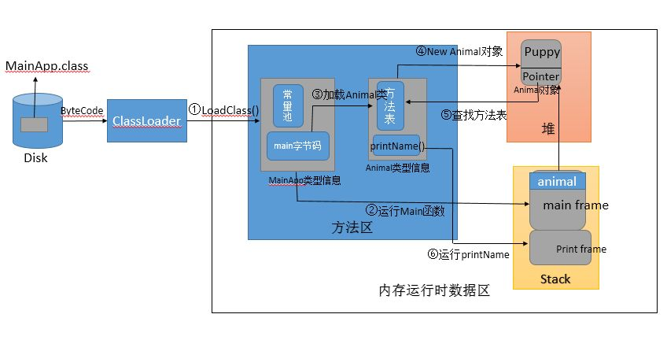

## 参考博文
[Java代码编译和执行的整个过程-简述(一)](https://zhuanlan.zhihu.com/p/32453148)
[Java基础 Java类的加载和对象创建流程的详细分析](https://www.cnblogs.com/study-everyday/p/6752715.html)


[TOC]

# 1. 源码编译过程
一次编写，到处运行的意思是说：
不管使用什么语言的文件，只要用对应的编译器编译成字节码文件(.class)交给JVM，JVM就能把.class文件翻译成对应机器的机器语言。

对于Java源文件(.java)的编译过程会分成两部分
1. 前端编译器(javac)：在编译期将.java文件编译成.class文件。这部分是与机器无关的部分，.class文件作为中间代码
2. 后端编译器(JIT)：作为热点代码的优化手段，在JVM运行过程中将字节码文件编译成机器指令存下来

[源码编译过程](./源码编译过程.md)

# 2. 类加载过程
[虚拟机类加载机制](./虚拟机类加载机制.md)


# 3. 类执行过程
[类执行过程](./类执行过程.md)


# 4. 举例
## 举例1
```java
//MainApp.java  
public class MainApp {  
public static void main(String[] args) {  
       Animal animal = new Animal("Puppy");  
       animal.printName();  
   }  
}  
//Animal.java  
public class Animal {  
public String name;  
public Animal(String name) {  
this.name = name;  
   }  
public void printName() {  
       System.out.println("Animal ["+name+"]");  
   }  
} 
```
第一步(编译): 创建完源文件之后，程序会先被编译为.class文件。Java编译一个类时，如果这个类所依赖的类还没有被编译，编译器就会先编译这个被依赖的类，然后引用，否则直接引用，这个有点象make。如果java编译器在指定目录下找不到该类所其依赖的类的.class文件或者.java源文件的话，编译器话报“cant find symbol”的错误。

第二步（运行）：java类运行的过程大概可分为两个过程：1、类的加载 2、类的执行。需要说明的是：JVM主要在程序第一次主动使用类的时候，才会去加载该类。也就是说，JVM并不是在一开始就把一个程序就所有的类都加载到内存中，而是到不得不用的时候才把它加载进来，而且只加载一次。

下面是程序运行的详细步骤：

在编译好java程序得到MainApp.class文件后，在命令行上敲java AppMain。系统就会启动一个jvm进程，jvm进程从classpath路径中找到一个名为AppMain.class的二进制文件，将MainApp的类信息加载到运行时数据区的方法区内，这个过程叫做MainApp类的加载。
然后JVM找到AppMain的主函数入口，开始执行main函数。
main函数的第一条命令是Animal animal = new Animal("Puppy");就是让JVM创建一个Animal对象，但是这时候方法区中没有Animal类的信息，所以JVM马上加载Animal类，把Animal类的类型信息放到方法区中。
加载完Animal类之后，Java虚拟机做的第一件事情就是在堆区中为一个新的Animal实例分配内存, 然后调用构造函数初始化Animal实例，这个Animal实例持有着指向方法区的Animal类的类型信息（其中包含有方法表，java动态绑定的底层实现）的引用。
当使用animal.printName()的时候，JVM根据animal引用找到Animal对象，然后根据Animal对象持有的引用定位到方法区中Animal类的类型信息的方法表，获得printName()函数的字节码的地址。
开始运行printName()函数。

