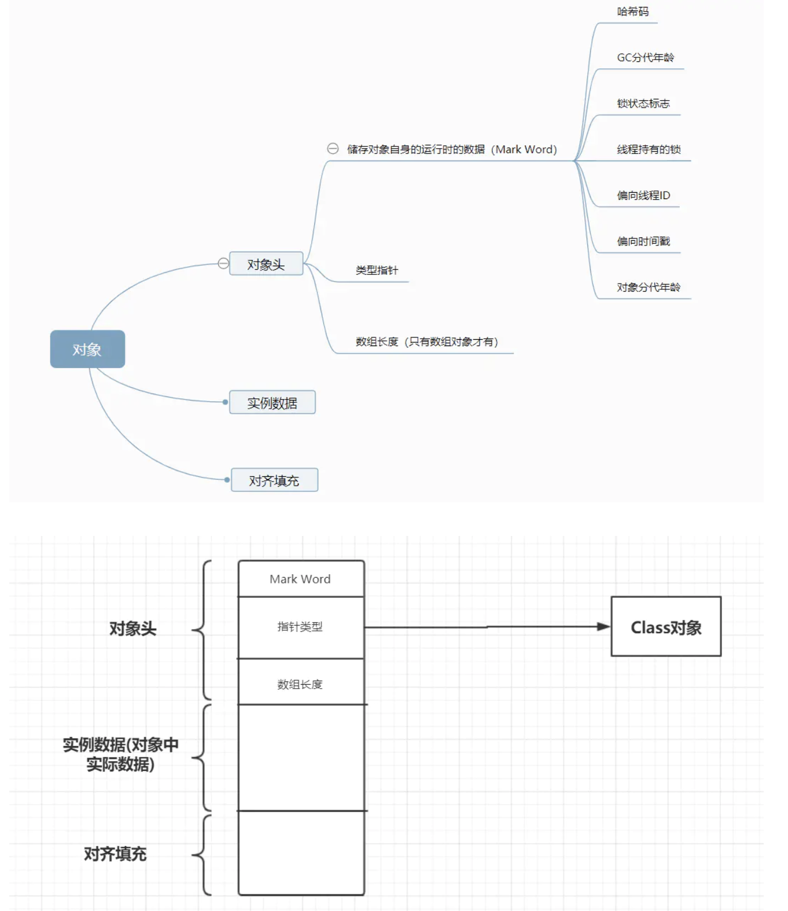
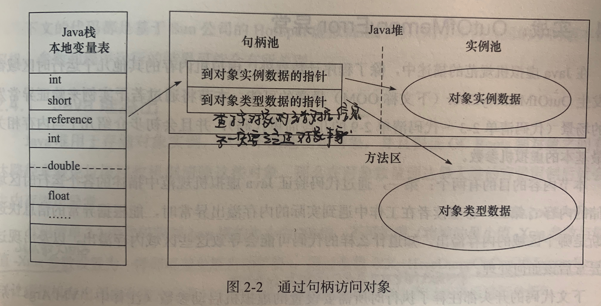

## 参考博文
[深入理解Java对象的创建过程：类的初始化与实例化](https://blog.csdn.net/justloveyou_/article/details/72466416)


[TOC]

# 1. 对象创建的方法
从Java虚拟机层面看，除了使用new关键字创建对象的方式外，其他方式全部都是通过转变为invokevirtual指令直接创建对象的

## 1.1 使用new关键字创建对象
最常见的方法，调用任意的构造函数
```java
Student student = new Student();
```

## 1.2 使用Class类的newInstance方法(反射机制)
[反射机制](../java基础/反射机制.md)
newInstance()调用的是无参构造函数,他的内部也是调用Constructor的newInstance()
```java
Student student2 = (Student)Class.forName("Student类全限定名").newInstance();　
或者：
Student stu = Student.class.newInstance();
```

## 1.3 使用Constructor类的newInstance方法(反射机制)
[反射机制](../java基础/反射机制.md)
java.lang.relect.Constructor的newInstance可以调用有参和私有的构造函数
```java
public class Student {

    private int id;

    public Student(Integer id) {
        this.id = id;
    }

    public static void main(String[] args) throws Exception {

        Constructor<Student> constructor = Student.class
                .getConstructor(Integer.class);
        Student stu3 = constructor.newInstance(123);
    }
}
```

## 1.4 使用Clone方法创建对象
[深克隆和浅克隆](../java基础/深克隆和浅克隆.md)
实现接口Cloneable，实现他的clone方法
```java
public class Student implements Cloneable{

    private int id;

    public Student(Integer id) {
        this.id = id;
    }

    @Override
    protected Object clone() throws CloneNotSupportedException {
        // TODO Auto-generated method stub
        return super.clone();
    }

    public static void main(String[] args) throws Exception {

        Constructor<Student> constructor = Student.class
                .getConstructor(Integer.class);
        Student stu3 = constructor.newInstance(123);
        Student stu4 = (Student) stu3.clone();
    }
}
```

## 1.5 使用(反)序列化机制创建对象
实现Serializable接口
```java
public class Student implements Cloneable, Serializable {

    private int id;

    public Student(Integer id) {
        this.id = id;
    }

    @Override
    public String toString() {
        return "Student [id=" + id + "]";
    }

    public static void main(String[] args) throws Exception {

        Constructor<Student> constructor = Student.class
                .getConstructor(Integer.class);
        Student stu3 = constructor.newInstance(123);

        // 写对象
        ObjectOutputStream output = new ObjectOutputStream(
                new FileOutputStream("student.bin"));
        output.writeObject(stu3);
        output.close();

        // 读对象
        ObjectInputStream input = new ObjectInputStream(new FileInputStream(
                "student.bin"));
        Student stu5 = (Student) input.readObject();
        System.out.println(stu5);
    }
}
```

# 2. 对象创建过程
对以下创建对象的语句，其实有两个过程：
1. 定义变量：首先定义变量per，并放入局部变量表中
2. 赋值：执行new Person()，创建一个Person的实例并在堆中开辟空间存储。然后将实例的地址赋值给per变量
```java
Person per = new Person();

//有以下两个过程
Person per;//定义
per = new Person();//赋值 
```

当JVM遇到一条new指令时，将做以下事情：
1. 将根据该指令的参数检查运行时常量池中是否有该类的符号引用，并检查该符号引用是否已经执行过类加载过程，如果没有将先执行类加载。2. 如果已经加载过，将为该实例分配堆中的内存空间
3. 分配完内存空间后，将分配到空间的实例变量初始化零值，所以实例字段可以不赋初始值就可以使用
4. 设置对象头
5. 执行实例构造函数<init()>[init和clinit](./init和clinit.md)

# 3. 对象在堆中分配内存方式
根据堆内存是否规整，创建对象分配堆内存的方式有两种：
1. 指针碰撞：堆内存分为被使用和空闲两大块，被使用的内存都在一边，空闲的内存都在一边，有一个指针作为分界点。当要分配内存时，将指针往空闲空间挪动对象大小的举例。用于采用带标记-整理的垃圾收集器的情况，例如Serial、ParNew
2. 空闲列表：虚拟机维护一个列表来记录空闲的内存块，在发呢配内存时就从列表中找到足够大小的块分配给对象。用于采用标记-清除算法的垃圾收集器的情况，例如CMS

# 4. 对象在堆中的内存布局
对象在堆中存储的数据可分为3块：
1. 对象头(header)
2. 实例数据(instance data)
3. 对齐填充(padding)



## 对象头
对象头包含两部分：
1. 对象自身的运行时数据(Mark Word)：包括哈希吗、GC分代年龄、锁状态标志、线程持有的锁、偏向线程ID等。Mark Word数据会随着锁标志的变化而变化
2. 类型指针：根据这个指针确定对象是哪个类的实例。如果是数组，还要记录数组的长度


## 实例数据
实例数据是对象真正存储的有效信息，就是代码中定义的各种字段


## 对齐填充
仅起到占位符的作用，要求对象起始地址必须是8字节的整数倍。那么对象的大小必须是8的整数倍，而对象头刚好是8字节的整数倍，所以当实例数据没有对齐时，将通过对齐填充来补全


# 5. 对象访问定位
程序通过栈中局部变量的引用来操作堆中对象，而通过引用变量访问堆中对象的具体位置有2种方式：
1. 使用句柄方式
2. 使用直接指针

## 使用句柄方式
堆中划分一块区域作为句柄池，句柄池中存储对象实例数据和类型数据的地址信息，引用变量中存的是对象的句柄地址。

句柄的好处是引用变量中存储的是稳定的句柄地址，在对象被移动时(GC时经常会移动对象)只改变句柄中的实例数据指针，而不影响引用变量。



## 使用直接指针
引用变量中存的就是对象在堆中的内存地址

好处是只用一次指针定位，速度更快。Sun HotSpot用的就是这种方式

