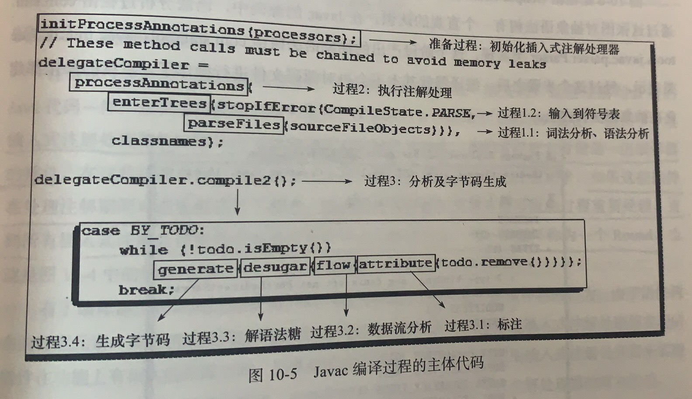

## 参考博文
[Java代码到底是如何编译成机器指令的](https://juejin.im/entry/5b441e5b5188251afb5c6b75)

[TOC]


# 1. 前端编译器(源码编译)


编译的入口是com.sun.tools.javac.main.JavaCompiler类，逻辑集中在compile()和compile2()两个方法中



## 1.1 解析与填充符号表
### (1)词法分析——标记集合
将源码中的字符流转变为标记(Token)集合。在源码中字符是最小单位，在编译过程中标记是最小单位。例如int a=b+2有6个标记，分别是int、a、=、b、+、2。

由com.sun.tools.javac.parser.Scanner实现
```shell
javac [ options ] [ sourcefiles ] [ @files ]
参数可按任意次序排列。

options:命令行选项。
sourcefiles:一个或多个要编译的源文件（例如 MyClass.java）。
@files:一个或多个对源文件进行列表的文件。
```

如果是在IDEA里面运行，.class文件都放在了/target/classes/里面


### (2)语法分析——抽象语法树
根据Token集合构造抽象语法树(AST),AST是描述代码语法结构的方式，树中每个节点都代表一个语法结构，例如包、类型、修饰符、运算符、接口、返回值等

由com.sun.tools.javac.parser.Parser实现，语法树由com.sun.tools.javac.tree.JCTree表示。

后面编译器的所有操作都针对抽象语法树

### (3)填充符号表
符号表是由一组符号地址和符号信息构成的K-V表格，将用于语义分析和生产中间代码，是对符号名分配地址的依据

由com.sun.tools.javac.comp.Enter类实现，返回一个待处理列表


## 1.2 注解处理
JDK1.6后提供了一组插入式注解处理器的API在编译期间对注解进行处理，而注解本身是在运行期间发挥作用

注解处理器可以读取、修改、添加抽象语法树中的元素，如果堆语法树进行了修改，编译器将重新执行解析与填充符号表过程，每一个这样的过程称为一个Round，直到所有处理器都不对语法树进行修改为止


## 1.3 分析与字节码生成
### (1)语义分析
判断源程序是否符合逻辑，例如一些类型检查。

例如数组下标必须为整数，如果使用浮点数作为下标，编译器就必须报错


#### 标注检查

检查变量使用前是否已经声明，变量与赋值之间的数据类型是否匹配，常量折叠等

在下面的赋值语句中，只有第1句int d=a+c;能通过语义分析
```java
int a=1;
boolean b=false;
char c=2;

int d=a+c;
int d=b+c;
char d=a+c
```

在下面的语句中，1+2在抽象语法树中会被折叠成3
```java
int a=1+2;
```

由com.sun.tools.javac.comp.Attr和com.sun.tools.javac.comp.Check类实现

#### 数据及控制流分析
检查局部变量使用前是否赋值、方法是否每个出口都有返回值等
由com.sun.tools.javac.comp.Flow类实现

#### 解语法糖
[语法糖](#语法糖)

### (2)生成字节码
将前面生成的语法树和符号表转化成字节码存在磁盘上，并进行少量的代码添加和转换工作


# 2. 后端编译器
当某个方法或者某段代码被运行的很频繁时，他们会被认作热点代码。

即时编译器(JIT)会将这些代码对应的字节码编译成平台相关的机器码缓存起来执行，而不通过解释执行

当程序需要迅速启动运行时，使用解释器可以省去编译的时间，会更有优势。而随着程序的执行，使用编译器的优势会更大。