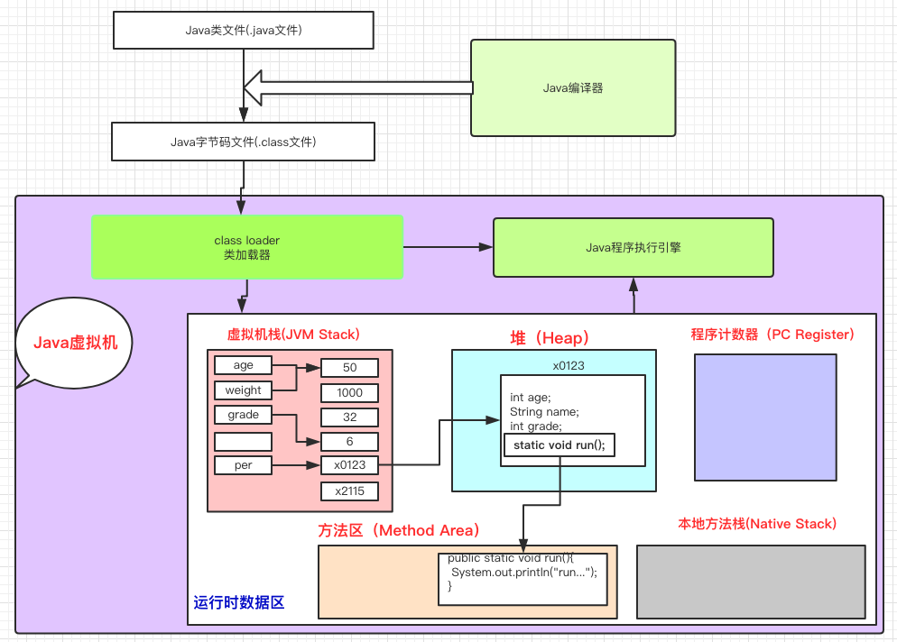
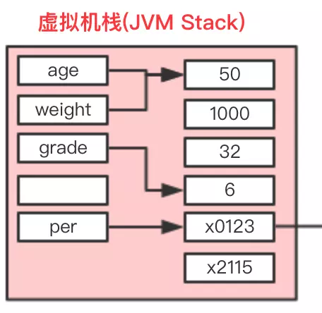
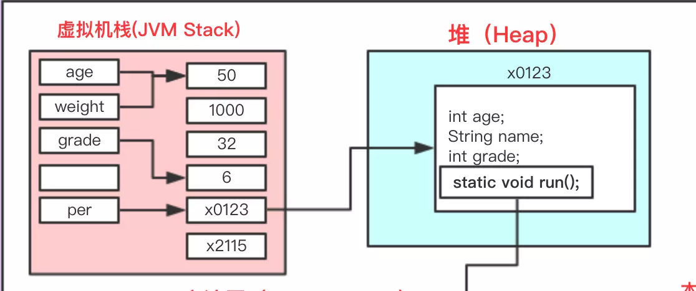

## 参考博文
[这一次，彻底解决Java的值传递和引用传递](https://juejin.im/post/5bce68226fb9a05ce46a0476)


[TOC]

# 1. 形参和实参
1. 形参：
方法的参数列表，例如func(int a)中的a只有在方法被调用时才在栈帧的局部变量表中分配内存。在方法结束后，栈帧退出，a的内存也被释放

2. 实参：
方法被调用时传进来的实际值，在方法调用前他就已经初始化好。


int a=10是实参，而func(int a)中的a是形参
```java
public static void main(String[] args){
    int a=10;//实参
    func(a);
}

public static void func(int a){
    a=20;
    System.out.println(a);
}
```

# 2. 变量在内存中的存储


## 2.1 基本数据类型的存储
### 基本数据类型的局部变量
局部变量是定义在方法中的，所以局部变量名会存在局部变量表中，而值也会存在虚拟机栈的内存空间内。所以声明并初始化基本数据类型的局部变量，他的变量名和字面值都是存在虚拟机栈中的

以下赋值操作其实分为两个步骤：
1. 创建一个名为age的变量放入局部变量表中
2. 在虚拟机栈中查找是否存在值为50的内容，如果存在则将age指向这个地址。否则在栈中开辟一块内存放入50，并将age指向这个地址
```java
int age = 50;
```

再接着执行以下语句：
1. 创建一个名为weight的变量放入局部变量表中
2. 在栈中找到一个50的值，将weight指向这个地址
```java
int weight = 50;
```

再接着执行以下语句：
在栈中寻找是否有40的值，没有就开辟空间存入40，并将weight指向这个地址。而age的值不会变
```java
weight = 40;
```
所以虚拟机栈中的值是该线程内共享的，对于多个变量赋值同一个值会指向同一个地址。而当变量再次赋值时，并不去改变原指向的字面量的内容。而是去寻找是否存在要赋值的数据，如果存在就重新指向这个地址；如果不存在就开辟新空间再指向他





### 基本数据类型的成员变量
这里的成员变量指的是在类中定义的非static变量。

对象的成员变量的名和值存在堆为该对象分配的内存中




### 基本数据类型的静态变量
这里的静态变量指的是在类中定义的static变量

对象的类变量的名和初始值已经在类加载的准备阶段就放入方法区的运行时常量池中了，并在初始化阶段赋值。随着类的生命周期加载和释放


## 2.2 引用数据类型的存储
[对象创建过程](../JVM/对象创建过程.md)
引用类型包括对象和数组，局部变量表中存储变量名，他的值是对象在堆中的内存地址。而对象的具体内容(属性字段)则存在堆里


# 3. 值传递和引用传递
## 3.1 值传递


## 3.2 引用传递