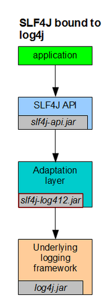

## 参考博文
Logback升级操作指导：[https://www.atatech.org/articles/154937?spm=ata.13269325.0.0.28a049faDLK6jS](https://www.atatech.org/articles/154937?spm=ata.13269325.0.0.28a049faDLK6jS)


slf4j+logback的配置及使用：[https://www.jianshu.com/p/696444e1a352](https://www.jianshu.com/p/696444e1a352)


Java 日志框架解析：汇总及最佳实践:[https://developer.aliyun.com/article/768396](https://developer.aliyun.com/article/768396)


# 几种日志框架

- **commons-logging**
`apache`最早提供的日志的门面接口。避免和具体的日志方案直接耦合。类似于`JDBC` 的`api` 接口，具体的的`JDBC driver` 实现由各数据库提供商实现。通过统一接口解耦，不过其内部也实现了一些简单日志方案。


- **slf4j**
全称为`Simple Logging Facade for Java`。 是对不同日志框架提供的一个门面封装。可以在部署的时候不修改任何配置即可接入一种日志实现方案。和`commons-loging` 类似。有两个额外特点：①能支持多个参数，并通过`{}`占位符进行替换，避免老写`logger.isXXXEnabled`这种无奈的判断，带来性能提升见；②`OSGI`机制更好兼容支持。


- **Log4j**
`Logging for Java`，经典的一种日志解决方案。内部把日志系统抽象封装成`Logger` 、`appender` 、`pattern` 等实现。我们可以通过配置文件轻松的实现日志系统的管理和多样化配置。


- **Log4j2**
`Log4j2`是`Log4j`的升级版，与之前的版本`Log4j 1.x`相比、有重大的改进，在修正了`Logback`固有的架构问题的同时，改进了许多`Logback`所具有的功能。


- **logback**
作为一个通用可靠、快速灵活的日志框架，将作为`Log4j` 的替代和`slf4j` 组成新的日志系统的完整实现。具有极佳的性能，在关键路径上执行速度是`log4j` 的10 倍，且内存消耗更少。


简单来说，`slf4j`和`commons-logging`是抽象接口，`Log4j`、`Log4j2`和`logback`是它们的实现，在实际使用中，一般选择`slf4j+Log4j2`或者`slf4j+logback`

# slf4j+logback
### 引入jar包
统一使用api包，原有的log4j的输出全部变成api包的形式，然后把log4j的实现依赖成空包，只使用logback的实现
```java
 1		  <!--使用统一的日志api包-->
     	  <dependency>
                <groupId>org.slf4j</groupId>
                <artifactId>slf4j-api</artifactId>
                <version>1.7.9</version>
            </dependency>
 
 6        <!--使用logback的绑定-->
     	  <!-- 
     		Logback当前分成三个模块：logback-core，logback- classic和logback-access
            logback-core是其它两个模块的基础模块
            logback-classic是log4j的一个改良版本，完整实现了SLF4J API
            logback-access模块与Servlet容器集成提供通过Http来访问日志的功能
     	  -->
 7        <dependency>
                <groupId>ch.qos.logback</groupId>
                <artifactId>logback-core</artifactId>
                <version>1.2.3</version>
            </dependency>
            <dependency>
                <groupId>ch.qos.logback</groupId>
                <artifactId>logback-access</artifactId>
                <version>1.2.3</version>
            </dependency>
            <dependency>
                <groupId>ch.qos.logback</groupId>
                <artifactId>logback-classic</artifactId>
                <version>1.2.3</version>
            </dependency>

17        <!--去除对log4j的绑定-->
18        <dependency>
19            <groupId>org.slf4j</groupId>
20            <artifactId>slf4j-log4j12</artifactId>
21            <version>99.0-does-not-exist</version>
22        </dependency>

23        <!--slf4j 的桥接器,将第三方类库对 log4j 的调用 delegate 到 slf api 上-->
     	  <!--log4j-over-slf4j与slf4j-log4j12不能共存-->
24        <dependency>
25            <groupId>org.slf4j</groupId>
26            <artifactId>log4j-over-slf4j</artifactId>
27            <version>1.7.9</version>
28        </dependency>
29        <dependency>
30            <groupId>org.slf4j</groupId>
31            <artifactId>jcl-over-slf4j</artifactId>
32            <version>1.7.7</version>
33        </dependency>

34        <!--强制排除 log4j 的依赖,全部 delegate 到 log4j-over-slf4j 上-->
35        <dependency>
36            <groupId>log4j</groupId>
37            <artifactId>log4j</artifactId>
38            <version>99.0-does-not-exist</version>
39        </dependency>
40        <dependency>
41            <groupId>apache-log4j</groupId>
42            <artifactId>log4j</artifactId>
43            <version>999-not-exist</version>
44        </dependency>
45        <dependency>
46            <groupId>commons-logging</groupId>
47            <artifactId>commons-logging</artifactId>
48            <version>99.0-does-not-exist</version>
49        </dependency>
 		  <dependency>
              <groupId>org.slf4j</groupId>
              <artifactId>slf4j-log4j12</artifactId>
              <version>99.0-does-not-exist</version>
          </dependency>
```

3. 代码引用修改
```java
以后日志依赖路径统一使用slf4j的api的接口工厂类：
import org.slf4j.Logger;
import org.slf4j.LoggerFactory;
private static Logger logger = LoggerFactory.getLogger(“xxx”);

请将原有的commom-logging和log4j的接口类和工厂类修改掉：
import org.apache.log4j.Logger;
import org.apache.commons.logging.Log;
import org.apache.commons.logging.LogFactory;
```


4. 配置logback.xml
```java
1<configuration debug="false">
 2 <!--WEB API 日志，在web请求出口处输出，使用该日志可以统计业务请求量、成功率以及错误码-->
 3    <appender name="xxxAppender" class="ch.qos.logback.core.rolling.RollingFileAppender">
 4        <file>${log.output}/webApi.log</file>
 5        <append>true</append>
 6        <rollingPolicy class="ch.qos.logback.core.rolling.SizeAndTimeBasedRollingPolicy">
 7            <fileNamePattern>${log.output}/webApi.log.%d{yyyy-MM-dd}.%i</fileNamePattern>
 8            <maxHistory>7</maxHistory>
 9            <maxFileSize>100MB</maxFileSize>
10            <totalSizeCap>500MB</totalSizeCap>
11        </rollingPolicy>
12        <filter class="ch.qos.logback.classic.filter.LevelFilter">
13            <level>WARN</level>
14        </filter>
15        <encoder>
16            <layout class="ch.qos.logback.classic.PatternLayout"/>
17            <pattern>%d|%-5p|%F|%C{0}.%M|%L|%X{remoteAddr}|%m|http|%X{requestURI}|%X{traceIdStr}%n</pattern>
18            <charset class="java.nio.charset.Charset">UTF-8</charset>
19        </encoder>
20    </appender>
21
22    <appender name="ASYNC_xxxAppender" class="com.alibaba.refundface2.pubserviceimpl.infrastructure.utils.logger.RF2AsyncAppender">
23        <!-- 不丢失日志.默认的,如果队列的80%已满,则会丢弃TRACT、DEBUG、INFO级别的日志 -->
24        <discardingThreshold>0</discardingThreshold>
25        <!-- 默认是false，如果想异步打印行号类名方法名等这些参数的时候，需要设置为true -->
26        <includeCallerData>true</includeCallerData>
27        <!-- 添加附加的appender,最多只能添加一个 -->
28        <appender-ref ref="xxxAppender"/>
29    </appender>
30
31    <!--日志命名，这里的name就是LoggerFactory.getLogger(“xxx”)-->
32    <logger name="xxx" level="${refundface2.log.level}" additivity="false">
33        <appender-ref ref="ASYNC_xxxAppender"/>
34    </logger>
35
36    <!--根日志-->
37    <root level="${log.level}">
38        <appender-ref ref="ASYNC_refundFace2Appender"/>
39    </root>
40</configuration>
```


# slf4j-api、slf4j-log4j12以及log4j
slf4j-api：日志接入的接口
slf4j-log4j12：链接slf4j-api和log4j中间的适配器
log4j：具体的日志系统

当系统采用log4j作为日志框架实现的调用关系：


首先系统包含slf4j-api作为日志接入的接口，at compile时slf4j-api中`public final class LoggerFactor`类中的`private final static void bind() `方法会寻找具体的日志实现类绑定，主要通过`StaticLoggerBinder.getSingleton()`语句调用slf4j-log4j12。它实现了slf4j-api中的StaticLoggerBinder接口，从而使得在编译时绑定的是slf4j-log4j12的`getSingleton()`法。通过slf4j-log4j12初始化Log4j，达到最终日志的输出





