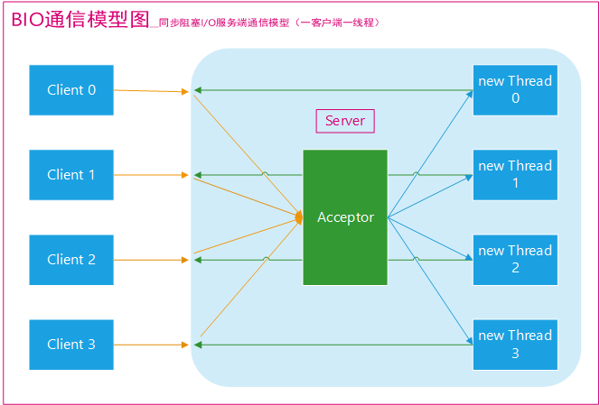

## 参考博文
[JavaGuide/docs/java/BIO-NIO-AIO.md](https://github.com/Snailclimb/JavaGuide/blob/master/docs/java/BIO-NIO-AIO.md)


[TOC]

# 1. Linux IO模型
[Linux五种IO模型](./Linux五种IO模型.md)

Java 中的 BIO、NIO和 AIO 理解为是 Java 语言对操作系统的各种 IO 模型的封装


# 2. BIO(一请求一应答通信模型)
同步阻塞I/O模式，数据的读取写入必须阻塞在一个线程内等待其完成

因为socket.accept()、socket.read()、socket.write()三个操作都是同步阻塞的，所以BIO为每一个客户端的socket请求都分配一个线程处理


可以使用线程池让线程的创建和回收成本相对较低，但是本质还是BIO





在活动连接数不是特别高（小于单机1000）的情况下，这种模型是比较不错的，可以让每一个连接专注于自己的 I/O 并且编程模型简单，也不用过多考虑系统的过载、限流等问题。线程池本身就是一个天然的漏斗，可以缓冲一些系统处理不了的连接或请求。但是，当面对十万甚至百万级连接的时候，传统的 BIO 模型是无能为力的。因此，我们需要一种更高效的 I/O 处理模型来应对更高的并发量

- 服务端
```java
package javaBase.socket;

import com.sun.security.ntlm.Server;

import java.io.IOException;
import java.net.ServerSocket;
import java.net.Socket;
import java.util.concurrent.ArrayBlockingQueue;
import java.util.concurrent.ThreadPoolExecutor;
import java.util.concurrent.TimeUnit;

/**
 * BIO客户端
 */
public class BIOServer {

    private static ThreadPoolExecutor executor = new ThreadPoolExecutor(10, 15, 10, TimeUnit.SECONDS, new ArrayBlockingQueue<Runnable>(10));

    public static void main(String[] args) throws IOException {
        ServerSocket serverSocket = new ServerSocket(2006);
        while (true) {
            Socket socket = serverSocket.accept();
            executor.execute(new ServerThread(socket));
        }
    }
}
/*
receive from client:hello2
*/
```

- socket连接封装成Runnable交给线程池
```java
package javaBase.socket;

import java.io.*;
import java.net.Socket;

/**
 * BIO线程任务
 */
public class ServerThread implements Runnable {

    private Socket socket;

    public ServerThread(Socket socket) {
        this.socket = socket;
    }

    @Override
    public void run() {
        try {
            OutputStream outputStream = socket.getOutputStream();
            InputStream inputStream = socket.getInputStream();

            PrintStream printStream = new PrintStream(outputStream);
            BufferedReader bufferedReader = new BufferedReader(new InputStreamReader(inputStream));

            boolean flag = true;
            while (flag) {
                String string = bufferedReader.readLine();
                if (string == null || "".equals(string) || "bye".equals(string)) {
                    flag = false;
                } else {
                    System.out.println("receive from client:" + string);
                    //告知客户端信息收到了
                    printStream.println("echo:" + string);
                }
            }

            printStream.close();
            socket.close();
        } catch (IOException e) {
            e.printStackTrace();
        }

    }
}
```

- 客户端
```java
package javaBase.socket;

import java.io.*;
import java.net.InetAddress;
import java.net.Socket;
import java.net.UnknownHostException;

/**
 * BIO客户端
 */
public class BIOClient {

    public static void main(String[] args) throws IOException {

        Socket socket = new Socket(InetAddress.getLocalHost().getHostAddress(), 2006);
        OutputStream outputStream = socket.getOutputStream();
        InputStream inputStream = socket.getInputStream();
        //获取键盘输入
        BufferedReader input = new BufferedReader(new InputStreamReader(System.in));
        PrintStream printStream = new PrintStream(outputStream);
        //接受服务端消息
        BufferedReader bufferedReader = new BufferedReader(new InputStreamReader(inputStream));

        boolean flag = true;
        while (flag) {
            String str = input.readLine();

            //发给服务端
            printStream.println(str);
            if ("bye".equals(str)) {
                flag = false;
            } else {
                String echo = bufferedReader.readLine();
                System.out.println(echo);
            }
        }
        input.close();
        if (socket != null) {
            socket.close();
        }

    }
}
/*
hello2
echo:hello2
*/
```


# 3. NIO(New IO、Non-blocking IO)
NIO是一种同步非阻塞的I/O模型，在Java 1.4 中引入了 NIO 框架，对应 java.nio 包，提供了 Channel , Selector，Buffer等抽象

客户端发送的连接请求都会注册到多路复用器上，多路复用器轮询到连接有I/O请求时才启动一个线程进行处理

多路复用器通过不断轮询各个连接的状态，只有在 socket 有流可读或者可写时，应用程序才需要去处理它，在线程的使用上，就不需要一个连接就必须使用一个处理线程了，而是只是有效请求时（确实需要进行 I/O 处理时），才会使用一个线程去处理，这样就避免了 BIO 模型下大量线程处于阻塞等待状态的情景

## 流和块 
- BIO以流为单位进行IO，每次都是一个字节一个字节的读写
- NIO将IO抽象成块，每次进行读写都以块为单位，块被读入内存之后就是一个byte[]，NIO一次可以读或写多个字节


## 通道Channel
Channel是对原来的I/O包中流的模拟，通过Channel来读取和写入数据。

- 流(InputStream、OutputStream)只能在一个方向上移动
- Channel是双向的，可以同时用于读写


通道包括以下类型:
```
FileChannel: 从文件中读写数据
DatagramChannel: 通过 UDP 读写网络中数据
SocketChannel: 通过 TCP 读写网络中数据
ServerSocketChannel: 可以监听新进来的 TCP 连接，对每一个新进来的连接都会创建一个 SocketChannel
```


## 缓冲区Buffer
读取数据不会直接对通道进行，而是先经过缓冲区。他的本质是一个数据，并提供了对数据的结构化访问，而且还可以跟踪系统的读/写进程

- 发送给一个通道的数据必须先放到缓冲区中
- 读取一个通道的数据必须先读到缓冲区中

缓冲区包括以下类型:
```
ByteBuffer
CharBuffer
ShortBuffer
IntBuffer
LongBuffer
FloatBuffer
DoubleBuffer
```


Buffer有3个状态变量：
```
capacity: 最大容量；
position: 当前已经读写的字节数；
limit: 还可以读写的字节数
```

① 新建一个大小为 8 个字节的缓冲区，此时 position 为 0，而 limit = capacity = 8。capacity 变量不会改变，下面的讨论会忽略它


② 从输入通道中读取 5 个字节数据写入缓冲区中，此时 position 移动设置为 5，limit 保持不变。


③ 在将缓冲区的数据写到输出通道之前，需要先调用 flip() 方法，这个方法将 limit 设置为当前 position，并将 position 设置为 0。


④ 从缓冲区中取 4 个字节到输出缓冲中，此时 position 设为 4。


⑤ 最后需要调用 clear() 方法来清空缓冲区，此时 position 和 limit 都被设置为最初位置。


## 选择器Selector
Selector用于采集各个通道的状态（或者说事件,先将通道注册到选择器，并设置好关心的事件，然后就可以通过调用select()方法，静静地等待事件发生


通道有如下4个事件可供我们监听：
```
Accept：有可以接受的连接
Connect：连接成功
Read：有数据可读
Write：可以写入数据了
```

对于BIO要为每一个连接分配一个线程，如果数据还在准备过程中，分配的线程就浪费了。对于非阻塞IO，轮询又会耗费CPU资源

所以通过Selector，线程只为已就绪的通道工作，不用盲目的重试了
```java
Selector selector = Selector.open();
channel.configureBlocking(false);
//如果你关心多个事件，用一个“按位或运算符”分隔:SelectionKey.OP_READ | SelectionKey.OP_WRITE
SelectionKey key = channel.register(selector, SelectionKey.OP_READ);
```


## 例子
- 服务端
```java

```


# 3. AIO