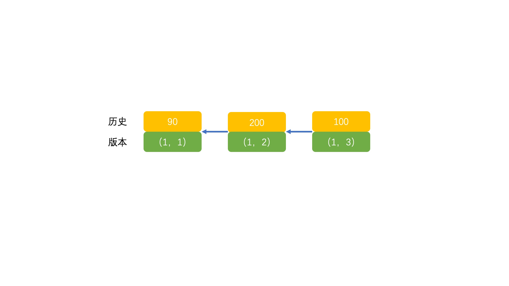

[TOC]
# MVCC多版本并发控制
保存数据库某时间的快照，一个事务从开始到结束读的内容都是一样的。做到不加锁也能处理读写冲突。行锁的变种。

通过3个隐式字段，undo日志，read view实现。
### 1.4.1 两种读
##### 1. 当前读
类似select in share mode(共享锁), select for update、update、insert、delete(排它锁)等都是当前读，读的都是最新的数据，读取时不允许其他事务更改数据。

##### 2. 快照读
类似普通select，在读取时不加锁。读到的不一定是最新数据，可能是历史数据。MVCC就是解决快照读的问题。

下面介绍InnoDB简化的MVCC实现：
1. 在每行记录后添加两个隐藏列，一列记录行的创建时间，一列记录行的删除时间。时间指的是系统版本号
2. 每开始一个新事务，系统版本号都加1，事务开始时的系统版本号作为对应事务的版本号。
3. 只在REPEATABLE READ和READ COMMITTED两个级别实现

- select

根据两个条件查找记录：

(1) 只返回创建系统版本号小于等于当前事务版本号的(确保读取的行出现在事务以前或被该事务操作过)

(2) 只返回删除系统版本号为undefined或者大于当前事务版本号的(确读取的行在事务开始前没被删除)

- insert

将当前系统版本号作为创建时间

- delete

将当前系统版本号作为删除时间

- update

update其实是插入新的一行，将当前系统版本号作为新行的创建时间以及作为旧行的删除时间

### 1.4.2 三个隐式字段
(1)DB_TRX_ID

最近修改事务ID：最后一次修改该记录的事务ID

(2)DB_ROLL_PTR

回滚指针：指向rollback segment(undo log)中上一个版本的地址

(3)DB_ROW_ID

隐藏的自增ID：如果数据表没有主键，InnodDB自动以DB_ROW_ID作为聚簇索引

举例：

1. 首先事务1插入一条记录

操作事务ID|name|age|DB_ROW_ID|DB_TRX_ID|DB_ROLL_PTR
---|---|---|---|---|---|
1|jerry|24|1|1|null

2. 事务2将名字修改为tom：首先事务2修改这行时，数据库会对该行加排它锁。然后将这行复制到undo log中。拷贝完毕后，修改name为tom，将DB_TRX_ID修改为2，将DB_ROLL_PTR指向复制到undo log中的拷贝记录。最后提交记录，释放锁。

操作事务ID|name|age|DB_ROW_ID|DB_TRX_ID|DB_ROLL_PTR
---|---|---|---|---|---|
2|tom|24|1|2|0x124465

undo log：
位置|name|age|DB_ROW_ID|DB_TRX_ID|DB_ROLL_PTR
---|---|---|---|---|---|
0x124465|tom|24|1|1|null

3. 事务3将年龄改为30：首先事务3修改这行时，数据库会对该行加排它锁。然后将这行复制到undo log中，发现这行记录已经有log了，就将这条log插入原有log的前面作为链头。拷贝完毕后，修改age为30，将DB_TRX_ID修改为3，将DB_ROLL_PTR指向复制到undo log中的拷贝记录。最后提交记录，释放锁。

操作事务ID|name|age|DB_ROW_ID|DB_TRX_ID|DB_ROLL_PTR
---|---|---|---|---|---|
3|tom|30|1|3|0x124469

undo log：同一记录的undo log会形成一个版本链表，最新的记录在表头
位置|name|age|DB_ROW_ID|DB_TRX_ID|DB_ROLL_PTR
---|---|---|---|---|---|
0x124469|tom|24|1|2|0x124465

位置|name|age|DB_ROW_ID|DB_TRX_ID|DB_ROLL_PTR
---|---|---|---|---|---|
0x124465|tom|24|1|1|null

### 1.4.3 read view(读视图)
read view是当某个事务执行快照读的时候，会生成数据库的当前快照，维护当前活跃的事务。将根据read view来判断事务能读到哪个版本的数据(可能是最新的，也可能是undo log里的)。判断方法是拿read view中被访问记录的DB_TRX_ID和read view中其他事务的事务ID作比较，如果满足可见性条件，就可以访问。如果不满足，则拿记录的DB_ROLL_PTR取undo log中取，直到满足可见性条件。

read view有四个字段：
```
1. m_ids：表示在生成ReadView时当前系统中活跃的读写事务的事务id列表。
2. min_trx_id：表示在生成ReadView时当前系统中活跃的读写事务中最小的事务id，也就是m_ids中的最小值。
3. max_trx_id：表示生成ReadView时系统中应该分配给下一个事务的id值。
4. creator_trx_id：表示生成该ReadView的事务的事务id。
```


1. 当要访问记录的最新DB_TRX_ID等于creator_trx_id，说明当前事务要访问被他最后一次修改过的记录，该版本记录可以被访问。
2. 当要访问记录的DB_TRX_ID小于min_trx_id，说明生成该版本的事务在当前事务创建前已经提交，该版本记录可以被访问。(DB_TRX_ID小于min_trx_id一定保证可以被访问，但是DB_TRX_ID大于min_trx_id的也有可能被访问，图中的指针不表示大小关系)
3. 当要访问记录的DB_TRX_ID大于max_trx_id，说明生成该版本的事务在当前事务创建后才开始，该版本记录可以被访问。(这种情况只适用于RC的情况)
4. 如果被访问记录的DB_TRX_ID介于min_trx_id和max_trx_id之间，如果DB_TRX_ID在m_ids列表中，表示生成该版本的事务还没有提交，不能访问；如果不在说明生成该版本的事务已经提交，可以被访问


举例：
初始值为(1,1),DB_TRX_ID为90
```
mysql> CREATE TABLE `t` (
  `id` int(11) NOT NULL,
  `k` int(11) DEFAULT NULL,
  PRIMARY KEY (`id`)
) ENGINE=InnoDB;
insert into t(id, k) values(1,1) ;
```
事务A 100|	事务B 200|
---|---|
begin|
&nbsp;|begin
&nbsp;|update t set k= k+1 where id=1;
&nbsp;|commit；
update t set k = k+1 where id=1;	|
select k from t where id =1;	|
commit;|

记录的版本号变化情况：


对于RR和RC两种情况，read view生成时间会有所不同
##### RC 每次读取数据都生成一次read view
```
# 使用READ COMMITTED隔离级别的事务
BEGIN;

# SELECT1：Transaction 100、200未提交
select k from t where id=1 ; # 得到值为1

这个SELECT1的执行过程如下：

1. 在执行SELECT语句时会先生成一个ReadView，ReadView的m_ids列表的内容就是[100, 200]，min_trx_id为100，max_trx_id为201，creator_trx_id为0。
2. 然后从版本链中挑选可见的记录，最新的版本trx_id值为100，在m_ids列表内，所以不符合可见性要求
3. 下一个版本的trx_id值也为200，也在m_ids列表内，所以也不符合要求，继续跳到下一个版本。
4. 下一个版本的trx_id值为90，小于ReadView中的min_trx_id值100，所以这个版本是符合要求的。
```
把事务B的事务提交一下，然后再到刚才使用READ COMMITTED隔离级别的事务中继续查找
```
# 使用READ COMMITTED隔离级别的事务
BEGIN;

# SELECT1：Transaction 100、200均未提交
SELECT * FROM hero WHERE number = 1; # 得到值为1

# SELECT2：Transaction 200提交，Transaction 100未提交
SELECT * FROM hero WHERE number = 1; # 得到值为2

这个SELECT2的执行过程如下：

1. 在执行SELECT语句时会又会单独生成一个ReadView，该ReadView的m_ids列表的内容就是[100]（事务id为200的那个事务已经提交了，所以再次生成快照时就没有它了），min_trx_id为100，max_trx_id为101，creator_trx_id为0。
2. 然后从版本链中挑选可见的记录，从图中可以看出，最新版本trx_id值为100，在m_ids列表内，所以不符合可见性要求
3. 下一个版本的trx_id值为200,小于max_trx_id，并且不在m_ids列表中，所以可见，返回的值为2
```
##### RR 在第一次读取数据时生成一个ReadView
```SQL
# 使用REPEATABLE READ隔离级别的事务
BEGIN;

# SELECT1：Transaction 100、200未提交
SELECT * FROM hero WHERE number = 1; # 得到值为1

这个SELECT1的执行过程如下：

1. 在执行SELECT语句时会先生成一个ReadView，ReadView的m_ids列表的内容就是[100, 200]，min_trx_id为100，max_trx_id为201，creator_trx_id为0。
2. 然后从版本链中挑选可见的记录，该版本的trx_id值为100，在m_ids列表内，所以不符合可见性要求
3. 下一个版本该版本的trx_id值为200，也在m_ids列表内，所以也不符合要求，继续跳到下一个版本。
4. 下一个版本的trx_id值为90，小于ReadView中的min_trx_id值100，所以这个版本是符合要求的。
```
之后，我们把事务B的事务提交一下
然后再到刚才使用REPEATABLE READ隔离级别的事务中继续查找:
```SQL
# 使用REPEATABLE READ隔离级别的事务
BEGIN;

# SELECT1：Transaction 100、200均未提交
SELECT * FROM hero WHERE number = 1; # 得到值为1

# SELECT2：Transaction 200提交，Transaction 100未提交
SELECT * FROM hero WHERE number = 1; # 得到值为1

这个SELECT2的执行过程如下：

1. 因为当前事务的隔离级别为REPEATABLE READ，而之前在执行SELECT1时已经生成过ReadView了，所以此时直接复用之前的ReadView，之前的ReadView的m_ids列表的内容就是[100, 200]，min_trx_id为100，max_trx_id为201，creator_trx_id为0。
2. 然后从版本链中挑选可见的记录，该版本的trx_id值为100，在m_ids列表内，所以不符合可见性要求
3. 下一个版本该版本的trx_id值为200，也在m_ids列表内，所以也不符合要求，继续跳到下一个版本。
4. 下一个版本的trx_id值为90，小于ReadView中的min_trx_id值100，所以这个版本是符合要求的。
```

==**MVCC不能阻止RR的完全幻读**==
```SQL
# 事务T1，REPEATABLE READ隔离级别下
mysql> BEGIN;
Query OK, 0 rows affected (0.00 sec)

mysql> SELECT * FROM hero WHERE number = 30;
Empty set (0.01 sec)

# 此时事务T2执行了：INSERT INTO hero VALUES(30, 'g关羽', '魏'); 并提交

mysql> UPDATE hero SET country = '蜀' WHERE number = 30;
Query OK, 1 row affected (0.01 sec)
Rows matched: 1  Changed: 1  Warnings: 0

mysql> SELECT * FROM hero WHERE number = 30;
+--------+---------+---------+
| number | name    | country |
+--------+---------+---------+
|     30 | g关羽   | 蜀      |
+--------+---------+---------+
1 row in set (0.01 sec)
```
在RR下T1第一次select生成一个read view，查询number=30的记录为empty set，然后T2插入了number=30的记录并提交，然后T1顺势update了这条记录，然后这条记录的DB_TRX_ID就变成了T1。然后T1再次select，就查询到了number=30的记录，产生幻读。
