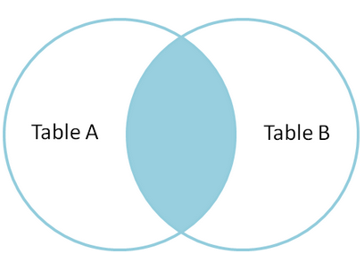
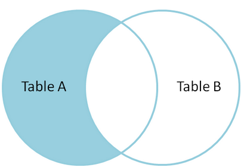
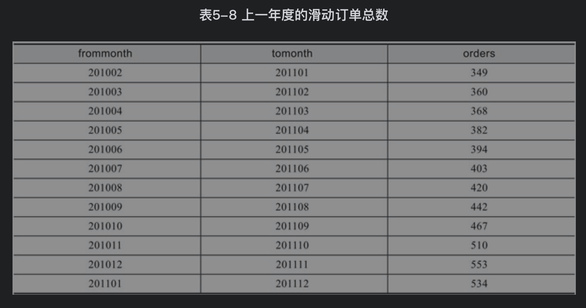

## 参考博文
[MySQL中的各种join](http://wxb.github.io/2016/12/15/MySQL%E4%B8%AD%E7%9A%84%E5%90%84%E7%A7%8Djoin.html)
[Mysql Join语法解析与性能分析](https://www.cnblogs.com/beginman/p/3754322.html)
[关于 MySQL LEFT JOIN 你可能需要了解的三点](https://www.oschina.net/question/89964_65912)

[TOC]

```SQL
mysql> select A.id,A.name,B.name from A,B where A.id=B.id;
+----+-----------+-------------+
| id | name       | name             |
+----+-----------+-------------+
|  1 | Pirate       | Rutabaga      |
|  2 | Monkey    | Pirate            |
|  3 | Ninja         | Darth Vader |
|  4 | Spaghetti  | Ninja             |
+----+-----------+-------------+
4 rows in set (0.00 sec)
```

# 内连接
inner join | join：返回满足on的列条件的行，只筛选两个表同时满足条件的行。指定过滤条件在ON子句和WHERE子句中是没有任何区别的

如果INNER JOIN后不跟ON子句，也是可以通过语法解析器的，这时INNER JOIN等于CROSS JOIN，即产生笛卡儿积

```SQL
mysql> select * from A inner join B on A.name = B.name;
+----+--------+----+--------+
| id | name   | id | name   |
+----+--------+----+--------+
|  1 | Pirate |  2 | Pirate |
|  3 | Ninja  |  4 | Ninja  |
+----+--------+----+--------+
```
以下三个语句等价：
```SQL
select a.emp_no,first_name,last_name 
from employees a
[inner] join dept_manager b
on a.emp_no=b.emp_no
where dept_no='1001';

select a.emp_no,first_name,last_name 
from employees a
[inner] join dept_manager b
on a.emp_no=b.emp_no
and dept_no='1001';

select a.emp_no,first_name,last_name 
from employees a，dept_manager b
where a.emp_no=b.emp_no and dept_no='1001';

//如果ON子句中的列具有相同的名称，可以使用USING子句来进行简化
select a.emp_no,first_name,last_name 
from employees a
[inner] join dept_manager b
using(emp_no)
where dept_no='1001';
```

# 外连接
## 左外连接
left join | left outer join：返回左表所有行，右表满足条件的行，右表不满足条件的返回null

和内连接不同的是，外连接必须指定on语句


```SQL
mysql> select * from A left join B on A.name = B.name;
#或者：select * from A left outer join B on A.name = B.name;

+----+-----------+------+--------+
| id | name      | id   | name   |
+----+-----------+------+--------+
|  1 | Pirate    |    2 | Pirate |
|  2 | Monkey    | NULL | NULL   |
|  3 | Ninja     |    4 | Ninja  |
|  4 | Spaghetti | NULL | NULL   |
+----+-----------+------+--------+
4 rows in set (0.00 sec)
```
使用where从A中筛选出不包含B的记录：

```SQL
mysql> select * from A left join B on A.name=B.name where A.id is null or B.id is null;
+----+-----------+------+------+
| id | name      | id   | name |
+----+-----------+------+------+
|  2 | Monkey    | NULL | NULL |
|  4 | Spaghetti | NULL | NULL |
+----+-----------+------+------+
2 rows in set (0.00 sec)
```
使用左外连接实现内连接
```SQL
mysql> select * from A left join B on A.name=B.name where A.id is not null and B.id is not null;
+----+--------+------+--------+
| id | name   | id   | name   |
+----+--------+------+--------+
|  1 | Pirate |    2 | Pirate |
|  3 | Ninja  |    4 | Ninja  |
+----+--------+------+--------+
2 rows in set (0.00 sec)
```

使用外连接解决最小确实值的问题
```SQL
//1,2,3,5,6,7,9
select min(x.a+1)
from num x
left join num y
on x.a+1=y.a
where y.a is null;
```
## 右外连接
right join | right outer join：返回右表所有行，左表满足条件的行，左表不满足条件的返回null
```SQL
mysql> select * from A right join B on A.name = B.name;
+------+--------+----+-------------+
| id   | name   | id | name        |
+------+--------+----+-------------+
| NULL | NULL   |  1 | Rutabaga    |
|    1 | Pirate |  2 | Pirate      |
| NULL | NULL   |  3 | Darth Vader |
|    3 | Ninja  |  4 | Ninja       |
+------+--------+----+-------------+
4 rows in set (0.00 sec)
```

# 自然连接
自然连接默认的对两表中相同的列进行匹配，就是对外连接和内连接省去了自己指定on条件
```SQL
select a.emp_no,first_name,last_name 
from employees a
[inner] join dept_manager b
on a.emp_no=b.emp_no

//以下等价
select a.emp_no,first_name,last_name 
from employees a
natural join dept_manager b
```

# STRAIGHT_JOIN
 STRAIGHT_JOIN会强制先读取左边的表作为驱动表
 ```SQL
select a.emp_no,first_name,last_name 
from employees a
[inner] join dept_manager b
on a.emp_no=b.emp_no
 ```
 explain结果看到先读取表b，然后再去匹配表a
 

```SQL
select a.emp_no,first_name,last_name 
from employees a
straight join dept_manager b
on a.emp_no=b.emp_no
```


# 笛卡尔积
cross join：得到两个表的乘积。若左表有m行数据，右表有n行数据，则CROSS JOIN将返回m*n行的表

inner join 不指定on得到的结果和cross join相同
```SQL
mysql> select * from A cross join B;
+----+-----------+----+-------------+
| id | name      | id | name        |
+----+-----------+----+-------------+
|  1 | Pirate    |  1 | Rutabaga    |
|  2 | Monkey    |  1 | Rutabaga    |
|  3 | Ninja     |  1 | Rutabaga    |
|  4 | Spaghetti |  1 | Rutabaga    |
|  1 | Pirate    |  2 | Pirate      |
|  2 | Monkey    |  2 | Pirate      |
|  3 | Ninja     |  2 | Pirate      |
|  4 | Spaghetti |  2 | Pirate      |
|  1 | Pirate    |  3 | Darth Vader |
|  2 | Monkey    |  3 | Darth Vader |
|  3 | Ninja     |  3 | Darth Vader |
|  4 | Spaghetti |  3 | Darth Vader |
|  1 | Pirate    |  4 | Ninja       |
|  2 | Monkey    |  4 | Ninja       |
|  3 | Ninja     |  4 | Ninja       |
|  4 | Spaghetti |  4 | Ninja       |
+----+-----------+----+-------------+
16 rows in set (0.00 sec)
```
CROSS JOIN的一个用处是快速生成重复测试数据

CROSS JOIN的另一个用处是可以作为返回结果集的行号
方法一：
```SQL
select emp_no,dept_no 
(select count(1) from dept_emp t2 where t2.emp_no<=t1.emp_no) as row_num from dept_emp t1;
```
可以看到首先会扫描t1得到全部数据，然后将每行数据和t2联接查询，对每行数据都要执行一次t2子查询的扫描操作


方法二：使用只有一行数据的表和dept_emp进行笛卡尔积，1*N=N
```SQL
select emp_no,dept_no,@a:=@a+1 as row_numm
from dept_emp,(select @a:=0) as t;
```


# on VS where
```SQL
mysql> CREATE TABLE `product` (
  `id` int(10) unsigned NOT NULL auto_increment,
  `amount` int(10) unsigned default NULL,
  PRIMARY KEY  (`id`)
) ENGINE=MyISAM AUTO_INCREMENT=5 DEFAULT CHARSET=latin1
 
mysql> CREATE TABLE `product_details` (
  `id` int(10) unsigned NOT NULL,
  `weight` int(10) unsigned default NULL,
  `exist` int(10) unsigned default NULL,
  PRIMARY KEY  (`id`)
) ENGINE=MyISAM DEFAULT CHARSET=latin1
 
mysql> INSERT INTO product (id,amount)
       VALUES (1,100),(2,200),(3,300),(4,400);
Query OK, 4 rows affected (0.00 sec)
Records: 4  Duplicates: 0  Warnings: 0
 
mysql> INSERT INTO product_details (id,weight,exist)
       VALUES (2,22,0),(4,44,1),(5,55,0),(6,66,1);
Query OK, 4 rows affected (0.00 sec)
Records: 4  Duplicates: 0  Warnings: 0
 
mysql> SELECT * FROM product;
+----+--------+
| id | amount |
+----+--------+
|  1 |    100 |
|  2 |    200 |
|  3 |    300 |
|  4 |    400 |
+----+--------+
4 rows in set (0.00 sec)
 
mysql> SELECT * FROM product_details;
+----+--------+-------+
| id | weight | exist |
+----+--------+-------+
|  2 |     22 |     0 |
|  4 |     44 |     1 |
|  5 |     55 |     0 |
|  6 |     66 |     1 |
+----+--------+-------+
4 rows in set (0.00 sec)
 
mysql> SELECT * FROM product LEFT JOIN product_details
       ON (product.id = product_details.id);
+----+--------+------+--------+-------+
| id | amount | id   | weight | exist |
+----+--------+------+--------+-------+
|  1 |    100 | NULL |   NULL |  NULL |
|  2 |    200 |    2 |     22 |     0 |
|  3 |    300 | NULL |   NULL |  NULL |
|  4 |    400 |    4 |     44 |     1 |
+----+--------+------+--------+-------+
4 rows in set (0.00 sec)
```
A left join B on中的on用于在B中检索出满足条件的行，如果B中没有满足条件的，将额外生成全为null的。检索出所有的行后，再去对行根据where条件进行过滤

on条件和where条件的不同:on条件对不满足条件的右表返回null，where则过滤不满足条件的

但对于inner join，on和where没区别
```SQL
mysql> SELECT * FROM product LEFT JOIN product_details
       ON (product.id = product_details.id)
       AND product_details.id=2;
+----+--------+------+--------+-------+
| id | amount | id   | weight | exist |
+----+--------+------+--------+-------+
|  1 |    100 | NULL |   NULL |  NULL |
|  2 |    200 |    2 |     22 |     0 |
|  3 |    300 | NULL |   NULL |  NULL |
|  4 |    400 | NULL |   NULL |  NULL |
+----+--------+------+--------+-------+
4 rows in set (0.00 sec)

mysql> SELECT * FROM product LEFT JOIN product_details
       ON (product.id = product_details.id)
       WHERE product_details.id=2;
+----+--------+----+--------+-------+
| id | amount | id | weight | exist |
+----+--------+----+--------+-------+
|  2 |    200 |  2 |     22 |     0 |
+----+--------+----+--------+-------+
1 row in set (0.01 sec)
```

# semi join
使用两个表的字段进行条件连接，但是只返回一个表的数据。返回左表的数据叫左半semi join,返回右表的数据叫右半semi join。

通常用在in和exists关键字中，

# 滑动订单问题
滑动订单问题是指为每个月返回上一年度（季度或月度等）的滑动订单数，即为每个月份N，返回从月份N-11到月份N的订单总数


每个月返回上一年度的滑动订单总数
```SQL
select date_format(a.ordermonth,'%Y%m') as frommonth,date_format(b.ordermonth,'%Y%m') as tomonth,sum(c.ordernum) as orders
from monthlyorders a 
inner join monthlyorders b on date_add(a.ordermonth,interval 11 month)=b.ordermonth
inner join monthlyorders c on c.ordermonth between a.ordermonth and b.ordermonth
group by a.ordermonth,b.ordermonth;
```



# 性能分析
TODO

