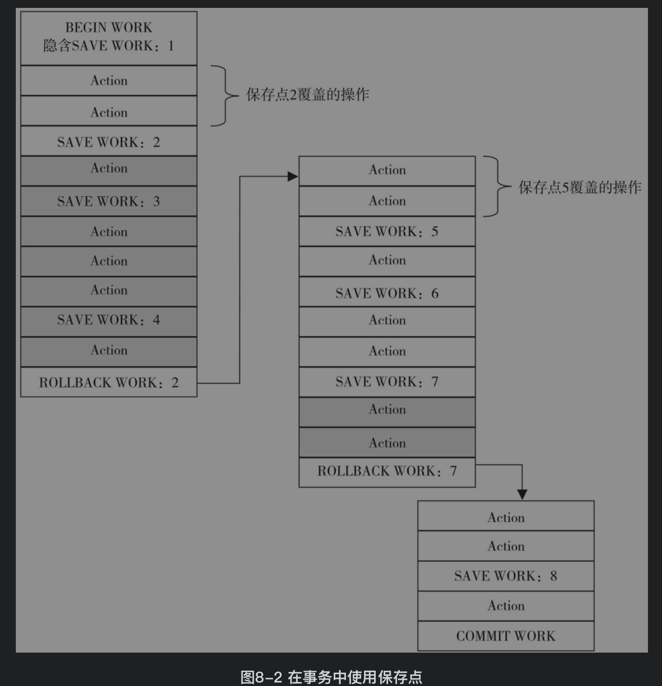
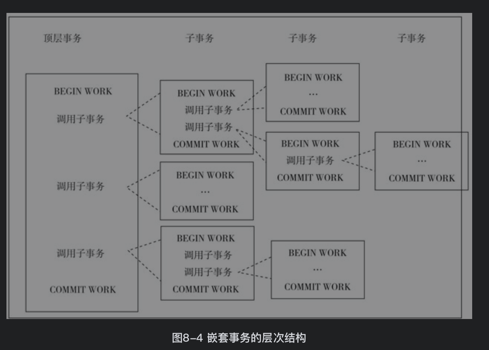

[TOC]

# 事务特性
1. 原子性(atomicicy)

一个事务中的操作要么都成功，要么都失败

2. 一致性(consistency)

数据库总是从一个一致性状态转移到另一个一致性状态。在事务开始之前和事务结束以后，数据库的完整性约束没有被破坏。如果表中有一个唯一性的字段，那么在事务提交或回滚之后，这个字段仍然不能出现重复记录

3. 隔离性(isolation)

[又叫并发控制（concurrencycontrol）、可串行化（serializability）、锁（locking)]

一个事务在提交之前，他所做的更改不会被其他事务看见

4. 持久性(durability)

一个事务提交了更改，如果数据库崩溃了，更改也不会丢失

# 事务分类
## 1. 扁平事务（flat transactions）
最基本的事务，事务中的所有操作处于同一层次，要么都做要么都不做。
它的缺点是不能提交或回滚事务中的某一部分。例如用户在旅行网站上制订自己的旅行度假计划。
当用户执行到S3时，发现由于飞机到达米兰的时间太晚，当天已经没有开往佛罗伦萨的火车。这时用户希望在米兰当地住一晚，第二天出发去佛罗伦萨。如果是扁平事务，需要回滚S1,S2,S3代价很大，需要带有保存点的扁平事务
```
BEGIN WORK
S1：预订杭州到上海的高铁
S2：上海浦东国际机场坐飞机，预订去米兰的航班
S3：在米兰转火车前往佛罗伦萨，预订去佛罗伦萨的火车
```
对于扁平事务来说，其隐式地设置了一个保存点，但是在整个事务中，只有这一个保存点，回滚只能回滚到事务开始时的状态

## 2. 带有保存点的扁平事务（flat transactions with savepoints）
保存点记录事务的某个状态，当发生错误时可以通过保存点回滚到某个状态而不是全部回滚，因为有些错误的发生并不会影响所有操作，无需全部回滚。保存点用SAVE WORK函数来建立

灰色部分是rollback work导致的回滚，没有实际执行。当执行到rollback work2时，事务会一步步回滚到save work2处，然后再执行之后本应该做的操作。再执行到save work7处。直到执行最后的COMMIT WORK操作
保存点在事务内部是递增的，即使回滚了也不影响保存点的计数


但是保存点是非持久的，当系统崩溃时所有保存点都会丢失，需要链事务

## 3. 链事务（chained transactions）
在提交一个事务时，释放不需要的数据对象，将必要的处理上下文隐式地传给下一个要开始的事务。注意，提交事务操作和开始下一个事务操作将合并为一个原子操作。这意味着下一个事务将看到上一个事务的结果，就好像在一个事务中进行的

链事务会回滚到最近的一个保存点,即这个事务开始前的样子


## 4. 嵌套事务（nested transactions）
有一个顶层事务（top-level transaction）控制着各个层次的事务。顶层事务之下嵌套的事务被称为子事务（subtransaction），其控制每一个局部的变换


嵌套事务的子事务既可以是嵌套事务也可以是扁平事务

处于叶子节点的事务是扁平事务。实际的数据访问工作都由叶子事务完成，其他事务都负责逻辑控制

任何子事务的提交都是在父事务提交后才真正提交。这就意味着所有事务都在顶层事务提交后才真正提交

任一事务的回滚都会导致他的所有子事务回滚


## 5. 分布式事务（distributed transactions）
[分布式事务](./分布式事务.md)

# 事务控制语句
## 自动提交
当autocommit=1 每个查询都被当做一个事务执行。但对MyISAM这种非事务型表不会有影响，对InnoDB这种事务型数据库才有作用。
MySQL默认事务都是自动提交的，每个SQL语句执行完之后就自动提交。要显式地开启一个事务须使用命令BEGIN和STARTTRANSACTION

当autocommit=0 所有查询都在一个事务中执行，直到显示执行commit或者rollback，才开启下一个事务。

以下这些SQL语句会产生一个隐式的提交操作，即执行完这些语句后，会有一个隐式的COMMIT操作

```
mysql> show variables like 'autocommit';
//1=ON;0=OFF;
mysql> set autocommit = 1;
```
```
//改变数据库的隔离级别，session只改变当前会话的隔离级别
mysql> set (session) transaction isolation level read committed;
```

## 事务语句
1. start transaction|begin：显示开始一个事务。在存储过程中只能使用START TRANSACTION，因为MySQL数据库的分析器会自动将BEGIN识别为BEGIN ... END
2. commit[work]：提交事务。当参数completion_type的值为0时，commit和commit work相同；当参数completion_type的值为1时，COMMIT WORK等同于COMMIT AND CHAIN，表示事务变成了链事务，马上自动开启一个相同隔离级别的事；当参数completion_type为2时，COMMIT WORK等同于COMMIT AND RELEASE。当事务提交后会自动断开与服务器的连接
3. rollback[work]：回滚事务
4. SAVEPOINT identifier：在事务中创建一个保存点
5. RELEASE SAVEPOINT identifier：删除一个保存点。当保存点不存在时会抛出异常
6. ROLLBACK TO [SAVEPOINT] identifier：将事务回滚到保存点的位置。并没有真的结束一个事务，之后也需要显式地运行COMMIT或ROLLBACK命令
7. SET TRANSACTION：设置事务隔离级别

```SQL
mysql> create table t1(a int primary key);
Query OK, 0 rows affected (0.01 sec)

mysql> set @@completion_type=1;
Query OK, 0 rows affected (0.00 sec)

mysql> begin;
Query OK, 0 rows affected (0.00 sec)

mysql> insert into t1 select 1;
Query OK, 1 row affected (0.00 sec)
Records: 1  Duplicates: 0  Warnings: 0

mysql> commit work;
Query OK, 0 rows affected (0.01 sec)

mysql> insert into t1 select 2;
Query OK, 1 row affected (0.00 sec)
Records: 1  Duplicates: 0  Warnings: 0

mysql> insert into t1 select 2;
ERROR 1062 (23000): Duplicate entry '2' for key 'PRIMARY'
mysql> rollback;
Query OK, 0 rows affected (0.00 sec)

mysql> select * from t1;
+---+
| a |
+---+
| 1 |
+---+
1 row in set (0.00 sec)
```


# 隔离级别
在存储引擎层面实现的
1. READ UNCOMMITTED(未提交读)

指的是事务能看见其他事务还未提交的修改，容易导致脏读
2. READ COMMITTED(提交读)

指的是事务只能看见其他事务已经提交的修改，满足了事务隔离性的定义，容易导致不可重复读(一个事务两次查询读到的数据不一致)
3. REPEATABLE READ(可重复读)

一个事务两次查询的结果一样，InnoDB的默认隔离级别。因为MVCC的实现。
4. SERIALIZABLE(可串行化)

强制使所有事务串行执行，在读取的每一行上加锁，解决幻读的问题(事务A在读，事务B插入一行，事务A再次读发现多了一行)

ANSI SQL隔离级别：
隔离级别|脏读可能性|不可重复读可能性|幻读可能性|加锁读|
---|---|---|---|---|
未提交读|yes|yes|yes|no|
提交读|no|yes|yes|no
可重复读|no|no|yes|no
可串行化|no|no|no|yes

在InnoDB存储引擎中，可以使用以下命令来设置当前会话或全局的事务隔离级别
```SQL
SET [GLOBAL | SESSION] TRANSACTION ISOLATION LEVEL {READ UNCOMMITTED| READ COMMITTED| REPEATABLE READ| SERIALIZABLE}
```

如果想在MySQL库启动时就设置事务的默认隔离级别，那就需要修改MySQL的配置文件(my.cnf)，在[mysqld]中添加如下行
```SQL
[mysqld]
transaction-isolation = READ-COMMITTED
```

查看全局的事务隔离级别，可以使用：
```SQL
mysql> select @@global.tx_isolation;
+-----------------------+
| @@global.tx_isolation |
+-----------------------+
| REPEATABLE-READ       |
+-----------------------+
1 row in set, 1 warning (0.00 sec)
```

# 死锁

两个或多个资源同时占有资源，并且请求对方的资源。

由存储引擎自己决定如何处理：死锁检测和死锁超时机制


# 事务日志
当修改数据时，经历以下过程(预写式日志)：
1. 修改缓存中的数据
2. 将修改行为记录到硬盘中的事务日志，事务日志的写入采用追加写的方式
3. 硬盘中的数据根据事务日志慢慢的修改

即使在执行第3步前，系统崩溃了，重新启动后还是能根据第2步中的事务日志继续修改


# 两阶段锁定协议
一个事务中分为加锁阶段和解锁阶段：加锁阶段能加锁、操作数据，但不能解锁；解锁阶段能解锁、操作数据，但不能加锁。

InnoDB实现两阶段锁定协议：在事务开始执行过程中能随意加锁，当事务commit、rollback后一次性释放所有锁。

对于InnoDB，如果自己显示定义了事务，那么他会先把autocommit给关了，只有我们自己commit了才会提交事务

- 性能分析
```
方案1:
begin;
// 扣减库存
update t_inventory set count=count-5 where id=${id} and count >= 5;
// 锁住用户账户表
select * from t_user_account where user_id=123 for update;
// 插入订单记录
insert into t_trans;
commit;
```
```
方案2:
begin;
// 锁住用户账户表
select * from t_user_account where user_id=123 for update;
// 插入订单记录
insert into t_trans;
// 扣减库存
update t_inventory set count=count-5 where id=${id} and count >= 5;
commit;
```
两者锁库存时间都为update到commit，但是方案1的时间比方案2更长，并发性更差。因此越热点的记录应放到事务的后面

---
```SQL
方案1：
 begin:
 int count = select count from t_inventory for update;
 if count >= 5:
 	update t_inventory set count=count-5 where id =123
 	commit 
 else
 	rollback
```
```SQL
方案2：
 begin:
 	int rows = update t_inventory set count=count-5 where id =123 and count >=5
	if rows > 0:
		commit;
	ele 
		rollback;
```
方案1在select for update就加锁，经历了update和commit才释放；方案2在update加锁，经历commit就释放，性能更好

# 不好的事务编程习惯
## 1. 在循环中提交
因为InnoDB的自动提交，在while循环中的insert每次都会自动提交。那么当执行到一半时出错就不好处理
```SQL
CREATE PROCEDURE load2(count INT UNSIGNED)
BEGIN
DECLARE s INT UNSIGNED DEFAULT 1;
DECLARE c CHAR(80) DEFAULT REPEAT('a',80);
WHILE s <= count DO
INSERT INTO t1 SELECT NULL,c;
SET s = s+1;
END WHILE;
END;
```
应该将所有的INSERT都放在一个事务中，一次提交
```SQL
create procedure load3(count int unsigned)
begin
declare s int unsigned default 1;
declare c char(80) default repeat('a',80);
start transaction;
while s<=count do
INSERT INTO t1 SELECT NULL,c;
SET s = s+1;
END WHILE;
commit;
end;
```
或者在调用时将存储过程显示放入一个事务中
```SQL
begin;
call load2(1000);
commit;
```

# 长事务
长事务就是需要执行时间较长的事务