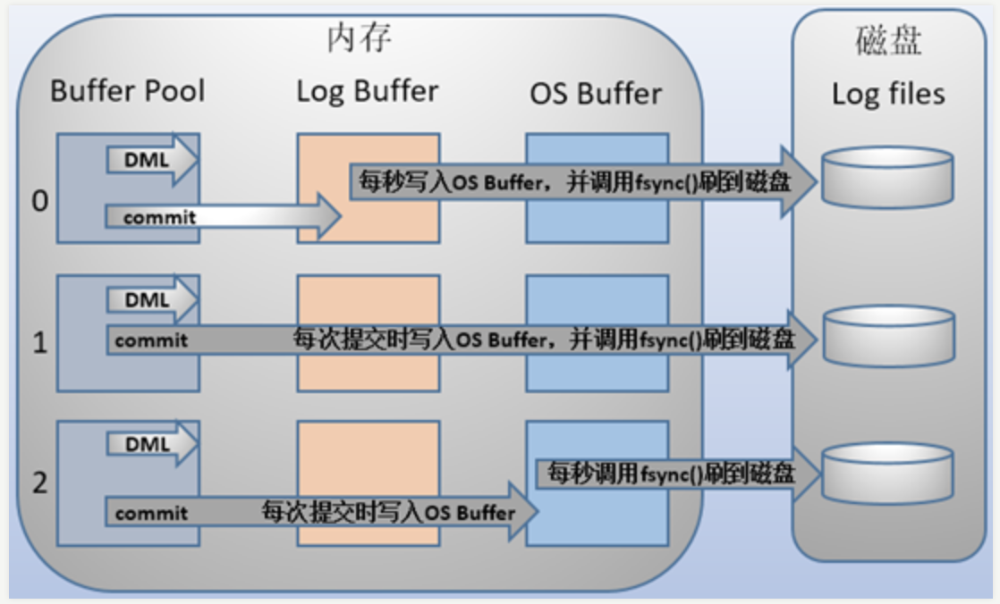

## 参考博文
[详细分析MySQL事务日志(redo log和undo log)](https://www.cnblogs.com/f-ck-need-u/archive/2018/05/08/9010872.html)
[MySQL日志查看详解](https://www.cnblogs.com/mungerz/p/10442791.html)
[详细分析MySQL的日志(一)](https://www.cnblogs.com/f-ck-need-u/p/9001061.html#blog5)

[TOC]

# MySQL服务层日志
## 1. 错误日志
错误日志默认开启且不能被关闭

错误日志文件通常的名称为hostname.err（hostname表示服务器的主机名）

错误日志记录信息：服务器启动关闭信息、运行错误信息、时间调度器运行一个事件时产生的信息、在服务器上启动进程产生的信息。

```SQL
mysql> show variables like 'log_error%';
+---------------------+----------------------------------------+
| Variable_name       | Value                                  |
+---------------------+----------------------------------------+
| log_error           | /usr/local/mysql/data/mysqld.local.err |
| log_error_verbosity | 3                                      |
+---------------------+----------------------------------------+
2 rows in set (0.00 sec)
```

## 2. 查询日志
用来记录未超过指定时间的查询。默认关闭，会记录用户所有操作，性能消耗太大.

## 3. 慢查询日志
[服务器性能剖析](./服务器性能剖析.md)

用来记录执行时间超过指定时间的查询语句


## 4. 二进制日志
[复制](./复制.md)

二进制日志也叫作变更日志，主要用于记录修改数据或有可能引起数据改变的mysql语句，以每个语句为单位而不是以事务为单位。并且记录了语句发生时间、执行时长、操作的数据等等。不会包括select和show这样的查询语句。
所以说通过二进制日志可以查询mysql数据库中进行了哪些变化。一般大小体积上限为1G

### 写入时间
对于事务表，二进制日志对每个查询的记录都先写入缓存，在事务提交前一次性写入磁盘。
对于非事务表，二进制日志对每个查询的记录在语句执行完后就写入磁盘。

### 记录格式
1. 基于行

2. 基于语句


# 存储引擎层日志(只有InnoDB有)
## 5. 事务日志
### redo log重做日志：修改后的数据
redo log 记录的是数据物理页的修改(而不是像二进制一样记录具体被修改的数据)，同一事务中对一个记录的多次修改只记录最后一个版本

redo log包含两部分：
1）内存中的日志缓冲(redo log buffer):易失性
2）磁盘上的重做日志文件(redo log file):持久的

写入缓存时间：
在语句执行前，会将修改后的数据记录在redo log buffer中

写入磁盘时间：通过innodb_flush_log_at_trx_commit的值可以自定义什么时候将redo log buffer的数据写入磁盘中：
>当值为0：不在事务提交前写入，而是每秒将redo log buffer中的数据写入os buffer中并调用fsync()刷到redo log file中

>当值为1：事务每次提交前都将redo log buffer中的数据写入os buffer中并调用fsync()刷到redo log file中

>当值为2：事务每次提交，将redo log buffer中的数据写入os buffer中，并每秒调用fsync()刷到redo log file中

