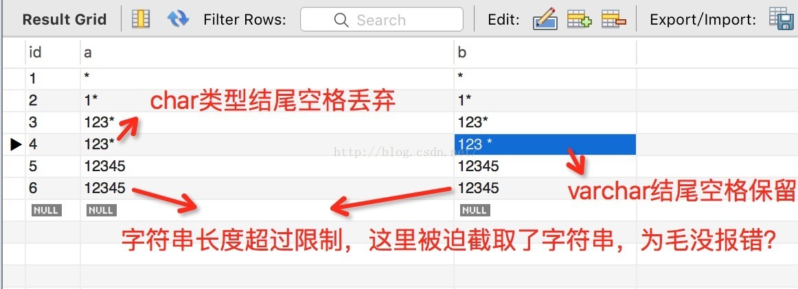

## 参考博文
[MySQL中数据类型介绍](https://blog.csdn.net/bzhxuexi/article/details/43700435)
[MySQL数据类型--浮点数类型和定点数类型](https://blog.csdn.net/u011794238/article/details/50902405)
[MySQL数据类型--字符串类型](https://blog.csdn.net/u011794238/article/details/50953414)
[MySQL中文文档](https://www.docs4dev.com/docs/zh/mysql/5.7/reference/blob.html)
[MySQL 中 datetime 和 timestamp 的区别与选择](https://segmentfault.com/a/1190000017393602)

[TOC]


# 1. 数据类型优化
## 1.1 整数类型
bool = tinyint(1)

可以存储的范围值从-2^(N-1)^ ~ 2^(N-1)^-1 (N是存储的位数)

为整数类型指定宽度，例如int(11)没有实际意义，他只限制了客户端工具显示整数的个数，对存储和计算来说没有区别

## 1.2 实数类型
decmial只是一种存储格式，cpu并不支持decmial计算，需求MYSQL服务器自行实现decmial。计算中decimal会转为double，需要额外的存储空间和计算开销，只有在需要精确计算时才使用。

decimal(18,9)表示小数点左右两边相加最大可以存18位数字，右边小数位最多可以存9位数字。小数精度超过限制的会四舍五入。float和double同规则

类型	|字节数(byte)
---|---|
FLOAT	|4
DOUBLE	|8
DECIMAL	|每9位数据占用4byte，小数点本身1byte，decimal(18,9)占用4+1+4=9byte
## 1.3 字符串类型
### char VS varchar


```SQL
CREATE TABLE `linkinframe`.`test` (
  `id` INT NOT NULL,
  `a` CHAR(5) NULL,
  `b` VARCHAR(5) NULL,
  PRIMARY KEY (`id`));

  INSERT INTO `linkinframe`.`test` (`id`, `a`, `b`) VALUES ('1','','');
INSERT INTO `linkinframe`.`test` (`id`, `a`, `b`) VALUES ('2','1','1');
INSERT INTO `linkinframe`.`test` (`id`, `a`, `b`) VALUES ('3','123','123');
INSERT INTO `linkinframe`.`test` (`id`, `a`, `b`) VALUES ('4','123 ','123 ');
INSERT INTO `linkinframe`.`test` (`id`, `a`, `b`) VALUES ('5','12345','12345');
//超过长度会被截断
INSERT INTO `linkinframe`.`test` (`id`, `a`, `b`) VALUES ('6','1234567','1234567');
```


MySQL数据类型	|含义|其他
---|---|---|
char(n)	|固定长度，最多255个字符|定义多长使用多长,删除末尾空格，适合经常更新
varchar(n)|	可变长度，最多65535个字符|仅使用必要的空间，保留末尾空格，适合列更新少

### blob vs text
blob家族用于采用二进制存储字符串，不区分大小写，存储的数据只能整体读出

text家族采用字符方式存储字符串，区分大小写

两者对超过长度的值会进行截断，不能对blob和text列的全部长度进行索引，必须指定索引前缀长度
MySQL数据类型	|含义|其他
---|---|---|
tinytext	|可变长度，最多255个字符
text	|可变长度，最多65535个字符
mediumtext	|可变长度，最多2的24次方-1个字符
longtext	|可变长度，最多2的32次方-1个字符

MySQL数据类型	|含义|其他
---|---|---|
tinyblob	|
blob	|
mediumblob	|
longblob	|

### 枚举enum
将不重复的字符串存储成一个预定义的集合

MySQL存储枚举很紧凑，会将列表值压缩到1-2个字节中，保存每个值在列表中的位置(从1开始)，并在表的.frm文件中存储"数字-字符串"的映射关系

枚举的字符串列表是固定的，添加或者删除字符串都必须alter table，如果未来字符串会改变则不适合使用enum

例子：
```SQL
CREATE TABLE shirts (
    name VARCHAR(40),
    //枚举 value 必须是带引号的 string 文字
    size ENUM('x-small', 'small', 'medium', 'large', 'x-large')
);
INSERT INTO shirts (name, size) VALUES ('dress shirt','large'), ('t-shirt','medium'),
  ('polo shirt','small');
SELECT name, size FROM shirts WHERE size = 'medium';
+---------+--------+
| name    | size   |
+---------+--------+
| t-shirt | medium |
+---------+--------+
UPDATE shirts SET size = 'small' WHERE size = 'large';
COMMIT;
```
如果插入数字，那么该数字将被解释成位置；如果插入字符串的数字，并且和枚举中的数字匹配上，那么就插入该值，否则会被解释成索引：
```SQL
//原本的枚举中有'0','1','2'
mysql> INSERT INTO t (numbers) VALUES(2),('2'),('3');
mysql> SELECT * FROM t;
//如果 store 2，则将其解释为索引 value，并变为'1'(索引为 2 的 value)。
//如果 store '2'，它匹配枚举 value，所以它存储为'2'。
//如果store '3'，它不匹配任何枚举 value，因此它被视为索引并变为'2'(索引为 3 的 value)。
+---------+
| numbers |
+---------+
| 1       |
| 2       |
| 2       |
+---------+
```
## 1.4 日期和时间类型
| 类型 | 占据字节 | 表示形式 | 时区 | 表示范围 | 默认值 |
| :--- | :--- | :--- | :--- | :--- | :--- |
| datetime | 8 字节 | yyyy-mm-dd hh:mm:ss | 与时区无关，不会根据当前时区进行转换 | '1000-01-01 00:00:00.000000' to '9999-12-31 23:59:59.999999' | null |
| timestamp | 4 字节 | yyyy-mm-dd hh:mm:ss | 与时区有关，查询时自动检索当前时区并进行转换。比如，存储的是1970-01-01 00:00:00，客户端是北京，那么就加8个时区的小时1970-01-01 08:00:00 | '1970-01-01 00:00:01.000000' to '2038-01-19 03:14:07.999999' | 当前时间(CURRENT_TIMESTAMP）


mysql允许插入的数据形式：

```java
2016-10-01 20:48:59
2016#10#01 20/48/59
20161001204859
```


- 测试

新建一个表

2019-6-11——2019-6-12-2


插入数据

2019-6-11——2019-6-12-3


查看数据，可以看到存进去的是NULL，timestamp会自动储存当前时间，而 datetime会储存NULL

2019-6-11——2019-6-12-4


把时区修改为东9区，再查看数据，会发现 timestamp 比 datetime 多一小时

2019-6-11——2019-6-12-5


## 1.5 位数据类型

## 1.6 选择标识符
避免使用字符串类型作为标识字段的类型

# 2. Schema设计中的陷阱
1. 一个表中有太多的列

服务器层向存储引擎获取数据时是通过行缓冲，而放入行缓冲的数据是经过编码的，所以服务器需要将行缓冲中的内容解码成各个列。如果一个表中列非常的多，这个解码过程的代价是很大的

2. 表间有太多的关联

如果想要查询性能好，最好将表之间的关联限制在12个以内

3. 

# 3. 范式和反范式
第一范式：原子性
第二范式：非主属性完全依赖主属性，不存在部分依赖
第三范式：非主属性间不存在传递依赖

有时候利用反范式减少表之间的关联，增加一些必要的冗余字段会使得查询变得更加高效。

# 4. 缓存表和汇总表
使用汇总表保存一些汇总的数据，并且定期更新而不是实时更新，在损失一定实时性的情况下可以对原表减少一些压力。例如在一个繁忙的网站计算每小时的消息数量，如果时刻对消息表进行计算，他的压力会非常大

使用缓存表从主表中缓存部分列数据，缓存表可以使用存储结构更小的存储引擎

对计数器的场景，一开始建表如下：
```SQL
create table count(
    cnt int unsigned not null
)
```
但是每次更新都会加上排它锁，事务对cnt的执行都是串行执行。为了提高更新的并发度，将cnt扩展到多行，添加一个slot，并插入100行数据：
```SQL
create table count(
    slot tinyint unsigned not null primary key,
    cnt int unsigned not null
)
```
每次更新如下，随机选一个槽进行更新：
```SQL
update count set cnt=cnt+1 where slot=rand()*100;
```
那么每次获取计数如下：
```SQL
select sum(cnt) from count;
```
如果想每天更新计数器的值，可以添加一行时间列,不需要预先生成行：
```SQL
create table count(
    day date not null,
    slot tinyint unsigned not null primary key,
    cnt int unsigned not null
)
```
插入数据如下,然后根据day group计算每天的计数器值：
```
insert into count(day,slot,cnt) values(current_date(),rand()*100,1) on duplicate key update cnt=cnt+1;
```

# 5. 加快alter table操作的速度
MySQL执行大部分alter table的过程是创建一张新表，将旧表数据复制到新表，再删除旧表。

为列改变默认值，可以选择alter column而不是modify column，alter column将直接修改frm文件
```SQL
alter table example alter column rent set default 5;
```

