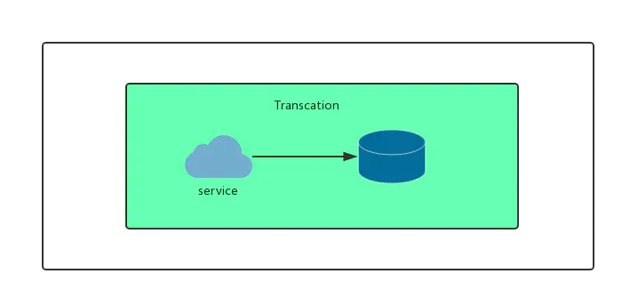
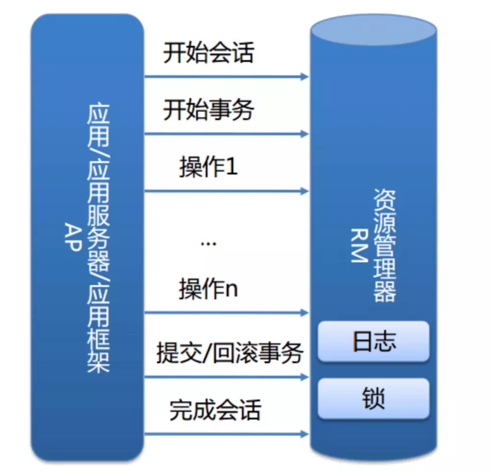
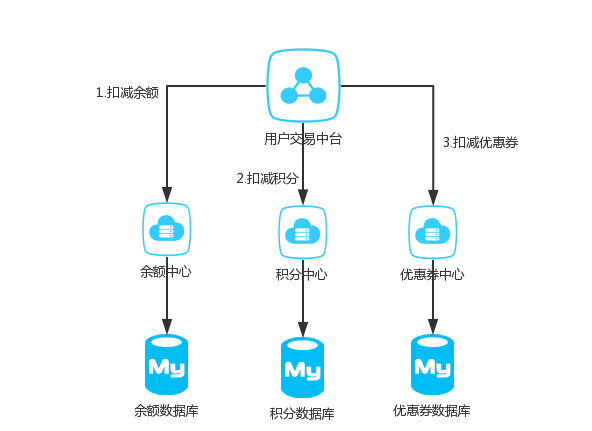
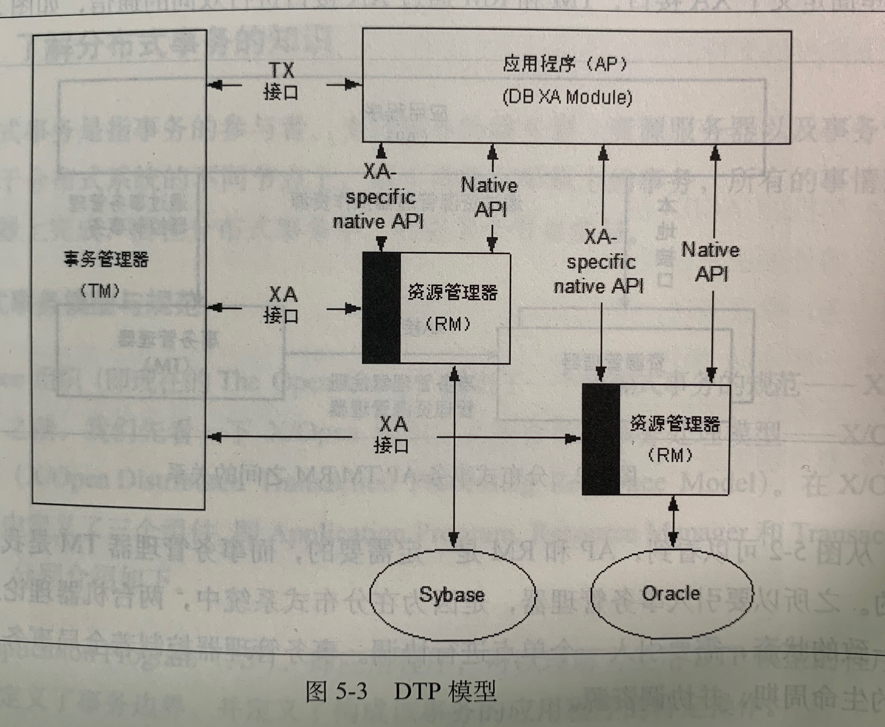
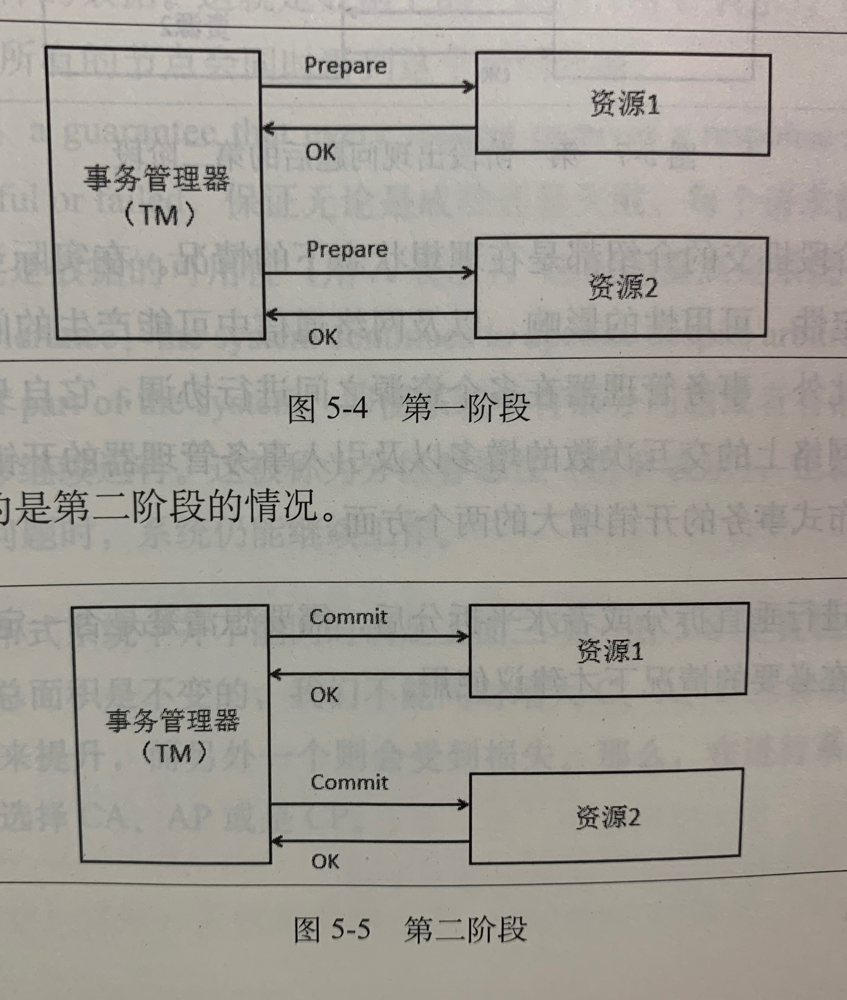
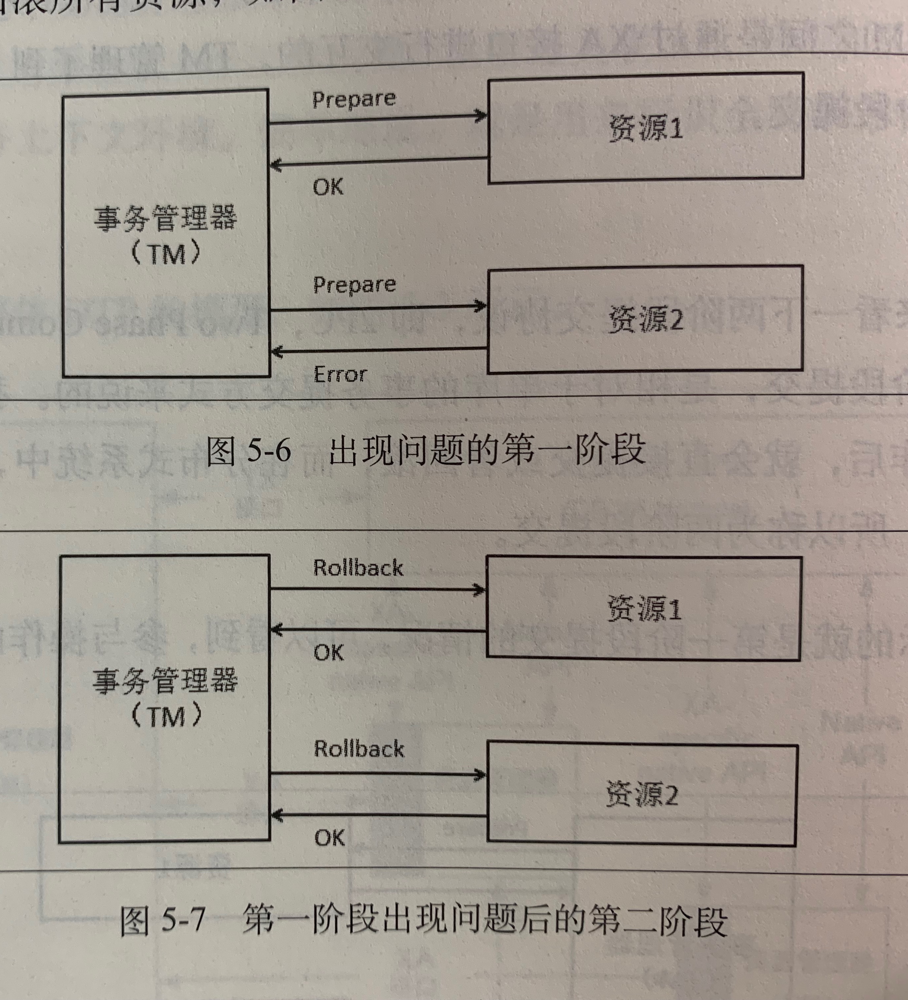
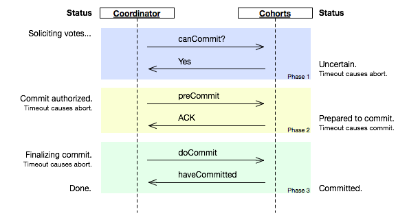

##  参考博文
[再有人问你分布式事务，把这篇扔给他](https://juejin.im/post/5b5a0bf9f265da0f6523913b)
[分布式事务的实现原理](https://draveness.me/distributed-transaction-principle)
[聊聊分布式事务，再说说解决方案](https://www.cnblogs.com/savorboard/p/distributed-system-transaction-consistency.html)


[TOC]


# 1. 本地事务
介绍InnoDB的本地事务：
在InnoDB中，事务将资源和服务包裹成一个整体，事务由资源管理器管理。





本地事务的ACID由InnoDB的锁和日志保证：
>>持久性：通过redo log保证，redo log记录新数据。在事务提交前，只更改内存里的数据内容而不写到磁盘中，而将redo log记录的新数据写到磁盘中，内存中的数据内容再慢慢刷回磁盘。这样当系统崩溃时，可以根据redo log将数据恢复到最新状态。

>>一致性、原子性：通过undo log实现，undo log记录更改前的数据。在对数据更改前先记录到undo log中，当事务发生错误或回滚时可以根据undo log恢复到原来的数据状态。

>>隔离性：通过数据库锁机制实现事物间的互不影响

# 2. 分布式事务
分布式事务用于保证不同数据库的数据一致性，多个分布在不同应用的操作需要全部失败或全部成功，需要分布式事务实现。

分布式事务有多个资源节点(resources)和多个服务节点(services)，分别由资源管理器和服务管理器管理。

XA事务允许不同数据库之间的分布式事务，如一台服务器是MySQL数据库的，另一台是Oracle数据库的，可能还有一台服务器是SQL Server数据库的，只要参与到全局事务中的每个节点都支持XA事务即可

服务节点例如：一个公司之内，用户的资产可能分为好多个部分，比如余额，积分，优惠券等等。在公司内部有可能积分功能由一个微服务团队维护，优惠券又是另外的团队维护


资源节点例如：Mysql一般来说装千万级的数据就得进行分库分表，对于一个支付宝的转账业务来说，你给朋友转钱，有可能你的数据库是在北京，而你的朋友的钱是存在上海，所以我们依然无法保证他们能同时成功


## 2.1 分布式事务处理模型(XA事务)
X/open DTP模型：
1. 应用程序AP
2. 事务管理器TM：管理和协调分布式事务。例如交易中间件、和MySQL连接的客户端
3. 资源管理器RM：例如数据库
4. 通信资源管理器ORM：消息中间件

当AP和RM之间需要进行分布式事务时，TM通过XA接口和RM进行通信，协调RM对事务的开始、提交操作



## 2.2 分布式事务理论基础
### CAP
1. C一致性
如果某个节点更新了数据，其他节点总能读取到最新的数据，那么是强一致性


2. A可用性
非故障节点应该在合理时间内返回合理的响应。合理时间是指某个请求不能被无限阻塞，被请求的节点应该在一定时间范围内给出响应；合理响应是指被请求的节点应该返回明确并且正确的结果

3. P分区容忍性
集群中的某个节点出故障后，不影响其他节点的工作，整个集群仍然是正常工作的


### BASE
BASE是对AP的扩展，它放弃强一致性，允许一段时间内的不一致，并在最终达到一致

1. Basically Available(基本可用)
当节点出现故障时，在核心功能保证可用的情况下允许非核心功能的部分不可用

2. Soft state(软状态)
在不影响可用性的情况下允许系统的不一致

3. Eventually consistent (最终一致性)
经过一段时间的不一致之后，最终所有节点的数据都会达到一致性
## 2.3 分布式事务解决方案
### 2PC
第一阶段(投票阶段):
>>1. 事务管理器向资源管理器发起询问是否可以执行请求，资源管理器将在本地执行事务但不提交，并写redo log和undo log。
>>2. 资源管理器给事务管理器发送agreement或abort

第二阶段(提交阶段):
>>1. 当事务管理器收到所有资源管理器的agreement消息时，将发送commit消息让所有资源管理器执行提交操作，资源管理器提交后将释放资源并返回消息。事务管理器将结束整个事务。
>>2. 当事务管理器并没有收到所有资源管理器的agreement消息时，将发送rollback消息，资源管理器将根据undo log回滚操作并返回消息。事务管理器将结束整个事务。





缺点：
1. 如果事务管理器宕机了，资源管理器会一直等待
2. 如果在第二阶段，某些资源管理器没有收到事务管理器的消息，那么资源管理器间将处于不一致状态
3. 在第一阶段完成后，资源管理器中的资源将被一直阻塞占用，直到资源被释放


### 3PC
在2PC的基础上引入超时机制和准备阶段：
如果资源管理器和事务管理器在一段时间内没有收到消息，将会根据当前状态终止或提交事务

第一阶段：canCommit阶段
>>事务管理器向资源管理器询问是否可以执行请求。如果可以，资源管理器将发送yes，否则no

第二阶段：preCommit阶段
>> 1. 如果事务管理器收到所有的yes，将向资源管理器发送preCommit请求，资源管理器将在本地执行事务但不提交，并写redo log和undo log，并发送ACK消息
>>2. 如果事务管理器收到了no，将向资源管理器发送abort消息，资源管理器将中断事务

第三阶段：doCommit阶段
>>如果事务管理器收到ACK消息，将向事务管理器发送doCommit消息，资源管理器收到后将执行事务的提交并返回ACK消息



### TCC
Try 阶段：
>>主要是对业务系统做检测及资源预留

Confirm 阶段:
>>主要是对业务系统做确认提交，Try阶段执行成功并开始执行 Confirm阶段时，默认 Confirm阶段是不会出错的。即：只要Try成功，Confirm一定成功。

Cancel 阶段:
>>主要是在业务执行错误，需要回滚的状态下执行的业务取消，预留资源释放。

举个例子，假如 Bob 要向 Smith 转账，思路大概是：
我们有一个本地方法，里面依次调用
1、首先在 Try 阶段，要先调用远程接口把 Smith 和 Bob 的钱给冻结起来。
2、在 Confirm 阶段，执行远程调用的转账的操作，转账成功进行解冻。
3、如果第2步执行成功，那么转账成功，如果第二步执行失败，则调用远程冻结接口对应的解冻方法 (Cancel)。

### 本地消息表
基于BASE理论

消息生产方，需要额外建一个消息表，并记录消息发送状态。消息表和业务数据要在一个事务里提交，也就是说他们要在一个数据库里面。然后消息会经过MQ发送到消息的消费方。如果消息发送失败，会进行重试发送。

消息消费方，需要处理这个消息，并完成自己的业务逻辑。此时如果本地事务处理成功，表明已经处理成功了，如果处理失败，那么就会重试执行。如果是业务上面的失败，可以给生产方发送一个业务补偿消息，通知生产方进行回滚等操作。

生产方和消费方定时扫描本地消息表，把还没处理完成的消息或者失败的消息再发送一遍。如果有靠谱的自动对账补账逻辑，这种方案还是非常实用的。


### MQ事务

### Saga事务

# 3. InnoDB支持的分布式事务
在使用分布式事务时，InnoDB存储引擎的事务隔离级别必须设置为SERIALIZABLE

MySQL数据库XA事务的SQL语法如下：
```SQL
XA {START|BEGIN} xid [JOIN|RESUME]
XA END xid [SUSPEND [FOR MIGRATE]]
XA PREPARE xid
XA COMMIT xid [ONE PHASE]
XA ROLLBACK xid
XA RECOVER
```
