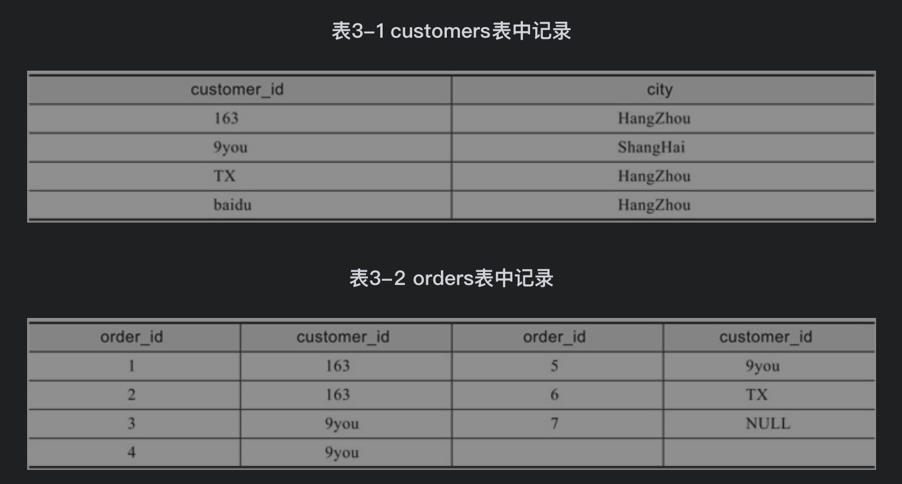
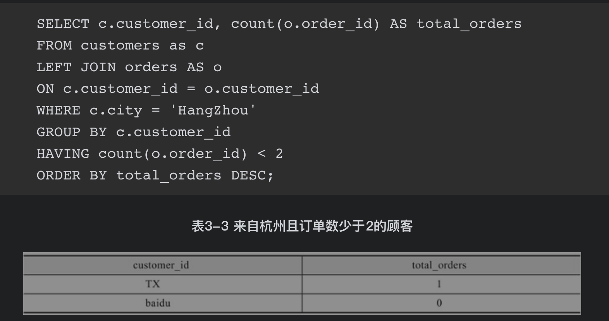
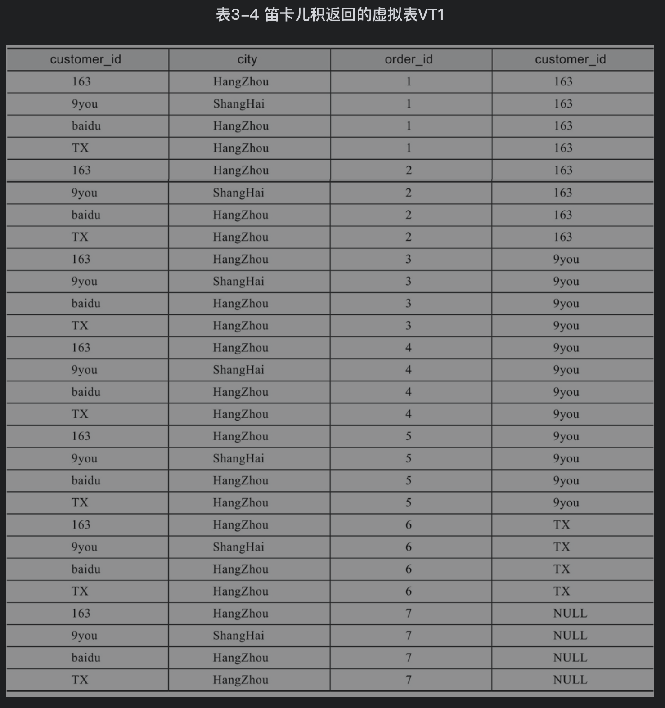
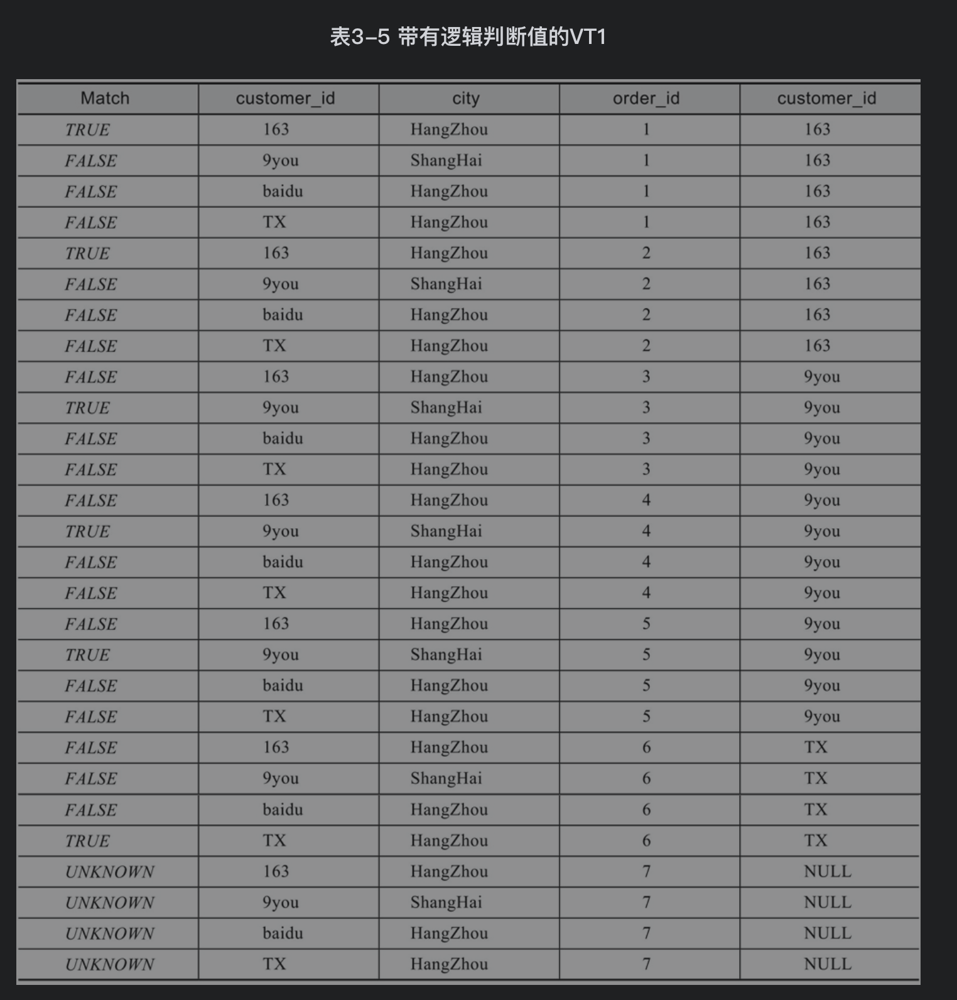
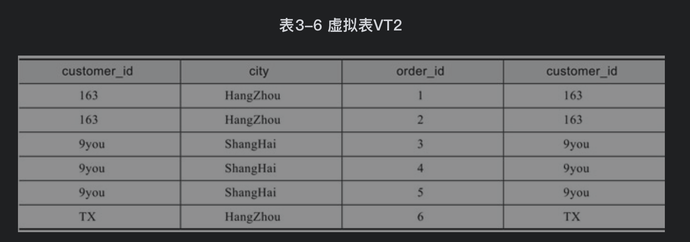
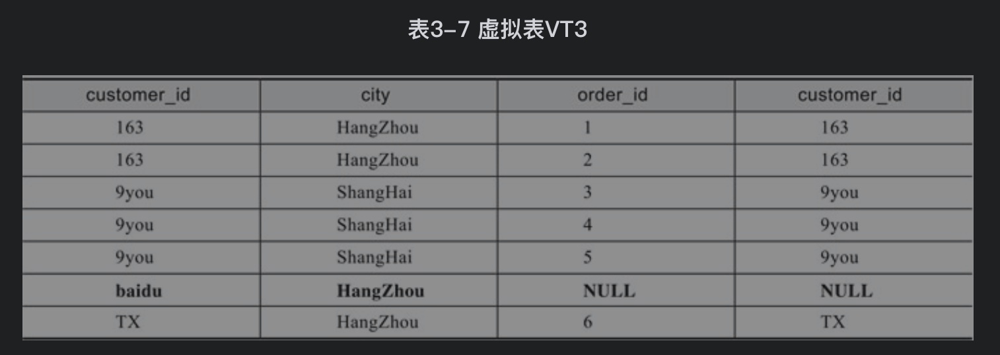

## 参考博文
[mysql group by 用法解析(详细)](https://www.jianshu.com/p/8f35129dd2ab)


[TOC]

逻辑查询处理表示执行查询应该产生什么样的结果，而物理查询代表MySQL数据库是如何得到该结果的。两种查询的方法可能完全不同，但是得到的结果必定是相同的。

# 1. 逻辑查询处理
逻辑执行顺序如下：
1. 执行from
2. 执行on匹配数据
3. 执行join
4. 执行where过滤数据
5. 执行group by
6. with{cube|rollup}
6. 执行having
7. 执行select
8. 执行distinct
9. 执行order by
10. 执行limit




## from笛卡尔积
对from前后的两张表执行笛卡尔积，产生虚拟表vt1
```SQL
from customers as c ... join orders as o
```
如果FROM子句前的表中包含a行数据，FROM子句后的表中包含b行数据，那么虚拟表VT1中将包含a*b行数据



## 应用ON过滤器
```SQL
on c.customer_id=o.customer_id
```
MySQL对null的处理:对于比较返回值为NULL的情况，将其视为UNKNOWN

在on过滤条件下，NULL值结果为UNKNOWN被视为FALSE来进行处理，即两个NULL并不相同

null被视为相同的情况：
1. GROUP BY子句把所有NULL值分到同一组
2. ORDER BY子句中把所有NULL值排列在一起

```SQL
mysql> select 1=null;
+--------+
| 1=null |
+--------+
|   NULL |
+--------+
1 row in set (0.00 sec)

mysql> select null=null;
+-----------+
| null=null |
+-----------+
|      NULL |
+-----------+
1 row in set (0.00 sec)
```

使用on过滤将在vt1的基础上增加一个额外的列来表示ON过滤条件的返回值(true or false)，然后取出比较值为TRUE的记录，产生虚拟表VT2




## join添加外部行
只在outer join情况下执行:left (outer) join、right (outer) join、full (outer) join

LEFT OUTER JOIN把左表记为保留表，RIGHT OUTER JOIN把右表记为保留表，FULL OUTER JOIN把左右表都记为保留表

添加外部行的工作就是在VT2表的基础上添加保留表中被过滤条件过滤掉的数据，非保留表中的数据被赋予NULL值，最后生成虚拟表VT3

如果需要连接表的数量大于2，则对虚拟表VT3重做本节首的步骤1）～步骤3），最后产生的虚拟表作为下一个步骤的输出



## 应用WHERE过滤器
对上一步骤产生的虚拟表VT3进行WHERE条件过滤，只有符合<where_condition>的记录才会输出到虚拟表VT4中

在当前应用WHERE过滤器时，有两种过滤是不被允许的：
1. WHERE 子句不能包含聚集函数:由于数据还没有分组，因此现在还不能在WHERE过滤器中使用where_condition=MIN(col)这类对统计的过滤。
2. 由于没有进行列的选取操作，因此在SELECT中使用列的别名也是不被允许的，如SELECT city as c FROM t WHERE c='ShangHai'是不允许出现的


## group by分组
```SQL
group by c.customer_id
```
SELECT子句中的列名必须为group by的列或列函数，列函数对于GROUP BY子句定义的每个组各返回一个结果

在SELECT语句中指定的每个列名必须在GROUP BY子句中提到


## 应用ROLLUP或CUBE

## 应用HAVING过滤器
HAVING 子句总是包含聚集函数
```SQL
/*在这个分组中不能使用COUNT（1）或COUNT（*），
因为这会把通过OUTER JOIN添加的行统计入内而导致最终查询结果与预期结果不同,会把order_id为null的算成1个
*/
having count(o.order_id)<2
```


## 处理SELECT列表
列的别名不能在SELECT中的其他别名表达式中使用
```SQL
select order_id as o,o+1 as n from orders;
ERROR 1054:unknow column o in field list
```

```SQL
select c.customer_id,count(o.order_id) as total_orders
```


## 应用DISTINCT子句
应用distinct会在内存中构建和vt7一样的表，但是对distinct的列添加了唯一索引过滤，去除重复数据

对于使用了GROUP BY的查询，再使用DISTINCT是多余的，因为已经进行分组，不会移除任何行

## 应用ORDER BY子句
根据order by指定的列对上一步产生的虚拟表进行排列返回vt8
```SQL
//还可以在ORDER BY子句中指定SELECT列表中列的序列号
select order_id,customer_id
from orders
//等同于order by customer_id,order_id
order by 2,1;
```
```SQL
order by total_orders
```


## LIMIT子句
从上一步骤的虚拟表中选出从指定位置开始的指定行数据
```SQL
limit m,n
```


# 2. 物理查询处理
数据库不会完全按照逻辑查询进行处理，优化器会对语句进行优化，选择一条最优的路径进行查询，但是会保证最后结果适合逻辑查询处理一致的

如果表上建有索引，那么优化器就会判断SQL语句是否可以利用该索引来进行优化

