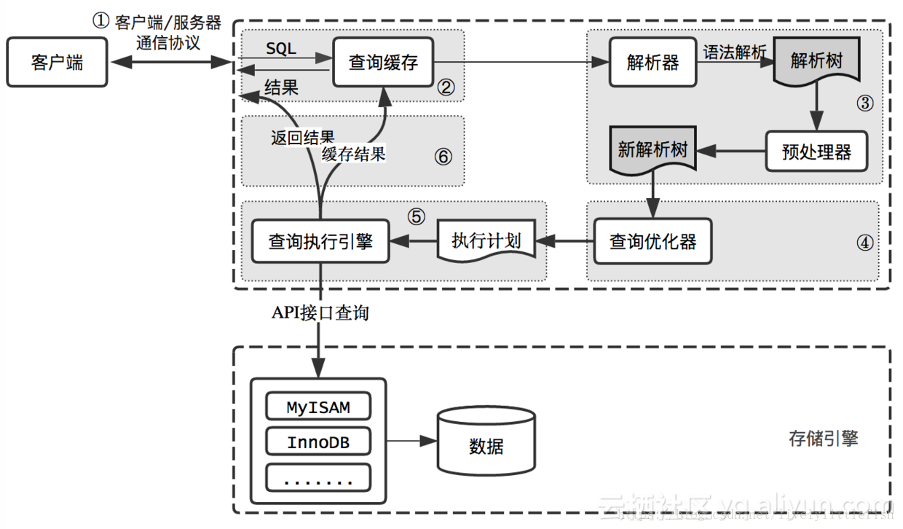

[TOC]

# 1. 慢查询基础：优化数据访问
- 使用索引
- 尽量避免select*

# 2. 重构查询方式
1. 将一个大查询分解成多个小查询。
2. 分解关联查询：将一个关联查询分解成多个单表查询，在应用程序中做关联。好处可能有：应用程序可以对不经常发生变更的单表查询结果进行缓存；单表查询可以减少锁的竞争

# 3. 查询执行的基础
## 3.1 查询执行过程
1. 客户端给服务器发送一条查询
2. 服务器检查缓存中是否有数据，如果有直接返回
3. 解析器进行解析、预处理器进行预处理，再由优化器处理生成对应的执行计划
4. 服务器根据执行计划调用存储引擎API执行查询
5. 将结果返回给客户端并存入缓存



## 3.2 MySQL客户端/服务器通信协议
客户端和服务器之间的通信是半双工方式。同一时刻只有一方能发数据，另一方只能接受数据。

客户端通过单数据包向服务器发送查询；服务器发送多个数据包将结果返回给客户端，客户端只能全部接受服务器的数据返回，不能选择性的接受。

## 3.3 查询缓存
在解析查询语句前，会先去查询缓存中看是否命中该查询，通过一个对大小写敏感的哈希查找实现

## 3.4 查询优化处理
##### 解析SQL
解析器通过关键字解析SQL语句，生成解析树，使用SQL语法规则验证SQL语法的合法性。
##### 预处理
使用SQL规则检查解析树是否合法，例如检查数据表和列是否存在，然后在验证权限
##### 查询优化器优化
优化器预测一个查询执行某个计划时的成本，并选择成本最小的一个计划。

- 静态优化：仅执行一次并且一直有用，不依赖于where中的具体数值
- 动态优化：每次查询执行都要重新进行，在执行过程中也有可能进行

计划是生成查询的一颗指令树，是一个数据结构而不是字节码文件，并由存储引擎执行这颗指令树
[多表连接查询执行过程](./多表连接查询执行过程.md)

##### 排序
如果不能使用索引排序，那么MySQL要自己进行排序。
(1)如果要排序的数据量小，则在内存里排序
(2)如果要排序的数据量大，则对数据进行分块排序并将结果存在磁盘上，然后合并每个块并返回结果

## 3.5 查询执行引擎
在查询阶段MySQL就为每张表创建一个handler实例，通过handler API调用存储引擎执行计划

## 3.6 返回结果给客户端
MySQL逐步、增量的将结果返回给客户端，每行数据都放进一个封包中通过TCP协议传输，在传输过程中，可以缓存封包批量传输

# 4. MySQL查询优化器的局限性
## 4.1 关联子查询
where中包含in()的子查询非常糟糕。

这个查询首先会全表扫描film，根据返回的film_id逐条执行子查询。如果film表数据很多，那么性能会很糟糕
```SQL
select * from film where film_id in 
(select film_id from film_actor where actor_id=1)
```
使用inner join重写该查询。首先会遍历film_actor的聚簇索引树使用索引actor_id返回满足条件的film_id，然后使用film_id匹配film的聚簇索引树中满足条件的数据
```SQL
select * from film inner join film_actor using(film_id) where film_actor.actor_id=1;
```

## 4.2 union的限制
对union的最外层的限制条件不能应用到内层子句。想对union的子句取部分结果集或排序再合并的话，必须对每个子句加上limit或order by

这个SQL会先把actor和customer的所有记录查询出来放在临时表中，然后再取临时表的前20条记录
```SQL
(select first_name,last_name from actor order by last_name)
union all
(select first_name,last_name from customer order by last_name)
limit 20;
```

这个SQL的临时表中就只包含40条记录。在临时表中取出的顺序不一定，所以还要加上全局的order by
```SQL
(select first_name,last_name from actor order by last_name limit 20)
union all
(select first_name,last_name from customer order by last_name limit 20)
limit 20;
```

# 5. 查询优化器的提示

# 6. 优化特定类型的查询
## 6.1 优化count()
count可以统计列值，但会忽略会null的值。也可以统计行数，当count内的表达式一定不为null是就是在统计行数，最简单的是count(*)

## 6.2 优化关联查询
1. 确保on或者using中的列都有索引。一般只需要在被驱动表的列上建立索引
2. 确保group by和order by只使用到一个表的列，就可以使用索引

## 6.3 优化group by和distinct
1. group by后面跟多个列进行嵌套分组，结果将在最后一个列上汇总
2. select中的每一列必须在group by中出现，但如果select中是聚集函数则不限制,而且如果group by后面是聚簇索引，select中可以选择非分祖列
3. 根据分组字段，将具有相同分组字段的记录归并成一条记录，每一个分组只能返回一条记录
4. 当查询使用group by时，结果集会按照分组字段自动排序。

## 6.4 优化limit分页
对于limit查询，如果某个表数据很大，并且limit偏移量也很大，那么对于分页查询需要加载并且丢弃的页更多，效率就很低下。对于每一页能存放的大小一定，如果某个表列很多，那么他的每行数据量就很大，每一页能容纳的行数就更少，如果要定位到偏移量的位置，就要加载更多的页并丢弃。

对于这种情况，可以使用覆盖索引扫描，先扫描覆盖索引中的列而不是查询所有的列，然后根据关联查询返回指定列。

例如如下查询，有一个联合索引(film_id,title)和主键索引film_id，要对原表数据根据title排序，此时不能利用联合索引(film_id,title)，而且select中还需要description，不能使用覆盖索引。所以会对全表所有数据进行排序，注意是包含所有列。
```SQL
select film_id,description from film order by title limit 50,5;
```
改进如下。首先film表使用主键索引film_id作为关联字段关联自身。在内层表中，使用覆盖索引(film_id,title)对lim表进行排序，此处的排序数据量小，不用对全表的列进行排序，然后选出50到55条数据，再根据film_id利用聚簇索引树关联外层表。
```SQL
select film_id,description from film
inner join (select film_id from film order by title limit 50,5) as lim
using(film_id);
```