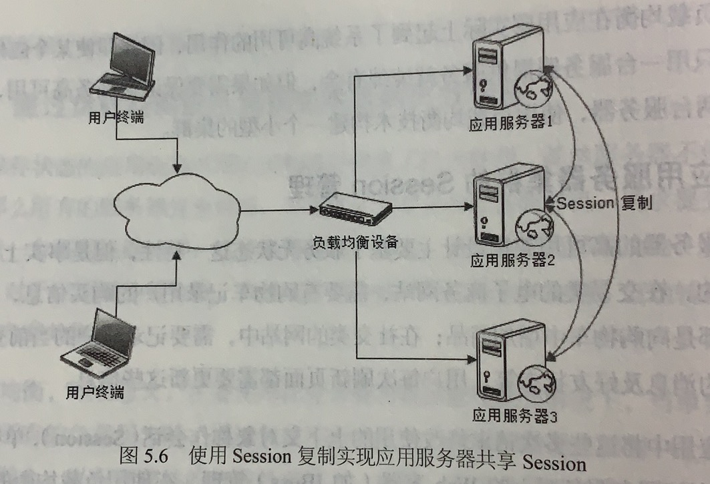
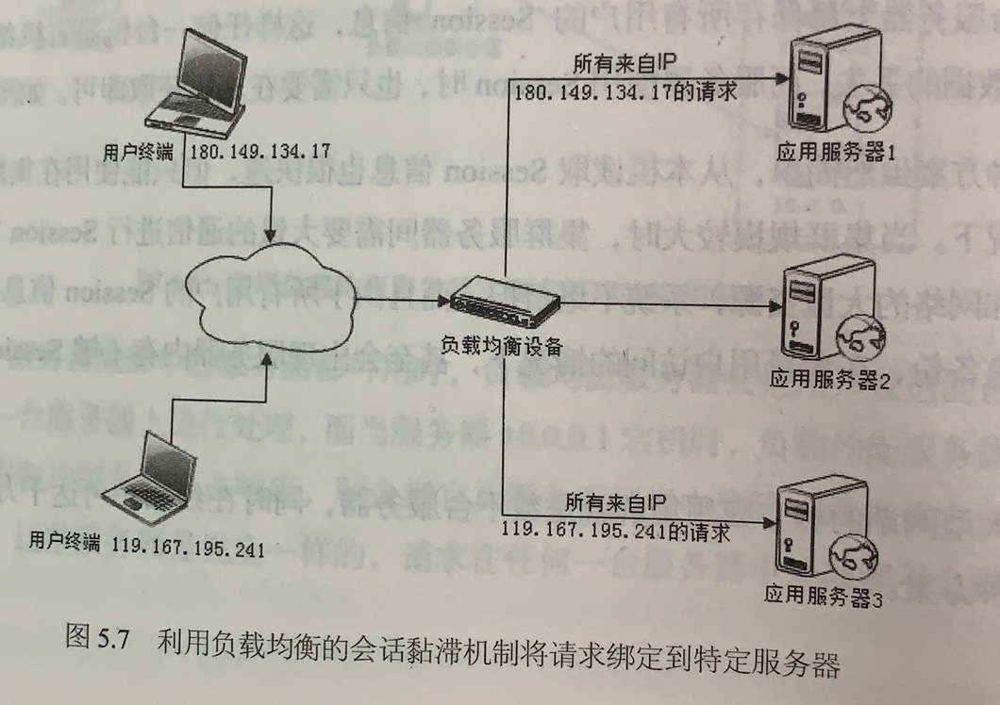
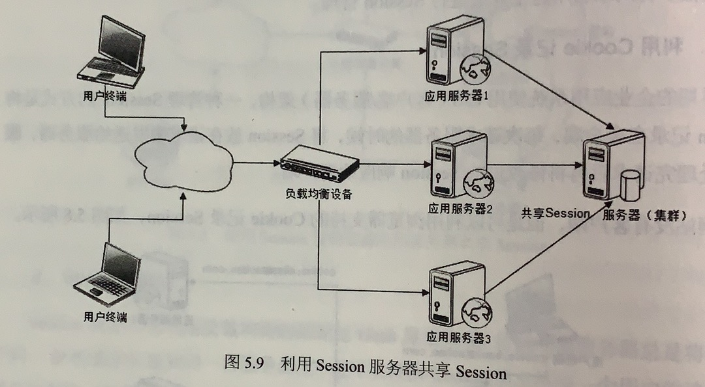

## 参考博文
[大型网站技术架构：核心原理与案例分析](大型网站技术架构：核心原理与案例分析)

[TOC]

# 1. session复制
各应用服务器间同步复制session，但是服务期间大量的session通信复制占用大量的网络资源。在大量用户访问时，服务器会出现内存不够session使用的情况

# 2. session绑定(会话粘滞)
利用负载均衡[负载均衡](./负载均衡.md)的源地址散列方法进行负载均衡。

来源于同一IP的请求将被分配到同一服务器。但是如果这台服务器宕机了，存储的session信息也就丢失了

# 3. 利用cookie记录session
利用浏览器的cookie将session记录在客户端，当客户端请求时将cookie发送给服务器，服务器处理完请求后将修改过的cookie返回给客户端

但是session的大小受cookie的限制，而且如果用户关闭cookie这种方法就不能用了

# 4.session服务器
由独立部署的session集群管理session，应用服务器都从session服务器取session。

其实是把服务器分成了无状态的应用服务器和有状态的session服务器

可以利用session服务器做成单点登录(SSO)、用户服务等功能

