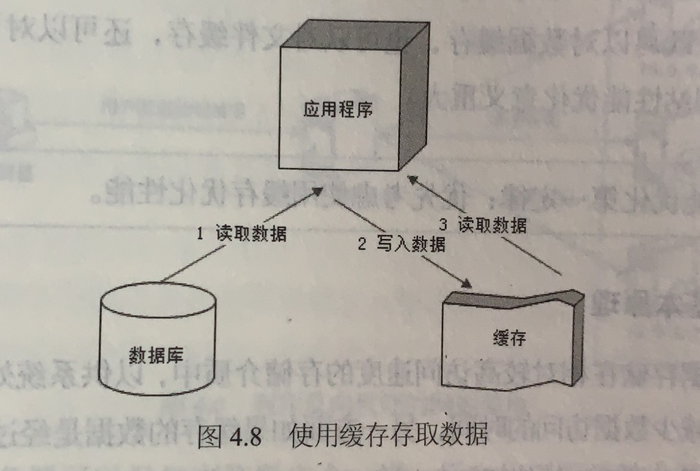

## 参考博文
[select * from user这条SQL语句背后藏着哪些不可告人的秘密？](https://www.geek-share.com/detail/2788755980.html)
[mysql中SQL执行过程详解](https://www.liangzl.com/get-article-detail-125197.html)

[TOC]

# 第一章 MYSQL架构与历史
## 1.1 MySQL逻辑架构

#### 1. 客户端
#### 2. 核心服务器层

所有和具体存储引擎无关的功能都在这一层实现：存储过程、触发器、函数等，这一层屏蔽不同存储引擎之间的差异

(1) 连接/线程处理：

每个客户端连接都在MYSQL服务器进程中有一个线程(服务器会缓存线程分配给客户端)，这个客户端所有的query都在这个线程中执行(解析-优化-执行)

(2) 解析器

解析器会对query进行解析，并创建解析树

(3) 优化器

优化器对query进行优化(重写查询、决定表的读取顺序、选择合适的索引)

(4) 查询缓存

对于select语句在解析之前，MYSQL会先查询缓存中有没有对应的语句，有的话直接返回缓存。
#### 3. 存储引擎

存储引擎定义了数据怎么存储和提取，包含了十几个底层函数。MYSQL服务器通过存储引擎API访问存储引擎，这些API屏蔽存储引擎之间的差异。
## 1.2 并发控制
### 1.2.1 读写锁
#### 共享锁(读锁、shared lock)
#### 排它锁(写锁 exclusive lock)

### 1.2.2 锁粒度
锁的开销和读写安全之间的平衡

#### 表锁(table lock)
MYSQL服务器为ALTER TABLE语句添加表锁
### 行级锁(row lock)
由存储引擎自己实现


##### for update(排它锁)
将数据库中的某行添加行锁(独占锁)，当某个事务使用for update添加了锁，那么其他事务只可以读，不可以更新这行也不可以加任何锁，直到持有锁的事务commit

```
select * from tb_test where id = 1 for update;
```
##### lock in share mode(共享锁)
加了lock in share mode锁的事务，其他事务可以读或加共享锁，但不可以更新或加排它锁

可能会造成死锁

```
select * from tb_test where id = 1 lock in share mode;
```

## 1.3 事务
[mysql事务](./MySQL事务.md)

由存储引擎实现

## 1.4 多版本并发控制(MVCC)
[MVCC](./MVCC.md)

MVCC实现了select读时不加锁，如果做所有操作都加锁，那么语句全变成串行的了。

保存数据库某时间的快照，一个事务从开始到结束读的内容都是一样的。做到不加锁也能处理读写冲突。行锁的变种。

通过3个隐式字段，undo日志，read view实现。


## 1.5 mysql命令行
[mysql命令行](./MySQL命令行.md)

### 1.5.1 InnoDB VS MyISAM
比较|InnoDB|MyISAM
---|---|---|
类型|事务型|非事务型
存储|表空间:将每个表的数据和索引存放在单独文件中|数据文件.MYD;索引文件.MYI
锁|支持行级锁|不支持行级锁，对整张表加锁。读时加共享锁，写时加排它锁
事务|崩溃后可以安全恢复|崩溃后只能手动恢复

# 1.6 MySQL语句加锁分析
[MySQL语句加锁分析](./MySQL语句加锁分析.md)

# 第二章 MySQL基准测试
[MySQL基准测试](./MySQL基准测试.md)

# 第三章 服务器性能剖析

[服务器性能剖析](./服务器性能剖析.md)

测量服务器的时间花在了哪里

性能：响应时间，完成某件任务需要花费的时间


# 第四章 Schema与数据类型优化
[Schema与数据类型优化](./Schema与数据类型优化.md)

# 第五章 创建高性能的索引
[MySQL索引](./MySQL索引.md)

# 第六章 查询性能优化
[查询性能优化](./查询性能优化.md)

# 第七章 MySQL高级特性
[MySQL高级特性](./MySQL高级特性.md)

# 第十章 复制
[复制](./复制.md)
复制解决的问题是保持主从数据库的数据一致性

# 第十一章 可扩展的MySQL
[可扩展的MySQL](./可扩展的MySQL.md)

可扩展性指当增加资源后，系统容量能得到划算的等同提升。

系统容量指在一定时间内能完成的工作量

# 第十二章 高可用性
[高可用性](./高可用性.md)

高可用性指更少的宕机时间，包括减少宕机次数以及宕机后能快速恢复

# 第十三章 云端的MySQL
[云端的MySQL](./云端的MySQL.md)

# 第十四章 应用层优化
[缓存](./缓存.md)

缓存的本质可以是本地一个变量或者一个hash表，用于存储读写比(2:1以上)很高、变化很少的数据



# 第十五章 备份与恢复
[备份与恢复](./备份与恢复.md)