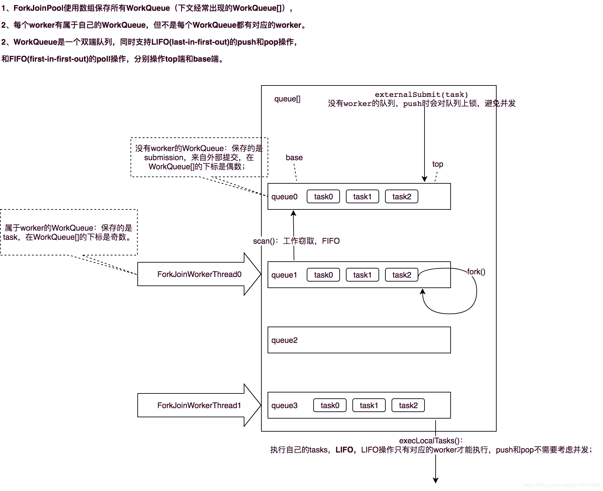

## 参考博文
[JUC线程池: Fork/Join框架详解](https://www.pdai.tech/md/java/thread/java-thread-x-juc-executor-ForkJoinPool.html)


[TOC]

# 1. 概述
Fork/Join是并行执行任务的框架：(分治算法)
1. Fork：他将一个大任务分解成多个小任务执行
2. Join：再将小任务的结果汇总起来返回

例如计算1加到10000的结果，可以分解成子任务对1000个数字求和，再汇总相加


# 2. 工作窃取算法(work-stealing)
为了减少线程间的竞争，可以把一个大任务分割成多个独立的子任务，然后将这些子任务放到不同的队列里，每个线程(ForkJoinWorkerThread)负责一个队列(WorkQueue)。例如A线程负责处理A队列中的子任务

但如果某个线程执行完自己队列的任务了，其他线程还没执行完。那这个执行完任务的线程就可以去拿别人队列中的任务执行。为了减少线程间的竞争，通常使用双端队列(例如[LinkedBlockingDeque](./BlockingQueue.md))，窃取任务的线程从队列尾部拿任务，被窃取任务的线程从队列头部拿任务。




# 3. Fork/Join的设计
步骤1：分割任务
利用ForkJoinTask将任务分割成多个子任务，他提供fork()和join()两个接口。并且有两个子类：RecursiveAction(用于没有返回结果的任务)和RecursiveTask(用于有返回结果的任务)

步骤2：执行任务并合并结果
ForkJoinTask通过ForkJoinPool来执行。分割出来的子任务会放到ForkJoinPool的双端队列的头部

所以ork/Join框架主要包含三个模块: 
1. 任务对象: ForkJoinTask (包括RecursiveTask、RecursiveAction 和 CountedCompleter) 
2. 执行Fork/Join任务的线程: ForkJoinWorkerThread 
3. 线程池: ForkJoinPool


# 4. 异常处理
ForkJoinTask在执行过程中可能会抛出异常，他提供了以下接口
```java
//通过isCompletedAbnormally来判断任务是否抛出异常或被取消了
if (task.isCompletedAbnormally()) {
    //通过getException获取Throwable对象，如果任务被取消了返回CancellationException,如果任务没有完成或没异常返回null
    System.out.println(task.getException());
}
```

# 5. 源码分析
Fork/Join执行流程如图所示


## ForkJoinPool内部属性
```java
public class ForkJoinPool extends AbstractExecutorService {
    // 主对象注册信息，workQueue
    volatile WorkQueue[] workQueues;   

    static final class WorkQueue {
        // 任务数组
        ForkJoinTask<?>[] array;  

        // 当前工作队列的工作线程，共享模式下为null 
        final ForkJoinWorkerThread owner; 
    }  
}
```

## ForkJoinTask的fork()
fork()会调用push()/externalPush异步的执行任务,push()/externalPush将任务放入WorkQueue的队列数组中，再调用signalWork唤醒一个工作线程来执行任务
```java
    public final ForkJoinTask<V> fork() {
        Thread t;
        //通过内部 fork 分割的子任务(Worker task)，存放在 workQueues 的奇数槽位
        if ((t = Thread.currentThread()) instanceof ForkJoinWorkerThread)
            ((ForkJoinWorkerThread)t).workQueue.push(this);
        else
            //直接通过 FJP 提交的外部任务(external/submissions task)，存放在 workQueues 的偶数槽位
            ForkJoinPool.common.externalPush(this);
        return this;
    }

    final void push(ForkJoinTask<?> task) {
            ForkJoinTask<?>[] a; ForkJoinPool p;
            int b = base, s = top, n;
            if ((a = array) != null) {    // ignore if queue removed
                int m = a.length - 1;     // fenced write for task visibility
                U.putOrderedObject(a, ((m & s) << ASHIFT) + ABASE, task);
                U.putOrderedInt(this, QTOP, s + 1);
                if ((n = s - b) <= 1) {
                    if ((p = pool) != null)
                        p.signalWork(p.workQueues, this);
                }
                else if (n >= m)
                    growArray();
            }
        }
```

## ForkJoinTask的join()
通过join来阻塞当前线程并获取子任务的执行结果
调用doJoin()来判断当前任务的状态：
1. NORMAL(任务已完成)：返回结果
2. CANCELLED(任务被取消)：抛出CancellationException
3. EXCEPTIONAL(任务抛出异常)：返回对应异常getThrowableException
4. SIGNAL

```java
   public final V join() {
        int s;
        if ((s = doJoin() & DONE_MASK) != NORMAL)
            reportException(s);
        return getRawResult();
    }

     private void reportException(int s) {
        if (s == CANCELLED)
            throw new CancellationException();
        if (s == EXCEPTIONAL)
            rethrow(getThrowableException());
    }
```

# 6. 举例
## 计算1+2+3+…+10000
希望每个子任务最多执行1000个数的相加，所以分割阈值是1000
```java
package thread;

import java.util.concurrent.ExecutionException;
import java.util.concurrent.ForkJoinPool;
import java.util.concurrent.Future;
import java.util.concurrent.RecursiveTask;

/**
 * 测试使用Fork/Join框架 计算1+2+3+…+10000
 */
public class CountTask extends RecursiveTask<Integer> {
    public static void main(String[] args) {
        ForkJoinPool forkJoinPool = new ForkJoinPool();
        //生成一个计算任务来计算1+2+3+4
        CountTask task = new CountTask(1, 10000);
        Future<Integer> result = forkJoinPool.submit(task);
        try {
            System.out.println(result.get());
        } catch (InterruptedException e) {
            e.printStackTrace();
        } catch (ExecutionException e) {
            e.printStackTrace();
        }
    }

    private static final int THRESHOLD = 1000;

    private int start;
    private int end;

    public CountTask(int start, int end) {
        this.start = start;
        this.end = end;
    }

    @Override
    protected Integer compute() {
        int sum = 0;

        boolean canCompute = (end - start) <= THRESHOLD;

        if (canCompute) {
            System.out.println(Thread.currentThread().getName() + " 开始执行: " + start + "-" + end);
            for (int i = start; i <= end; i++) {
                sum += i;
            }
        } else {
            int middle = (start + end) / 2;
            CountTask leftTask = new CountTask(start, middle);
            CountTask rightTask = new CountTask(middle + 1, end);

            //执行子任务
            leftTask.fork();
            rightTask.fork();

            //等待子任务执行完并获得结果
            int leftResult = leftTask.join();
            int rightResult = rightTask.join();

            //合并子任务
            sum = leftResult + rightResult;
        }

        return sum;
    }
}
/*
ForkJoinPool-1-worker-6 开始执行: 7501-8125
ForkJoinPool-1-worker-6 开始执行: 8126-8750
ForkJoinPool-1-worker-3 开始执行: 5001-5625
ForkJoinPool-1-worker-6 开始执行: 8751-9375
ForkJoinPool-1-worker-1 开始执行: 626-1250
ForkJoinPool-1-worker-5 开始执行: 1-625
ForkJoinPool-1-worker-1 开始执行: 1876-2500
ForkJoinPool-1-worker-7 开始执行: 1251-1875
ForkJoinPool-1-worker-11 开始执行: 2501-3125
ForkJoinPool-1-worker-7 开始执行: 3751-4375
ForkJoinPool-1-worker-7 开始执行: 4376-5000
ForkJoinPool-1-worker-5 开始执行: 6876-7500
ForkJoinPool-1-worker-6 开始执行: 9376-10000
ForkJoinPool-1-worker-4 开始执行: 5626-6250
ForkJoinPool-1-worker-0 开始执行: 6251-6875
ForkJoinPool-1-worker-11 开始执行: 3126-3750
50005000
*/
```

## 实现斐波那契数列
斐波那契数列: 1、1、2、3、5、8、13、21、34、…… 公式 : F(1)=1，F(2)=1, F(n)=F(n-1)+F(n-2)(n>=3，n∈N*)

```java
package thread;

import java.util.concurrent.ForkJoinPool;
import java.util.concurrent.RecursiveTask;

/**
 * 测试Fork/Join 实现斐波那契数列: 1、1、2、3、5、8、13、21、34、…… 公式 : F(1)=1，F(2)=1, F(n)=F(n-1)+F(n-2)(n>=3，n∈N*)
 */
public class Fibonacci extends RecursiveTask<Integer> {

    public static void main(String[] args) {
        // 最大并发数4
        ForkJoinPool forkJoinPool = new ForkJoinPool(4);
        Fibonacci fibonacci = new Fibonacci(20);
        long startTime = System.currentTimeMillis();
        Integer result = forkJoinPool.invoke(fibonacci);
        long endTime = System.currentTimeMillis();
        System.out.println("Fork/join sum: " + result + " in " + (endTime - startTime) + " ms.");
    }

    final int n;

    public Fibonacci(int n) {
        this.n = n;
    }

    @Override
    protected Integer compute() {
        if (n <= 1) {
            return n;
        }

        Fibonacci f1 = new Fibonacci(n - 1);
        Fibonacci f2 = new Fibonacci(n - 2);
        f1.fork();
        f2.fork();

        return f1.join() + f2.join();
    }
}
/*
Fork/join sum: 6765 in 11 ms.
*/
```