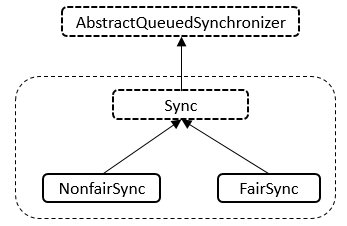

## 参考博文
[JUC工具类: Semaphore详解](https://www.pdai.tech/md/java/thread/java-thread-x-juc-tool-semaphore.html)
[Java并发之Semaphore详解](https://blog.csdn.net/lipeng_bigdata/article/details/52165426)


[TOC]


## 1. 概述
Semaphore用来控制同时访问资源的线程数量。例如用来做流量控制，Semaphore来规定同时能访问的线程数量，通过acquire()获得许可，release()释放许可

# 2. 源码分析


## 构造函数
可以是公平的也可以是非公平的

非公平会无视同步队列，上来就抢

```java
public class Semaphore implements java.io.Serializable {

    private final Sync sync;

    abstract static class Sync extends AbstractQueuedSynchronizer {
        ...
    }
    static final class NonfairSync extends Sync {
        ...
    }
    
    static final class FairSync extends Sync {
        ...
    }
}
public Semaphore(int permits) {
    sync = new NonfairSync(permits);
}

public Semaphore(int permits, boolean fair) {
    sync = fair ? new FairSync(permits) : new NonfairSync(permits);
}
```

## acquire()
获取一个信号量，如果信号量不够了将被阻塞加入同步队列中
```java
//Semaphore
public void acquire() throws InterruptedException {
    sync.acquireSharedInterruptibly(1);
}

//AQS
public final void acquireSharedInterruptibly(int arg) throws InterruptedException {
    if (Thread.interrupted())
        throw new InterruptedException();
    if (tryAcquireShared(arg) < 0)
        doAcquireSharedInterruptibly(arg);
}

//非公平获取
static final class NonfairSync extends Sync {

    protected int tryAcquireShared(int acquires) {
        return nonfairTryAcquireShared(acquires);
        }
    }

//公平获取
static final class FairSync extends Sync {

    FairSync(int permits) {
            super(permits);
        }
    /*
    会先判断队列里是否有在排队的，如果有就要将该线程放入同步队列中
    */
    protected int tryAcquireShared(int acquires) {
        for (;;) {
            if (hasQueuedPredecessors())
                return -1;
            int available = getState();
            int remaining = available - acquires;
            if (remaining < 0 ||compareAndSetState(available, remaining))
                return remaining;
        }
    }
}

//Sync
/*
1. 获取当前state
2. 获取当前state减去申请的数量后还剩多少许可remaining
3. 如果remaining小于0，说明许可不够了不能申请，加入等待队列中。否则通过CAS尝试申请。
*/
final int nonfairTryAcquireShared(int acquires) {
    for (;;) {
        int available = getState();
        int remaining = available - acquires;
        if (remaining < 0 ||compareAndSetState(available, remaining))
            return remaining;
    }
}
```

## release()
release不一定要在acqire之后调用。

例如semaphore初始化有2个令牌，一个线程调用1次release方法，然后一次性获取3个令牌，这3个令牌是可以获取到的，因为release给加上了1个。
```java
//Semaphore
public void release() {
    sync.releaseShared(1);
}

//AQS
public final boolean releaseShared(int arg) {
    if (tryReleaseShared(arg)) {
        doReleaseShared();
        return true;
    }
    return false;
}

//Sync
protected final boolean tryReleaseShared(int releases) {
    for (;;) {
        int current = getState();
        int next = current + releases;
        if (next < current) // overflow
            throw new Error("Maximum permit count exceeded");
        if (compareAndSetState(current, next))
            return true;
    }
}
```


# 3. 实例
```java
package thread;

import java.util.concurrent.Semaphore;

/**
 * 测试信号量
 */
public class SemaphoreTest extends Thread {

    public final static int SEM_SIZE = 10;

    public static void main(String[] args) {
        Semaphore semaphore = new Semaphore(SEM_SIZE);
        SemaphoreTest t1 = new SemaphoreTest("t1", semaphore);
        SemaphoreTest t2 = new SemaphoreTest("t2", semaphore);
        t1.start();
        t2.start();
        int permits = 5;
        System.out.println(Thread.currentThread().getName() + " trying to acquire");
        try {
            semaphore.acquire(permits);
            System.out.println(Thread.currentThread().getName() + " acquire successfully");
            Thread.sleep(1000);
        } catch (InterruptedException e) {
            e.printStackTrace();
        } finally {
            semaphore.release();
            System.out.println(Thread.currentThread().getName() + " release successfully");
        }
    }

    private Semaphore semaphore;

    public SemaphoreTest(String name, Semaphore semaphore) {
        super(name);
        this.semaphore = semaphore;
    }

    public void run() {
        int count = 3;
        System.out.println(Thread.currentThread().getName() + " trying to acquire");
        try {
            semaphore.acquire(count);
            System.out.println(Thread.currentThread().getName() + " acquire successfully");
            Thread.sleep(1000);
        } catch (InterruptedException e) {
            e.printStackTrace();
        } finally {
            semaphore.release(count);
            System.out.println(Thread.currentThread().getName() + " release successfully");
        }
    }
}
/*
t1 trying to acquire
main trying to acquire
t2 trying to acquire
main acquire successfully
t1 acquire successfully
main release successfully
t2 acquire successfully
t1 release successfully
t2 release successfully
*/
```