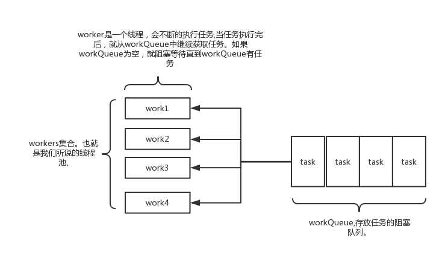

## 参考博文
[JUC线程池: ThreadPoolExecutor详解](https://www.pdai.tech/md/java/thread/java-thread-x-juc-executor-ThreadPoolExecutor.html)
[线程池之ThreadPoolExecutor使用](https://www.jianshu.com/p/f030aa5d7a28)
[java线程池ThreadPoolExecutor类使用详解](https://www.cnblogs.com/dafanjoy/p/9729358.html)


[TOC]

# 1. 概述
线程池有一个线程集合workers和一个阻塞队列workQueue，worker会从workQueue获取任务来执行




# 2. 线程池的创建
```java
new ThreadPoolExecutor(corePoolSize, maximumPoolSize, keepAliveTime, unit, workQueue, handler)
```

- corePoolSize：线程池基本大小
- maximumPoolSize：线程池允许创建的最大线程数，但如果是无界的任务队列这个参数就没什么用
- keepAliveTime：线程池中的线程空闲后，能存活的时间
- unit：存活时间的单位。DAYS、HOURS、MINUTES、MILLISECONDS、MICROSECONDS、NANOSECONDS
- workQueue：任务队列，用于存放任务的[阻塞队列](./BlockingQueue.md)
  - ArrayBlockingQueue：基于数据的有界阻塞队列
  - LinkedBlockingQueue：基于链表的有界阻塞队列
  - SynchronousQueue：不存储元素的队列
  - PriorityQueue：有优先级的无界阻塞队列
- factory：创建线程的工厂，通过自定义的线程工厂可以给每个新建的线程设置一个具有识别度的线程名。默认为DefaultThreadFactory
- handler：饱和策略。当线程池和阻塞队列都满了，就要采取饱和策略处理
  - AbortPolicy：直接抛出RejectedExecutionException。默认
  - CallerRunsPolicy：用调用者所在的线程执行任务
  - DiscardOldesPolicy：丢弃阻塞队列中最前的任务，然后执行当前任务
  - DiscardPolicy：直接丢弃

```java
public ThreadPoolExecutor(int corePoolSize,
                              int maximumPoolSize,
                              long keepAliveTime,
                              TimeUnit unit,
                              BlockingQueue<Runnable> workQueue,
                              ThreadFactory factory,
                              RejectedExecutionHandler handler)
  
```

# 3. 向线程池提交任务
## execute()
提交不需要返回值的任务，所以不能判断任务是否被线程池执行成功
```java
threadPool.execute(new Runnable() {
    @Override
    public void run() {
        ...
    }
});
```

## submit()
提交需要返回值的任务，返回一个Future对象，通过这个对象来判断任务是否执行成功。可以通过get()方法来获取返回值，get()会阻塞当前线程直到任务执行完成。
```java
Future<Object> future = threadPool.submit(task);
Object s = future.get();
```


# 4. 关闭线程池
原理是遍历线程池的工作线程，逐个调用线程的interrupt方法来中断线程

只要调用这两个关闭方法中的任意一个, isShutDown() 返回true. 当所有任务都成功关闭了, isTerminated()返回true

## shutdown()
先将线程池状态设为STOP，然后尝试停止所有正在执行或暂停执行的线程，并返回等待执行任务的列表


## shutdownNow()
将线程池状态设置为SHUTDOWN，然后中断所有没有在执行任务的线程

# 5. 例子
## 例子1
```java
public class ThreadTest {

    public static void main(String[] args) throws InterruptedException, IOException {
        int corePoolSize = 2;
        int maximumPoolSize = 4;
        long keepAliveTime = 10;
        TimeUnit unit = TimeUnit.SECONDS;
        BlockingQueue<Runnable> workQueue = new ArrayBlockingQueue<>(2);
        ThreadFactory threadFactory = new NameTreadFactory();
        RejectedExecutionHandler handler = new MyIgnorePolicy();
        ThreadPoolExecutor executor = new ThreadPoolExecutor(corePoolSize, maximumPoolSize, keepAliveTime, unit,
                workQueue, threadFactory, handler);
        executor.prestartAllCoreThreads(); // 预启动所有核心线程
        
        for (int i = 1; i <= 10; i++) {
            MyTask task = new MyTask(String.valueOf(i));
            executor.execute(task);
        }

        System.in.read(); //阻塞主线程
    }

    static class NameTreadFactory implements ThreadFactory {

        private final AtomicInteger mThreadNum = new AtomicInteger(1);

        @Override
        public Thread newThread(Runnable r) {
            Thread t = new Thread(r, "my-thread-" + mThreadNum.getAndIncrement());
            System.out.println(t.getName() + " has been created");
            return t;
        }
    }

    public static class MyIgnorePolicy implements RejectedExecutionHandler {

        public void rejectedExecution(Runnable r, ThreadPoolExecutor e) {
            doLog(r, e);
        }

        private void doLog(Runnable r, ThreadPoolExecutor e) {
            // 可做日志记录等
            System.err.println( r.toString() + " rejected");
//          System.out.println("completedTaskCount: " + e.getCompletedTaskCount());
        }
    }

    static class MyTask implements Runnable {
        private String name;

        public MyTask(String name) {
            this.name = name;
        }

        @Override
        public void run() {
            try {
                System.out.println(this.toString() + " is running!");
                Thread.sleep(3000); //让任务执行慢点
            } catch (InterruptedException e) {
                e.printStackTrace();
            }
        }

        public String getName() {
            return name;
        }

        @Override
        public String toString() {
            return "MyTask [name=" + name + "]";
        }
    }
}
```


## 例子2
```java
public class ThreadPool {
    private static ExecutorService pool;
    public static void main( String[] args )
    {
        //自定义线程工厂
        pool = new ThreadPoolExecutor(2, 4, 1000, TimeUnit.MILLISECONDS, new ArrayBlockingQueue<Runnable>(5),
                new ThreadFactory() {
            public Thread newThread(Runnable r) {
                System.out.println("线程"+r.hashCode()+"创建");
                //线程命名
                Thread th = new Thread(r,"threadPool"+r.hashCode());
                return th;
            }
        }, new ThreadPoolExecutor.CallerRunsPolicy());
          
        for(int i=0;i<10;i++) {
            pool.execute(new ThreadTask());
        }    
    }
}

public class ThreadTask implements Runnable{    
    public void run() {
        //输出执行线程的名称
        System.out.println("ThreadName:"+Thread.currentThread().getName());
    }
}

/*
线程118352462创建
线程1550089733创建
线程865113938创建
ThreadName:threadPool1550089733
ThreadName:threadPool118352462
线程1442407170创建
ThreadName:threadPool1550089733
ThreadName:threadPool1550089733
ThreadName:threadPool1550089733
ThreadName:threadPool865113938
ThreadName:threadPool865113938
ThreadName:threadPool118352462
ThreadName:threadPool1550089733
ThreadName:threadPool1442407170
*/
```

## 例子3
```java
public class ThreadPool {
    private static ExecutorService pool;
    public static void main( String[] args ) throws InterruptedException
    {
        //实现自定义接口
        pool = new ThreadPoolExecutor(2, 4, 1000, TimeUnit.MILLISECONDS, new ArrayBlockingQueue<Runnable>(5),
                new ThreadFactory() {
            public Thread newThread(Runnable r) {
                System.out.println("线程"+r.hashCode()+"创建");
                //线程命名
                Thread th = new Thread(r,"threadPool"+r.hashCode());
                return th;
            }
        }, new ThreadPoolExecutor.CallerRunsPolicy()) {
    
            protected void beforeExecute(Thread t,Runnable r) {
                System.out.println("准备执行："+ ((ThreadTask)r).getTaskName());
            }
            
            protected void afterExecute(Runnable r,Throwable t) {
                System.out.println("执行完毕："+((ThreadTask)r).getTaskName());
            }
            
            protected void terminated() {
                System.out.println("线程池退出");
            }
        };
          
        for(int i=0;i<10;i++) {
            pool.execute(new ThreadTask("Task"+i));
        }    
        pool.shutdown();
    }
}

public class ThreadTask implements Runnable{    
    private String taskName;
    public String getTaskName() {
        return taskName;
    }
    public void setTaskName(String taskName) {
        this.taskName = taskName;
    }
    public ThreadTask(String name) {
        this.setTaskName(name);
    }
    public void run() {
        //输出执行线程的名称
        System.out.println("TaskName"+this.getTaskName()+"---ThreadName:"+Thread.currentThread().getName());
    }
}
/*
线程118352462创建
线程1550089733创建
准备执行：Task0
准备执行：Task1
TaskNameTask0---ThreadName:threadPool118352462
线程865113938创建
执行完毕：Task0
TaskNameTask1---ThreadName:threadPool1550089733
执行完毕：Task1
准备执行：Task3
TaskNameTask3---ThreadName:threadPool1550089733
执行完毕：Task3
准备执行：Task2
准备执行：Task4
TaskNameTask4---ThreadName:threadPool1550089733
执行完毕：Task4
准备执行：Task5
TaskNameTask5---ThreadName:threadPool1550089733
执行完毕：Task5
准备执行：Task6
TaskNameTask6---ThreadName:threadPool1550089733
执行完毕：Task6
准备执行：Task8
TaskNameTask8---ThreadName:threadPool1550089733
执行完毕：Task8
准备执行：Task9
TaskNameTask9---ThreadName:threadPool1550089733
准备执行：Task7
执行完毕：Task9
TaskNameTask2---ThreadName:threadPool118352462
TaskNameTask7---ThreadName:threadPool865113938
执行完毕：Task7
执行完毕：Task2
线程池退出
*/
```