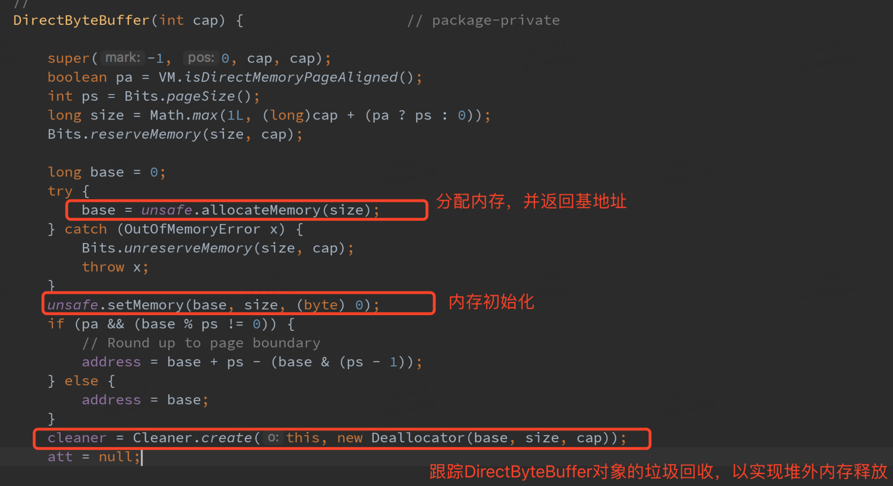
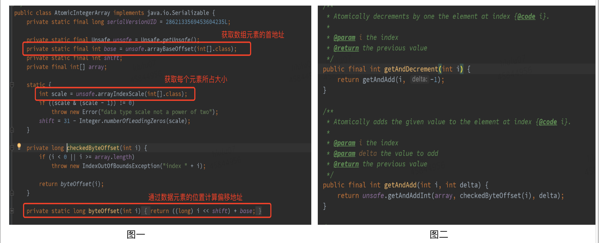

## 参考博文
[Java魔法类：Unsafe应用解析](https://tech.meituan.com/2019/02/14/talk-about-java-magic-class-unsafe.html)


[TOC]


# 1. 概念
Java 无法直接访问底层操作系统，只能通过本地（native）方法来访问。Unsafe 提供了硬件级别的操作，比如说获取某个属性在内存中的位置，比如说修改对象的私有字段值

Unsafe是单例类，并且调用getUnsafe获取Unsafe实例的调用类必须是引导类加载器Bootstrap Classloader加载的，否则抛出SecurityException异常。
```java
public final class Unsafe {
  // 单例对象
  private static final Unsafe theUnsafe;

  private Unsafe() {
  }
  @CallerSensitive
  public static Unsafe getUnsafe() {
    Class var0 = Reflection.getCallerClass();
    // 仅在引导类加载器`BootstrapClassLoader`加载时才合法
    if(!VM.isSystemDomainLoader(var0.getClassLoader())) {    
      throw new SecurityException("Unsafe");
    } else {
      return theUnsafe;
    }
  }
}
```

不提倡在代码中显示使用Unsafe类，但是可以有两种获取他的示例的方法：
1. 通过Java命令行命令-Xbootclasspath/a把调用Unsafe相关方法的类A所在jar包路径追加到默认的bootstrap路径中，使得A被引导类加载器加载，从而通过Unsafe.getUnsafe方法安全的获取Unsafe实例
```
java -Xbootclasspath/a: ${path}   // 其中path为调用Unsafe相关方法的类所在jar包路径 
```

2. 通过反射获取单例对象theUnsafe
```java
private static Unsafe reflectGetUnsafe() {
    try {
      Field field = Unsafe.class.getDeclaredField("theUnsafe");
      field.setAccessible(true);
      return (Unsafe) field.get(null);
    } catch (Exception e) {
      log.error(e.getMessage(), e);
      return null;
    }
}
```

# 2. 应用


## 内存操作
在Java中创建的对象都分配在堆内存中，由虚拟机进程管控。而堆外内存是虚拟机管控之外的内存区域，它由操作系统管理。Java对堆外内存的操作通过Unsafe提供的操作堆外内存的native方法
```java
//分配内存, 相当于C++的malloc函数
public native long allocateMemory(long bytes);
//扩充内存
public native long reallocateMemory(long address, long bytes);
//释放内存
public native void freeMemory(long address);
//在给定的内存块中设置值
public native void setMemory(Object o, long offset, long bytes, byte value);
//内存拷贝
public native void copyMemory(Object srcBase, long srcOffset, Object destBase, long destOffset, long bytes);
//获取给定地址值，忽略修饰限定符的访问限制。与此类似操作还有: getInt，getDouble，getLong，getChar等
public native Object getObject(Object o, long offset);
//为给定地址设置值，忽略修饰限定符的访问限制，与此类似操作还有: putInt,putDouble，putLong，putChar等
public native void putObject(Object o, long offset, Object x);
//获取给定地址的byte类型的值（当且仅当该内存地址为allocateMemory分配时，此方法结果为确定的）
public native byte getByte(long address);
//为给定地址设置byte类型的值（当且仅当该内存地址为allocateMemory分配时，此方法结果才是确定的）
public native void putByte(long address, byte x);
```

- 使用堆外内存的原因
1. 改善GC时的回收停顿：使用堆外内存，可以使堆内存保持一个比较小的规模，减少GC的回收停顿时间
2. 提高I/O操作的性能：在I/O过程中， 需要将堆内存数据拷贝到堆外内存中， 对需要频繁拷贝并且生命周期短的数据可以直接放到堆外内存

### DirectByteBuffer
DirectByteBuffer是Java用于实现堆外内存的一个重要类，通常用在通信过程中做缓冲池，如在Netty、MINA等NIO框架中应用广泛。DirectByteBuffer对于堆外内存的创建、使用、销毁等逻辑均由Unsafe提供的堆外内存API来实现。

下图为DirectByteBuffer构造函数，创建DirectByteBuffer的时候，通过Unsafe.allocateMemory分配内存、Unsafe.setMemory进行内存初始化，而后构建Cleaner对象用于跟踪DirectByteBuffer对象的垃圾回收，以实现当DirectByteBuffer被垃圾回收时，分配的堆外内存一起被释放


Cleaner继承虚引用PhantomReference，并结合引用队列ReferenceQueue实现虚引用关联对象被垃圾回收时能够进行系统通知、资源清理等功能。使用Cleaner关联DirectByteBuffer对象，当该对象被GC时，对象的引用会被放入pending列表中，等待Reference-Handler线程(拥有最高优先级的守护线程)处理。该线程会调用Cleaner的clean方法根据创建Cleaner时传入的Deallocator来进行堆外内存的释放


## CAS
JAVA中CAS的应用--[atomic](CAS.md)都是调用Unsafe中的方法实现的，它里面的方法都是native方法

经过反编译，可以看到他的CAS方法有3种
```java
/**
  * CAS
  * @param o         包含要修改field的对象
  * @param offset    对象中某field的偏移量
  * @param expected  期望值
  * @param update    更新值
  * @return          true | false
  */
public final native boolean compareAndSwapObject(Object o, long offset,  Object expected, Object update);

public final native boolean compareAndSwapInt(Object o, long offset, int expected,int update);
  
public final native boolean compareAndSwapLong(Object o, long offset, long expected, long update);
```


## 线程调度
包括线程挂起、恢复、锁机制等方法

将一个线程进行挂起是通过park方法实现的，调用park方法后，线程将一直阻塞直到超时或者中断等条件出现；unpark可以终止一个挂起的线程，使其恢复正常

Java锁和同步器框架的核心类AbstractQueuedSynchronizer([AQS](./AQS.md))，就是通过调用LockSupport.park()和LockSupport.unpark()实现线程的阻塞和唤醒的，而LockSupport的park、unpark方法实际是调用Unsafe的park、unpark方式来实现
```java
//取消阻塞线程
public native void unpark(Object thread);
//阻塞线程
public native void park(boolean isAbsolute, long time);
//获得对象锁（可重入锁）
@Deprecated
public native void monitorEnter(Object o);
//释放对象锁
@Deprecated
public native void monitorExit(Object o);
//尝试获取对象锁
@Deprecated
public native boolean tryMonitorEnter(Object o);
```


## Class相关
此部分主要提供Class和它的静态字段的操作相关方法，包含静态字段内存定位、定义类、定义匿名类、检验&确保初始化等
```java
//获取给定静态字段的内存地址偏移量，这个值对于给定的字段是唯一且固定不变的
public native long staticFieldOffset(Field f);
//获取一个静态类中给定字段的对象指针
public native Object staticFieldBase(Field f);
//判断是否需要初始化一个类，通常在获取一个类的静态属性的时候（因为一个类如果没初始化，它的静态属性也不会初始化）使用。 当且仅当ensureClassInitialized方法不生效时返回false。
public native boolean shouldBeInitialized(Class<?> c);
//检测给定的类是否已经初始化。通常在获取一个类的静态属性的时候（因为一个类如果没初始化，它的静态属性也不会初始化）使用。
public native void ensureClassInitialized(Class<?> c);
//定义一个类，此方法会跳过JVM的所有安全检查，默认情况下，ClassLoader（类加载器）和ProtectionDomain（保护域）实例来源于调用者
public native Class<?> defineClass(String name, byte[] b, int off, int len, ClassLoader loader, ProtectionDomain protectionDomain);
//定义一个匿名类
public native Class<?> defineAnonymousClass(Class<?> hostClass, byte[] data, Object[] cpPatches);
```

## 对象操作
此部分主要包含对象成员属性相关操作及非常规的对象实例化方式等相关方法。
```java
//返回对象成员属性在内存地址相对于此对象的内存地址的偏移量
public native long objectFieldOffset(Field f);
//获得给定对象的指定地址偏移量的值，与此类似操作还有：getInt，getDouble，getLong，getChar等
public native Object getObject(Object o, long offset);
//给定对象的指定地址偏移量设值，与此类似操作还有：putInt，putDouble，putLong，putChar等
public native void putObject(Object o, long offset, Object x);
//从对象的指定偏移量处获取变量的引用，使用volatile的加载语义
public native Object getObjectVolatile(Object o, long offset);
//存储变量的引用到对象的指定的偏移量处，使用volatile的存储语义
public native void putObjectVolatile(Object o, long offset, Object x);
//有序、延迟版本的putObjectVolatile方法，不保证值的改变被其他线程立即看到。只有在field被volatile修饰符修饰时有效
public native void putOrderedObject(Object o, long offset, Object x);
//绕过构造方法、初始化代码来创建对象
public native Object allocateInstance(Class<?> cls) throws InstantiationException;
```

- 常规对象实例化方式：我们通常所用到的创建对象的方式，从本质上来讲，都是通过new机制来实现对象的创建。但是，new机制有个特点就是当类只提供有参的构造函数且无显示声明无参构造函数时，则必须使用有参构造函数进行对象构造，而使用有参构造函数时，必须传递相应个数的参数才能完成对象实例化。
- 非常规的实例化方式：而Unsafe中提供allocateInstance方法，仅通过Class对象就可以创建此类的实例对象，而且不需要调用其构造函数、初始化代码、JVM安全检查等。它抑制修饰符检测，也就是即使构造器是private修饰的也能通过此方法实例化，只需提类对象即可创建相应的对象。由于这种特性，allocateInstance在java.lang.invoke、Objenesis（提供绕过类构造器的对象生成方式）、Gson（反序列化时用到）中都有相应的应用


## 数组相关
arrayBaseOffset与arrayIndexScale这两个方法配合起来使用，即可定位数组中每个元素在内存中的位置
```java
//返回数组中第一个元素的偏移地址
public native int arrayBaseOffset(Class<?> arrayClass);
//返回数组中一个元素占用的大小
public native int arrayIndexScale(Class<?> arrayClass);
```

在java.util.concurrent.atomic 包下的AtomicIntegerArray可以实现对Integer数组中每个元素的原子性操作,他的getAndAdd方法即通过checkedByteOffset方法获取某数组元素的偏移地址，而后通过CAS实现原子性操作




## 内存屏障
在Java 8中引入，用于定义内存屏障（也称内存栅栏，内存栅障，屏障指令等，是一类同步屏障指令，是CPU或编译器在对内存随机访问的操作中的一个同步点，使得此点之前的所有读写操作都执行后才可以开始执行此点之后的操作），避免代码重排序
```java
//内存屏障，禁止load操作重排序。屏障前的load操作不能被重排序到屏障后，屏障后的load操作不能被重排序到屏障前
public native void loadFence();
//内存屏障，禁止store操作重排序。屏障前的store操作不能被重排序到屏障后，屏障后的store操作不能被重排序到屏障前
public native void storeFence();
//内存屏障，禁止load、store操作重排序
public native void fullFence();
```

## 系统相关
这部分包含两个获取系统相关信息的方法。
```java
//返回系统指针的大小。返回值为4（32位系统）或 8（64位系统）。
public native int addressSize();  
//内存页的大小，此值为2的幂次方。
public native int pageSize();
```

为java.nio下的工具类Bits中计算待申请内存所需内存页数量的静态方法，其依赖于Unsafe中pageSize方法获取系统内存页大小实现后续计算逻辑。

