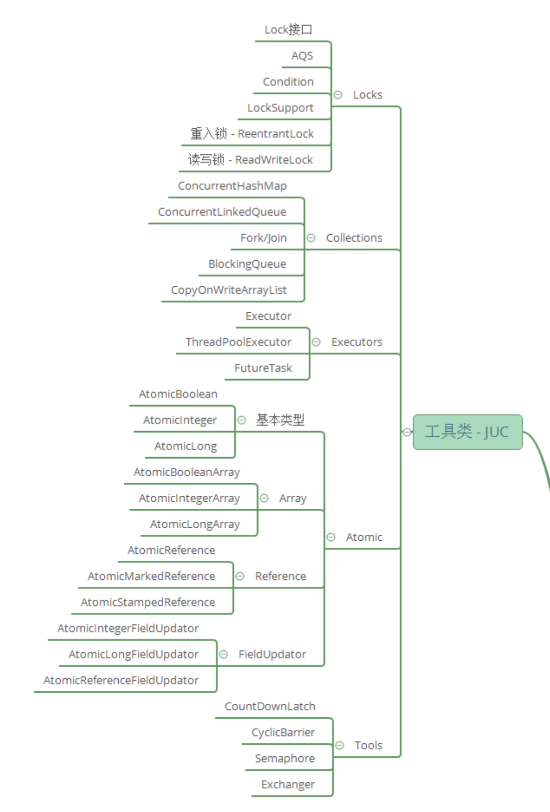
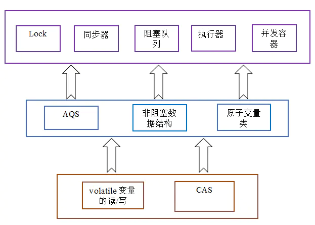

## 参考博文
[并发队列ConcurrentLinkedQueue与阻塞队列LinkedBlockingQueue的区别](https://my.oschina.net/huluerwa/blog/311316)


[TOC]





# 1. Locks
## 1.1 AQS
[AQS](./AQS.md)

## 1.2 Condition
[AQS](./AQS.md)
[ReentrantLock](./ReentrantLock.md)

## 1.3 LockSupprt
[LockSupport](./LockSupport.md)

## 1.4 ReentrantLock
[ReentrantLock](./ReentrantLock.md)

## 1.5 ReentrantReadWriteLock
[ReentrantReadWriteLock](./ReentrantReadWriteLock.md)


# 2. Colletions
# 2.1 ConcurrentHashMap
[ConcurrentHashMap](./ConcurrentHashMap.md)

# 2.2 队列
## 非阻塞队列ConcurrentLinkedQueue
[ConcurrentLinkedQueue](./ConcurrentLinkedQueue.md)

## 阻塞队列
[BlockingQueue](./BlockingQueue.md)


## 阻塞 VS 非阻塞
```java
public class QueueCompare {

    private static final org.slf4j.Logger LOGGER
            = LoggerFactory.getLogger(QueueCompare.class);

    /**
     * 生产者、消费者
     */
    interface Market<V> {

        void producer(V v);

        void consumer();

    }


    /**
     * concurrentLinkedQueue 的生产与消费实现
     */
    private static class ConcurrentLinkedQueueMarket<V> implements Market<V> {

        @Override
        public void producer(V o) {
            concurrentLinkedQueue.add(o);
            // LOGGER.info("concurrentLinkedQueue <{}> producer <{}>", concurrentLinkedQueue, o);
        }


        @Override
        public void consumer() {
            while (!concurrentLinkedQueue.isEmpty()) {//return first() == null; !!! size 方法是遍历队列返回总数
                concurrentLinkedQueue.poll();
                // LOGGER.info("concurrentLinkedQueue <{}> consumer <{}>", linkedBlockingQueue, o);
            }
        }
    }


    /**
     * linkedBlockingQueue 的生产与消费实现
     */
    private static class LinkedBlockingQueueMarket<V> implements Market<V> {

        @Override
        public void producer(V o) {
            try {
                linkedBlockingQueue.put(o);
                //LOGGER.info("linkedBlockingQueue <{}> producer <{}>", linkedBlockingQueue, o);
            } catch (InterruptedException e) {
                e.printStackTrace();
            }
        }

        @Override
        public void consumer() {
            while (!linkedBlockingQueue.isEmpty()) {//return size() == 0; 与直接使用 size 方法无区别
                try {
                    linkedBlockingQueue.take();
                    // LOGGER.info("linkedBlockingQueue <{}> consumer <{}>", linkedBlockingQueue, o);
                } catch (InterruptedException e) {
                    e.printStackTrace();
                }
            }
        }

    }


    /**
     * 生产处理线程
     *
     * @param <T> extends Market
     */
    private static class ProducerHandle<T extends Market<V>, V> implements Runnable {

        T market;
        V v;

        private ProducerHandle(T market, V v) {
            this.market = market;
            this.v = v;
        }

        @Override
        public void run() {

            for (int i = 0; i < PRODUCER_OBJ_NUM; i++) {

                market.producer(v);
            }
        }
    }

    /**
     * 消费处理线程
     *
     * @param <T> extends Market
     */
    private static class ConsumerHandle<T extends Market<V>, V> implements Runnable {

        T market;
        V v;

        private ConsumerHandle(T market, V v) {
            this.market = market;
            this.v = v;
        }


        @Override
        public void run() {
            market.consumer();
            LOGGER.info(" <{}> done <{}> need time <{}>"
                    , market.getClass().getSimpleName()
                    , PRODUCER_OBJ_NUM
                    , DateTime.now().toString(ISODateTimeFormat.dateHourMinuteSecond()));
        }
    }


    //执行的线程数量
    private static final int SYNCHRONIZED_DONE_THREAD_NUM = 4;


    //线程池
    private static final ExecutorService EXECUTOR_SERVICE
            = Executors.newFixedThreadPool(SYNCHRONIZED_DONE_THREAD_NUM);

    //linkedBlockingQueue init
    private static LinkedBlockingQueue linkedBlockingQueue
            = new LinkedBlockingQueue();

    //concurrentLinkedQueue init
    private static ConcurrentLinkedQueue concurrentLinkedQueue
            = new ConcurrentLinkedQueue();

    //测试生产数量
    public static final int PRODUCER_OBJ_NUM = 10000000;

    private static void runTest() {

        /**
         * 添加concurrentLinkedQueue生产线程
         */
        Market<String> concurrentLinkedQueueMarket =
                new ConcurrentLinkedQueueMarket<>();

        EXECUTOR_SERVICE.execute(
                new ProducerHandle<>(concurrentLinkedQueueMarket, "concurrentLinkedQueueMarket")
        );
        EXECUTOR_SERVICE.execute(
                new ConsumerHandle<>(concurrentLinkedQueueMarket, "concurrentLinkedQueueMarket")
        );


        /**
         * 添加blockingQueue生产线程
         */
        Market<String> blockingQueueMarket
                = new LinkedBlockingQueueMarket<>();
        EXECUTOR_SERVICE.execute(
                new ProducerHandle<>(blockingQueueMarket, "blockingQueueMarket")
        );
        EXECUTOR_SERVICE.execute(
                new ConsumerHandle<>(blockingQueueMarket, "blockingQueueMarket")
        );


        EXECUTOR_SERVICE.shutdown();
    }


    public static void main(String[] args) {
        runTest();
    }
}
/*
 <LinkedBlockingQueueMarket>    done <10000> need time <2014-08-29T09:46:21>
 <ConcurrentLinkedQueueMarket>  done <10000> need time <2014-08-29T09:46:21>


 <LinkedBlockingQueueMarket>    done <100000> need time <2014-08-29T09:46:46>
 <ConcurrentLinkedQueueMarket>  done <100000> need time <2014-08-29T09:47:12>


 <LinkedBlockingQueueMarket>    done <1000000> need time <2014-08-29T09:47:33>
 <ConcurrentLinkedQueueMarket>  done <1000000> need time <2014-08-29T.超长耗时>


 ConcurrentLinkedQueueMarket采用 isEmpty() 方法判断大小
 --------------------------------------------------------------------------
 <LinkedBlockingQueueMarket>    done <1000000> need time <2014-08-29T09:53:24>
 <ConcurrentLinkedQueueMarket>  done <1000000> need time <2014-08-29T09:53:24>


 <ConcurrentLinkedQueueMarket>  done <10000000> need time <2014-08-29T09:55:54>
 <LinkedBlockingQueueMarket>    done <10000000> need time <2014-08-29T09:55:54>
*/
```

## 2.3 Fork&Join
[Fork&Join](./Fork&Join.md)


## 2.4 CpoyOnWriteArrayList
[CpoyOnWriteArrayList](./CpoyOnWriteArrayList.md)