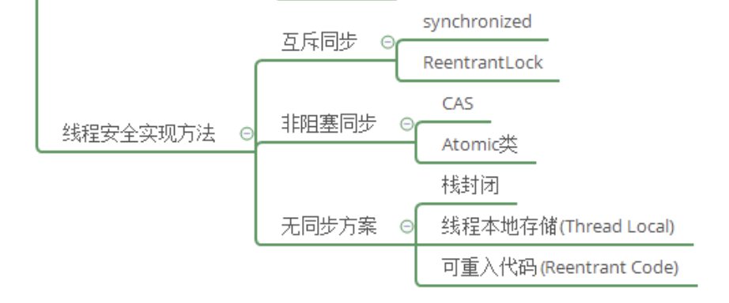

## 参考博文

[TOC]

# 1. 互斥同步
## 1.1 synchronized
[synchronized](./synchronized.md)

## 1.2 ReentrantLock
[ReentrantLock](./ReentrantLock.md)

## 1.3 synchronized VS ReentrantLock
||ReentrantLock|Synchronized
--|--|--|
底层实现|AQS|通过JVM实现，其中synchronized又有多个类型的锁，除了重量级锁是通过monitor对象(操作系统mutex互斥原语)实现外，其它类型的通过对象头实现
是否可重入|是(AQS的state)|是(锁计数器)
公平锁|是|否
非公平锁|是|是
锁的类型|悲观锁、显式锁|悲观锁、隐式锁(内置锁)
是否支持中断|是|否
是否支持超时等待|是|否
是否自动获取/释放锁|否|是
等待通知机制([线程基础](./线程基础.md))|Condition：await、signal、signalAll|Object:wait、notify、notifyAll

# 2. 非阻塞同步
## 2.1 CAS
[CAS](./CAS.md)

## 2.2 atomic类
[atomic](./atomic.md)

# 3. 无同步方案
## 3.1 栈封闭
当多个线程访问一个方法的局部变量时不会存在线程安全问题，因为局部变量存在线程私有的虚拟机栈中

## 3.2 线程本地存储ThreadLocal

[ThreadLocal](./ThreadLocal.md)

如果共享数据的代码能在一个线程中执行，就可以将共享数据的可见范围限制在一个线程中，那么无需同步就能保证线程间不出现数据争用的问题

很多”生产者-消费者“的模式都会选择在一个线程中将产品消费完

就可以使用java.lang.ThreadLocal 类来实现线程本地存储功能

## 3.3 可重入代码Reentrant Code
可重入代码指的是：可以在执行他执行到一半的时候转去执行其他代码，当回来再执行他的时候不会出现问题

他的特征是：
1. 不和别人共享变量，也就是说不依赖堆上的公共资源
2. 用到的状态量都由参数传入
3. 没有调用其他非可重入的方法