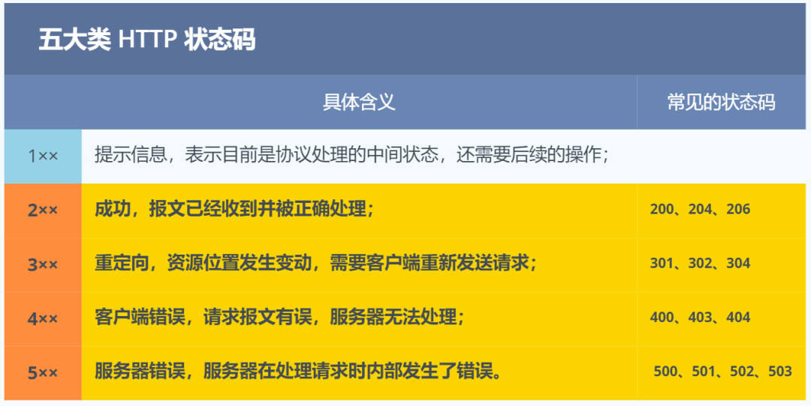

## 参考博文
[详细解析 HTTP 与 HTTPS 的区别](https://juejin.im/entry/58d7635e5c497d0057fae036)

[TOC]


超文本传输协议HTTP协议被用于在Web浏览器和网站服务器之间传递信息，HTTP协议以明文方式发送内容，不提供任何方式的数据加密,有安全问题

安全套接字层超文本传输协议HTTPS，为了数据传输的安全，HTTPS在HTTP的基础上加入了SSL协议，SSL依靠证书来验证服务器的身份，并为浏览器和服务器之间的通信加密

# 1. 超文本传输协议HTTP协议
[HTTP协议](./web浏览器.md)



## 请求方式
1. GET	请求指定的页面信息，并返回实体主体。
2. HEAD	类似于 GET 请求，只不过返回的响应中没有具体的内容，用于获取报头
3. POST	向指定资源提交数据进行处理请求（例如提交表单或者上传文件）。数据被包含在请求体中。POST 请求可能会导致新的资源的建立和/或已有资源的修改。
4. PUT	从客户端向服务器传送的数据取代指定的文档的内容。
5. DELETE	请求服务器删除指定的页面。
6. CONNECT	HTTP/1.1 协议中预留给能够将连接改为管道方式的代理服务器。
7. OPTIONS	允许客户端查看服务器的性能。
8. TRACE	回显服务器收到的请求，主要用于测试或诊断。
9. PATCH	是对 PUT 方法的补充，用来对已知资源进行局部更新


## HTTP2.0和HTTP1.X相比的新特性
1. 新的二进制格式（Binary Format），HTTP1.x的解析是基于文本。基于文本协议的格式解析存在天然缺陷，文本的表现形式有多样性，要做到健壮性考虑的场景必然很多，二进制则不同，只认0和1的组合。基于这种考虑HTTP2.0的协议解析决定采用二进制格式，实现方便且健壮。

2. 多路复用（MultiPlexing），即连接共享，即每一个request都是是用作连接共享机制的。一个request对应一个id，这样一个连接上可以有多个request，每个连接的request可以随机的混杂在一起，接收方可以根据request的 id将request再归属到各自不同的服务端请求里面。

3. header压缩，如上文中所言，对前面提到过HTTP1.x的header带有大量信息，而且每次都要重复发送，HTTP2.0使用encoder来减少需要传输的header大小，通讯双方各自cache一份header fields表，既避免了重复header的传输，又减小了需要传输的大小。

4. 服务端推送（server push），同SPDY一样，HTTP2.0也具有server push功能。


# 2. 安全套接字层超文本传输协议HTTPS
## 工作原理
一开始使用非对称加密，后面数据的传输过程使用对称加密

1. 客户端发送连接请求。发送的内容包含一个随机值1和它支持的加密算法
2. 服务端收到后返回随机值2和经过和客户端匹配协商后的加密算法
3. 然后将数字证书和公钥发送给客户端
4. 客户端收到证书后会证书的有效性，如果验证通过就会生成一个随机的预主密钥
5. 客户端通过随机值1、随机值2和与主密钥组装成会话秘钥，然后通过公钥加密会话秘钥发送给服务端
6. 服务端收到后利用私钥解密，得到会话秘钥
7. 客户端和服务端之间会互发一条消息来验证是否能正常发送，如果没问题的话连接就建立成功。

- 浏览器验证证书的有效性：
```
浏览器会查自己有没有这个CA机构的根证书，如果有就拿根证书中的公钥去解密数字证书中的指纹和指纹算法。
拿到指纹算法之后对证书中的摘要进行计算得到指纹，然后和服务器发过来的指纹进行对比。
```
## 优缺点
HTTPS是安全的

1. 相同网络环境下，HTTPS协议会使页面的加载时间延长近50%，增加10%到20%的耗电。此外，HTTPS协议还会影响缓存，增加数据开销和功耗。
2. HTTPS协议的安全是有范围的，在黑客攻击、拒绝服务攻击、服务器劫持等方面几乎起不到什么作用。
3. 最关键的，SSL 证书的信用链体系并不安全。特别是在某些国家可以控制 CA 根证书的情况下，中间人攻击一样可行。