[TOC]

# 1. 创建套接字
## 1.1 协议栈内部结构
第一层网络应用程序将数据的收发工作交给下层执行

第二层是Socket库，作为桥梁请求协议栈

第三层是操作系统的协议栈，它有两块工作。
第一块是使用TCP或UDP协议收发数据的部分，这块将接受委托执行收发数据的操作；浏览器、邮件等一般应用程序收发数据时用TCP;DNS查询等收发较短的控制数据时用UDP。
第二块是用IP协议控制网络数据包([5.1包的基本知识](#51-包的基本知识))收发操作的部分。在网络中数据会被分隔成网络包发送，IP协议负责将网络包发送给通信对象。IP协议中还包括ICMP协议和ARP协议，ICMP用于告知网络包传输过程中的错误和控制信息，ARP则用于根据IP地址查询以太网MAC地址

第四层是网卡驱动程序，负责控制网卡硬件

第五层网卡则负责完成实际的收发操作，也就是对网线中的信号执行发送和接收的操作

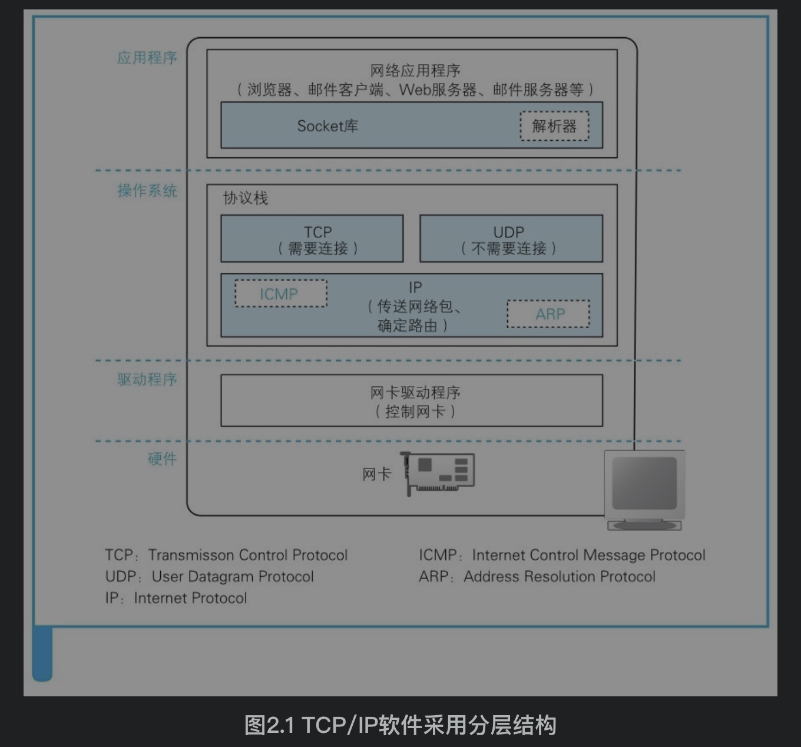


## 1.2 通信控制信息
### 头部信息
在连接、数据收发、连接断开阶段都需要的信息，被放在网络包的头部。有TCP头部(运输层)、IP头部(网络层)以太网头部(MAC头部、数据链路层)、


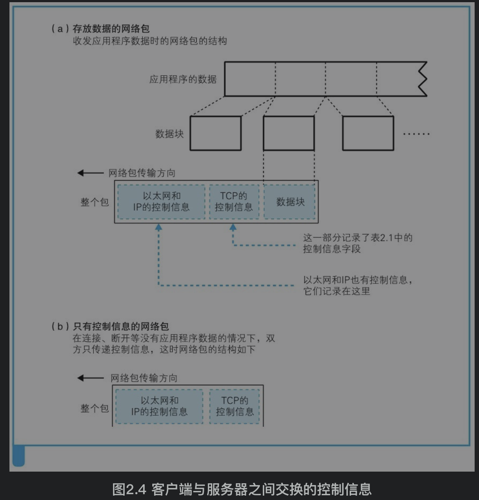

### 套接字信息
套接字本身就是一个概念，它实体就是通信控制信息。它其实是协议栈内部的一块用来存放控制信息的内存空间，协议栈根据控制信息来执行下一步操作。

套接字中的控制信息例如：通信对象IP地址和端口号、是否已经收到响应、发送数据后经过了多长时间等

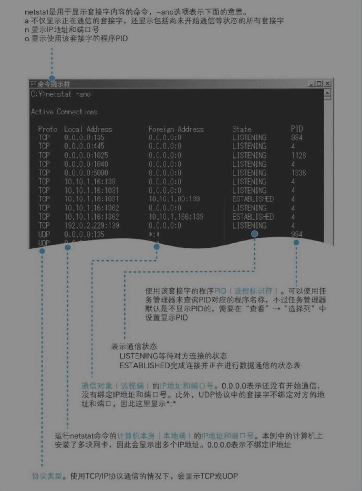

## 1.3 使用TCP协议调用socket时的操作
和调用解析器一样，浏览器通过调用Socket库中的socket()方法创建套接字，就是分配一个套接字需要的内存空间，然后写入初始状态，并随机给这个套接字分配一个端口

浏览器会收到一个描述符并放在内存中。描述符用来给协议栈标识用哪个套接字发送和获取数据。

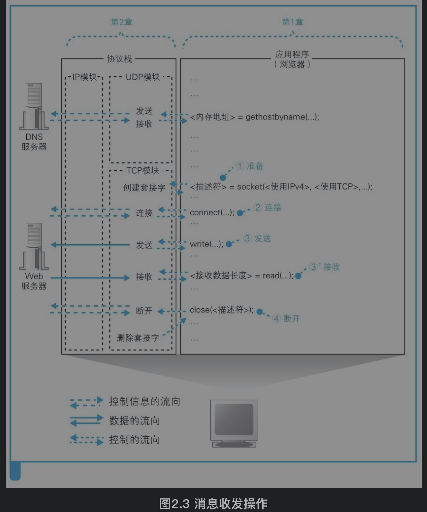


# 2. 连接服务器
```java
connect(<描述符>，<服务器IP地址和端口号>，...)
```
浏览器将通过调用Socket库中的connect()方法与服务器那边的套接字连接起来,需要指定描述符、服务器IP地址和端口号这3个参数。当连接成功后，服务器和客户端的协议栈会将对方的IP地址和端口号等信息保存在套接字中。
1）描述符告诉协议栈使用哪一个socket和对方进行连接。描述符是协议栈用来和浏览器沟通的东西，是不能拿来和对方建立通信的
2）同时指定服务器IP和端口号才能确定一个服务器上的某个套接字，同时确定浏览器和服务器的IP和端口号就能确定两者之间的一个socket连接

connect的执行过程其实就是TCP的==三次握手过程==：
>1. 客户端发出连接请求
1)客户端调用connect接口将服务器IP地址和端口号传递给协议栈的TCP模块
2)TCP模块创建TCP头部，重点是包含发送方和接收方的端口号，设置TCP头部中==SYN=1(表示连接)，ACK=0==，选择序号为x
3)TCP模块将TCP头部委托IP模块发送([5.IP与以太网的包收发操作](#5-ip与以太网的包收发操作))，经过一系列操作后网络包到达服务器。

>2. 服务器发送连接确认信息
1)服务器的IP模块将数据传递给TCP模块，TCP模块根据TCP头部信息从处于等待的套接字中找到端口号对应的套接字。套接字中会写入相应的信息，并将状态改为正在连接。
2)服务器的TCP模块返回响应，该过程和客户端发送连接请求一样，设置TCP头部中==SYN=1，ACK=1==(ACK=0表示确认网络包已经送达)，ACK确认号为x+1,序号为y

>3. 客户端回复确认信息
1)网络包到达客户端的TCP模块后，根据TCP头部中的SYN是否为1判断连接是否成功，如果为1表示成功则向套接字中写入服务器的IP地址、端口号等信息，同时还会将状态改为连接完毕。
2)客户端发送ACK=1,确认ACK为y+1的响应信息
3)服务器收到后才表示连接已经建立

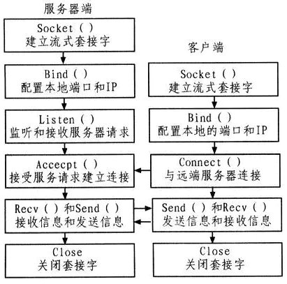


# 3. 收发数据
## 3.1 将HTTP请求消息交给协议栈
```java
write(<描述符>,<发送数据>,<发送数据长度>)
```
客户端调用write方法将要发送的数据交给协议栈，协议栈将要发送的数据看做一定长度的二进制字节序列。

发送方的协议栈收到数据后，会将数据放入发送缓冲区中，根据网络包数据长度和时间两个指标在积累一定的数据量后将数据发送出去。
1）每个包能容纳的最大数据长度MSS：当从协议栈收到的数据长度超过或者接近MSS时再发送出去，就可以避免发送大量小包的问题了
2）当发送数据频率不高时，如果等到达到MSS再发送会有很高的延迟。所以协议栈内部有一个计时器，当经过一定时间之后，就会把网络包发送出去
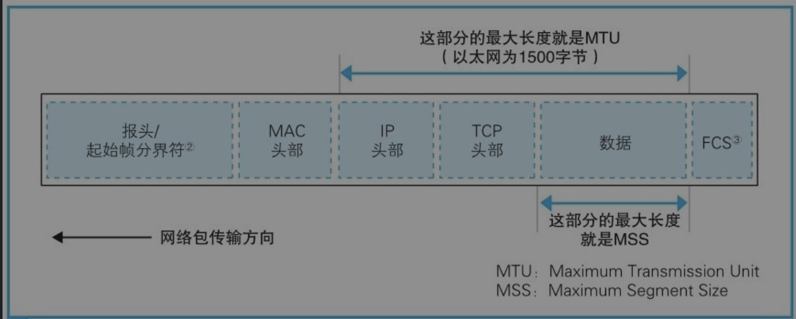

接收方的协议栈收到数据后，检查收到的数据块和TCP头部的内容，判断是否有数据丢失，如果没有问题则返回ACK号。会先将数据存在接收缓冲区中，并将数据顺序组装起来交给应用程序(将数据复制到应用程序指定的内存地址中)，然后将控制流程交回应用程序。

### 对较大的数据进行拆分
当要发送的数据超过一个MSS时(例如发送一篇博客)，那么应用程序数据会被以MSS为长度单位拆分成多个网络包发送


### 使用ACK号确认网络包已收到
TCP协议发送数据具有确认网络包是否成功发送的功能，具体是通过序号和ACK号。
1）序号：TCP模块在拆分数据时，会计算每块数据相对于数据块头部是第几个字节，并将其作为序号写入TCP头部中。并且接收方还需要知道这个包的数据有多长，可以通过网络包长度减去头部长度获取。
2）ACK号：接收方会将目前为止收到的数据长度加起来再加1，放入TCP头部的ACK号中返回。ACK同时也表示接收方希望收到的下一个序号。在得到对方确认之前，发送过的包都会保存在发送缓冲区中。如果对方没有返回某些包对应的ACK号，那么就重新发送这些包

通过序号和ACK判断收到的数据是否有遗漏，如果上次接收方收到第1460字节，那么接下来如果收到序号为1461的包，说明中间没有遗漏。
相当于发送方在发送时会告诉接收方“现在发送的是从第××字节开始的部分，一共有××字节哦”，接收方返回“到第××字节之前的数据我已经都收到了哦”
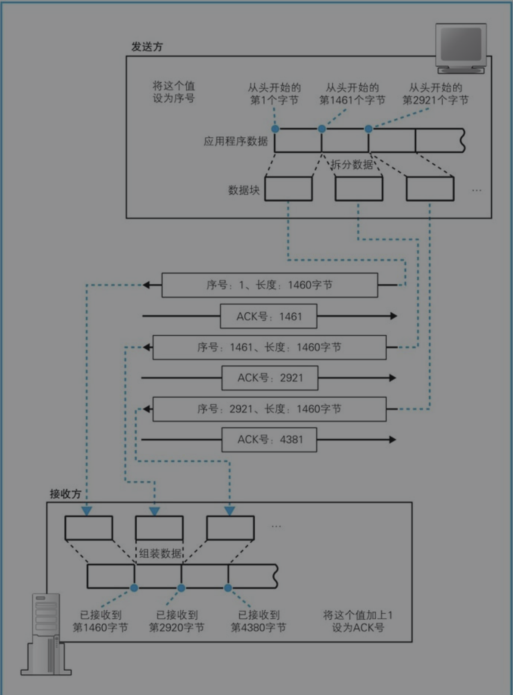

TCP数据收发是双向的，服务器也需要给客户端发送数据：

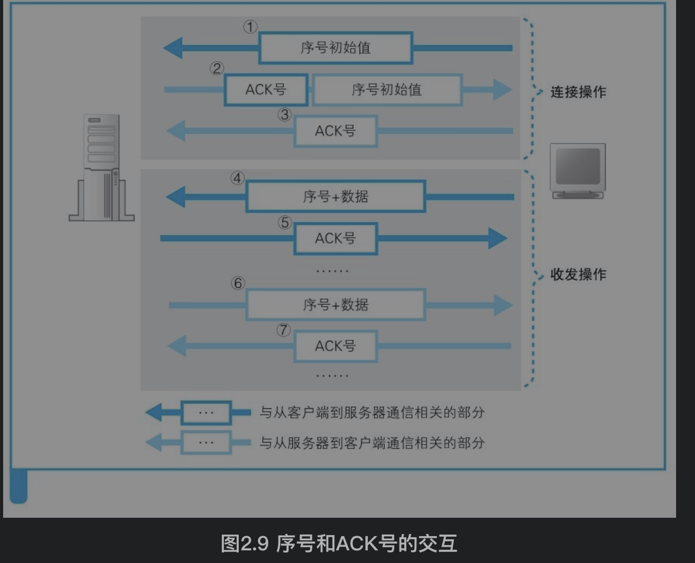

### 根据网络包平均往返时间调整ACK号等待时间
TCP会在发送数据的过程中持续测量ACK号的返回时间，如果ACK号返回变慢，则相应延长等待时间；相对地，如果ACK号马上就能返回，则相应缩短等待时间


### 使用窗口有效管理ACK号
如果发送一个包就一直等待ACK的响应，那么等待的时间什么都不做会很浪费。所以采用滑动窗口方式，在发送完一个包之后连续发后面的包。
不过这样有可能会出现发送包的频率超过接收方处理能力的情况，接收方的接收缓存区会溢出。所以接收方需要告诉发送方自己最多能接收多少数据，然后发送方根据这个值对滑动窗口大小进行控制

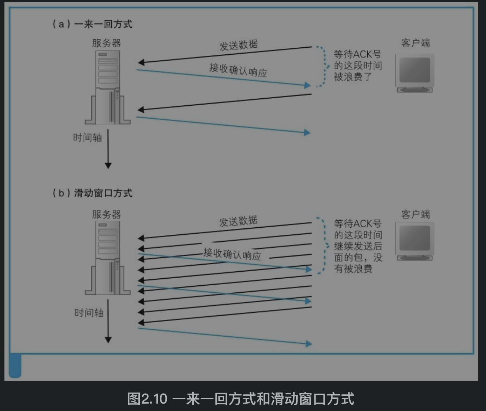

实际上，接收方在收到数据之后马上就会开始进行处理，如果接收方的性能高，处理速度比包的到达速率还快，缓冲区马上就会被清空，并通过窗口字段告知发送方

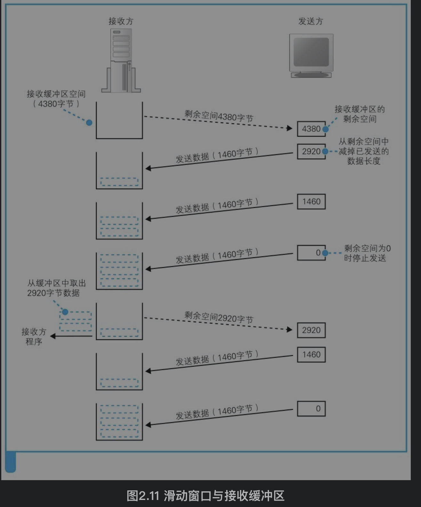


### ACK与窗口的合并


## 3.2 接收HTTP响应消息
浏览器发送完HTTP请求消息后，调用Socket库的read()获取响应消息，控制流程会通过read转移到协议栈。
协议栈尝试从接收缓冲区中获取响应消息，如果缓冲区还为空就挂起。剩下的接收数据的操作和服务方接收数据相同。

# 4. 从服务器断开连接并删除套接字
## 4.1 数据发送完毕后断开连接
当应用程序判断数据收发结束了就会调用Socket库的close程序，不同应用程序发起断开的可能是服务器也可能是客户端。

对于浏览器向Web服务器发送请求消息，服务器发送完毕会发起连接断开的请求。这个断开的过程就是TCP的==4次挥手==：
>1. 服务器发起断开连接请求
服务器的应用程序调用Socket库的close程序，协议栈生成包含断开信息的TCP头部，即将控制位中的==FIN=1==，并记录进套接字中，委托IP模块向客户端发送数据

>2. 客户端确认报文
当收到FIN=1的头部后，客户端会向服务器返回一个ACK号确认报文已收到。并会将自己的套接字标记为进入断开操作状态。此时TCP处于半关闭状态，服务器不能发数据但能收数据

>3. 客户端发起断开连接请求
当应用程序继续调用read获取数据时，如果接收缓冲区中没数据了，协议栈会告知应用程序（浏览器）来自服务器的数据已经全部收到了。客户端的应用程序调用Socket库的close程序，协议栈将和服务器一样生成包含断开信息的TCP头部，即将控制位中的==FIN=1==，并记录进套接字中，委托IP模块向客户端发送数据

>4. 服务器确认报文
服务器收到后，返回一个ACK号确认报文已收到，两者之间的连接就断开了

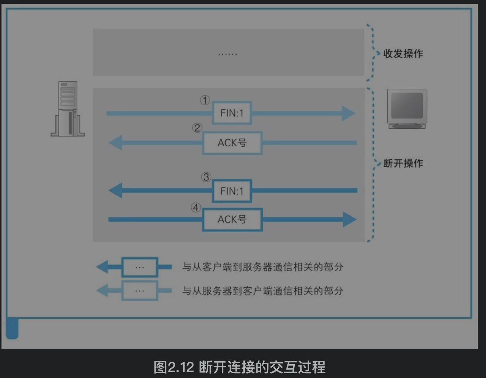

## 4.2 删除套接字
连接断开后，会等待一段时间再删除套接字。

等待一段时间的作用：
如果最后服务器返回的确认报文丢失了，客户端会重发断开连接的请求。如果这时服务器的套接字已经删除了，又在这个端口创建了新的套接字，那么这个新的套接字就会收到这个断开连接的请求，新套接字就开始断开连接了。


# 5. IP与以太网的包收发操作
TCP模块在执行连接、收发、断开操作时，都要委托IP模块将数据封装成包发送给对方。
## 5.1 包的基本知识
包包含头部和数据两部分，头部包含目的地的控制信息(相当于快递单)，数据就是要发给对方的数据(相当于货物)。
1）头部包含IP头部和MAC头部。MAC头部包含以太网所需的MAC地址，他可以被替换成无线局域网、ADSL、FTTH等
2）数据包含TCP头部和数据。
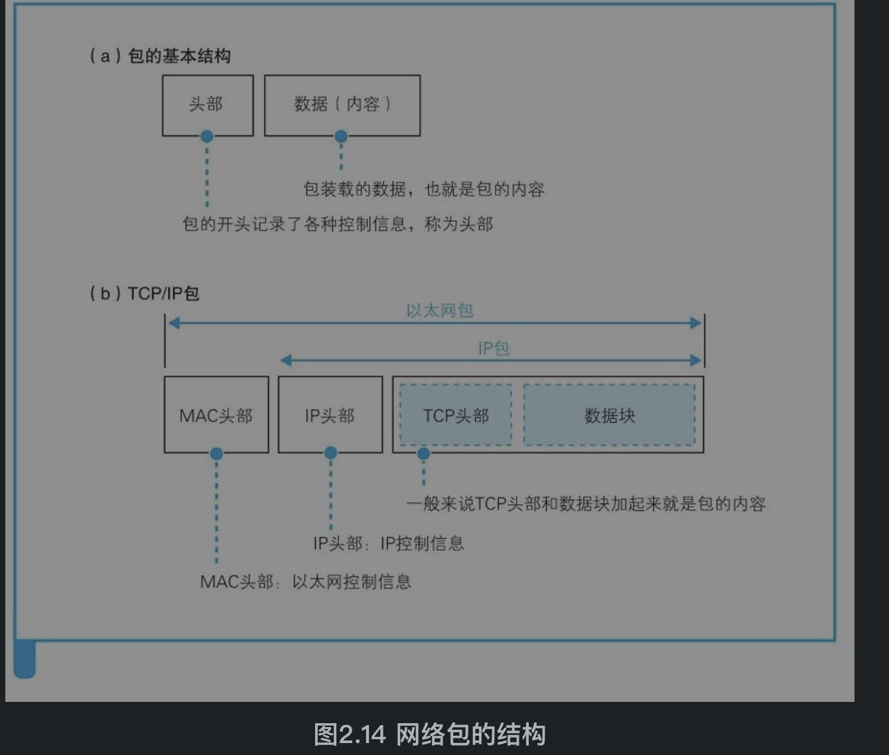
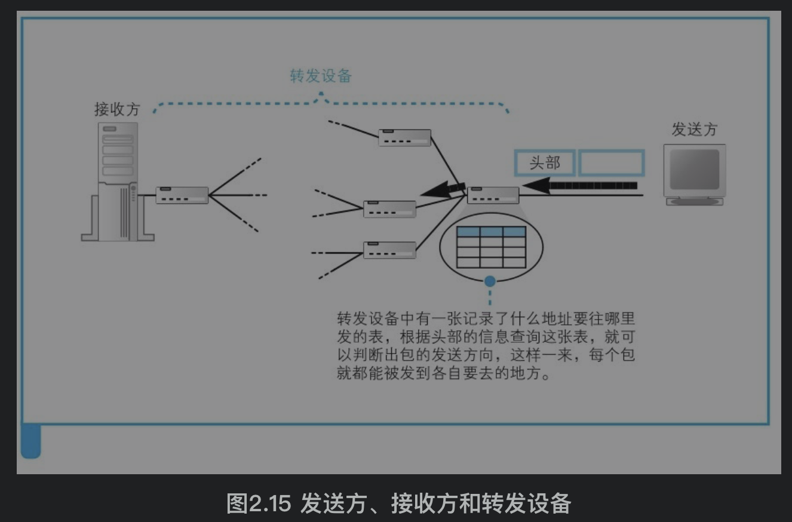

## 5.2 包的收发操作
### IP头部：路由表
TCP模块在数据块的前面加上TCP头部，然后整个传递给IP模块。IP模块将TCP头部和数据块封装成数据，再加上目的地址的IP头部和下一个路由器的MAC头部。封装好的包会被交给网卡，网卡会将这些数字信息转换为电信号或光信号，并通过网线（或光纤）发送出去。
当路由器收到包后，他会使用目的IP地址从路由表中查出下一个要发送的路由器位置A,并根据ARP缓存查处A的MAC地址来替换包的MAC头部，再发送出去。
所以在发送过程中IP头部是不会变的，即目的IP地址和源IP地址不变，但是MAC头部在每个节点发送过程中都会变，即目的MAC地址和源MAC地址一直在变
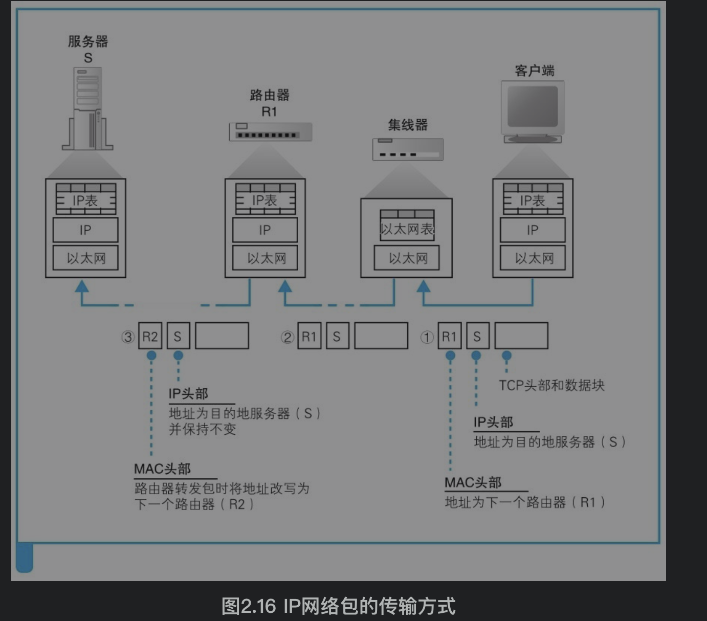


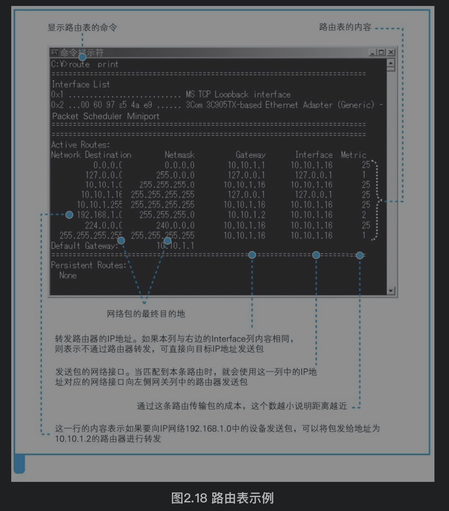


### MAC头部：ARP
IP是被分配给计算机的网卡的

通过更换网卡，计算机不仅可以支持以太网，也可以支持无线局域网。我们的计算机有无线局域网的网卡，如果有网口就也有以太网的网卡。像MAC就没有，就需要买转接头，这个转接头里有张网卡。

MAC地址是在网卡生产时写入ROM里的，在操作系统启动时网卡驱动程序在初始化网卡时会从配置文件中读取网卡的MAC地址并分配给MAC模块
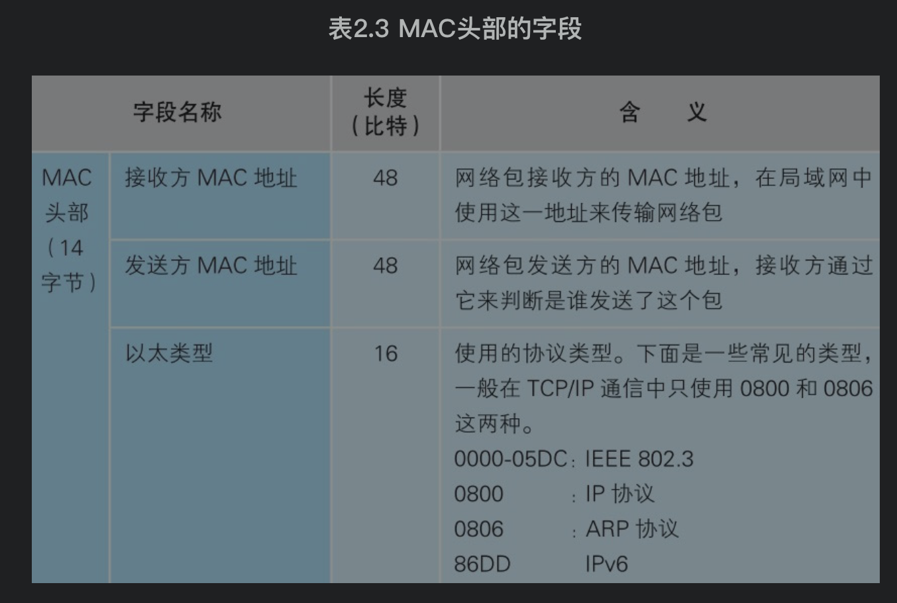


### 通过ARP查询目标路由器的MAC地址
根据路由表查出下一个路由器的IP地址后，将根据ARP协议查出该路由器的MAC地址。
首先查询ARP缓存是否有该IP地址对应的MAC地址，如果有就写入MAC头部。否则IP模块的ARP将广播询问同一个子网中的机器该IP地址的MAC地址是多少，那么当对应IP的路由器收到消息后将返回自己的MAC地址，收到MAC地址后就存入ARP缓存中。
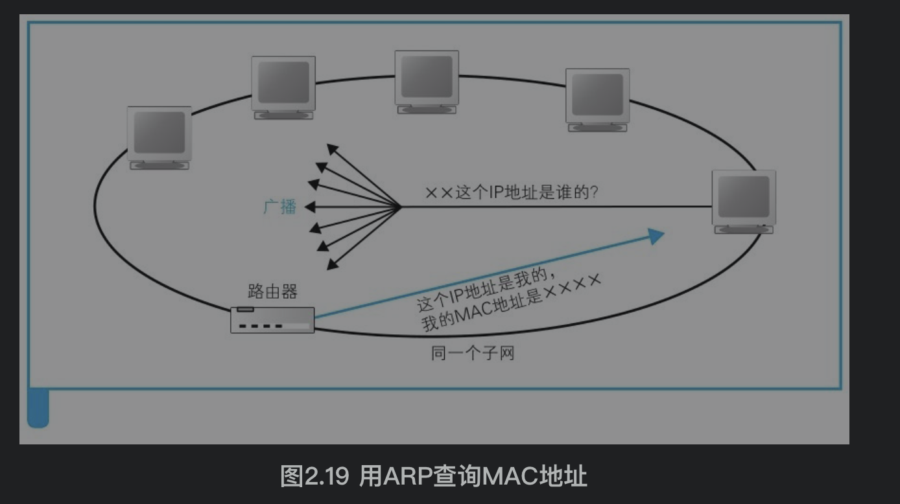

ARP缓存中的值在经过一段时间后会被删除，一般这个时间在几分钟左右
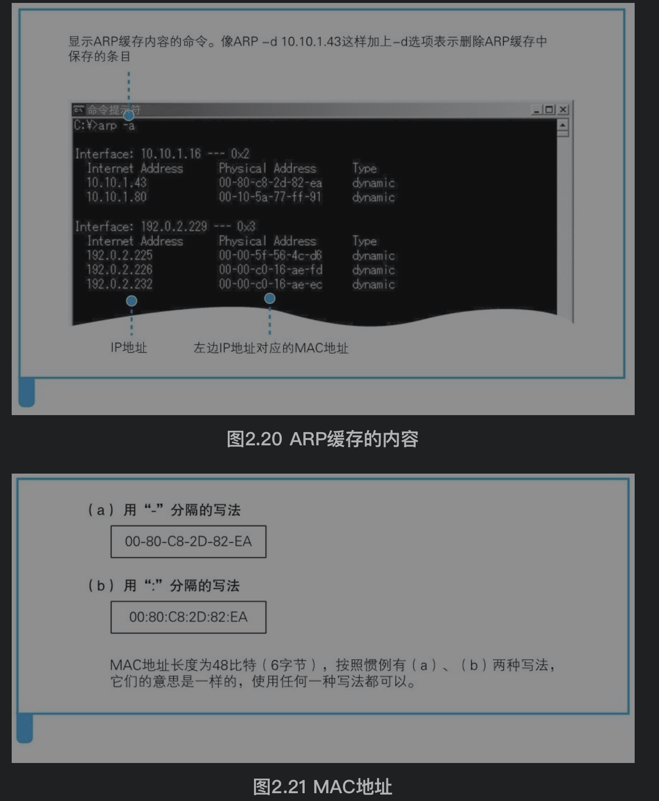

### MAC模块发送包
网卡驱动从IP模块获取包之后，会将其复制到网卡内的缓冲区中，然后向MAC模块发送发送包的命令。MAC模块会将包从缓冲区中取出，并在开头加上报头和起始帧分界符，在末尾加上用于检测错误的帧校验序列。
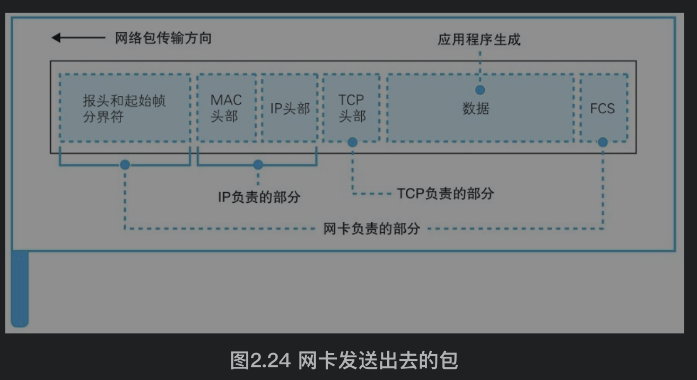

## 5.3 将服务器的响应包从IP传递给TCP
网卡驱动收到的响应包后判断接收方MAC地址是不是网卡的MAC地址，如果不是就丢弃。如果是就交给协议栈，IP模块首先检查IP头部格式是否正确，如果正确则查看接收方IP地址和自己网卡的IP地址是否一致，检查通过后将包交给TCP模块，TCP将根据端口号找到对应的套接字执行相应操作

如果错误，IP模块会让ICMP模块发送ICMP消息告知对方发错了。
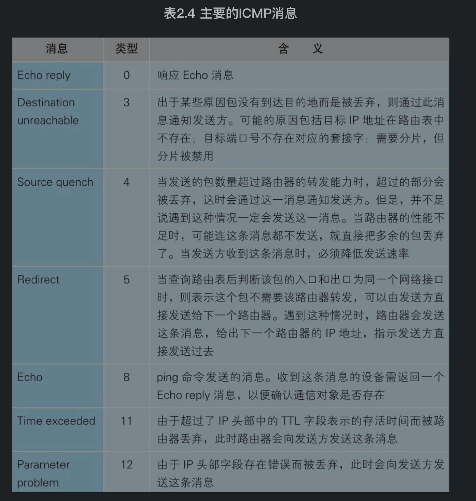

