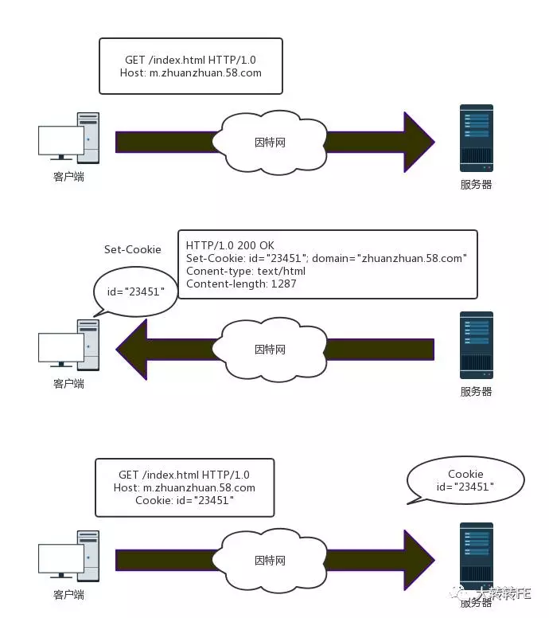

## 参考博文
[这一次带你彻底了解Cookie](https://juejin.im/entry/5a29fffa51882531ba10da1c)

[TOC]


# 1. cookie---客户端的解决方案
## 1.1 概念
cookie是服务器发送给浏览器的用来标识身份的文本信息。当浏览器首次访问服务器，服务器的响应中会带上Set-Cookie字段，浏览器会将这个内容存在cookie数据库中。当用户访问同一站点的时候，会将cookie带上发送给服务器。服务器就可以用cookie中的内容来标识用户了。




## 1.2 类型
### 会话cookie
是一种临时cookie，用户退出浏览器，会话Cookie就会被删除了

### 持久cookie
储存在硬盘里，保留时间更长，关闭浏览器，重启电脑，它依然存在

持久cookie 设置一个特定的过期时间（Expires）或者有效期（Max-Age）

```
 Set-Cookie: id=a3fWa; Expires=Wed, 21 Oct 2019 07:28:00 GMT;
```

## 1.3 cookie的传递
浏览器到服务端：
放在HTTP请求头的cookie字段中


服务端到浏览器：
放在HTTP响应头的set-cookie字段中


## 1.4 Path
Path属性可以为服务器特定文档指定Cookie

如果只设置domain，所有匹配这个URL的cookie都能访问到。

如果设置了path，除了能访问到匹配domain的cookie，还能访问到匹配domain+path的cookie

例如：m.zhuanzhuan.58.com 和 m.zhaunzhuan.58.com/user/这两个url

m.zhuanzhuan.58.com 设置cookie
```
Set-cookie: id="123432";domain="m.zhuanzhuan.58.com";
```

m.zhaunzhuan.58.com/user/ 设置cookie：
```
Set-cookie：user="wang", domain="m.zhuanzhuan.58.com"; path=/user/
```

访问其他路径m.zhuanzhuan.58.com/other/就会获得
```
cookie: id="123432"
```

如果访问m.zhuanzhuan.58.com/user/就会获得
```
cookie: id="123432"

cookie: user="wang"
```


## 1.5 secure
设置了属性secure，cookie只有在https协议加密情况下才会发送给服务端。但是这并不是最安全的，由于其固有的不安全性，敏感信息也是不应该通过cookie传输的.

```
Set-Cookie: id=a3fWa; Expires=Wed, 21 Oct 2015 07:28:00 GMT; Secure;
```


# 2. session---服务端的解决方案
session是通过服务端保存状态的机制，服务端开辟空间保存用户的状态信息，会将session_id存放在cookie中，服务端可以根据这个id来查找对应的信息。


对于短时间内不用重复登录就是使用session和cookie实现的。

通常session的过期时间都设置成cookie的过期时间

## 2.1 实现机制
session的实现机制有两种：
1. 放在cookie中
2. 不支持cookie的放在URL中作为参数


## 2.2 session的存储
### 单机
对于单机就直接存在内存中或者数据库中

### 集群
[集群下的session管理](../mysql/集群下的session管理.md)